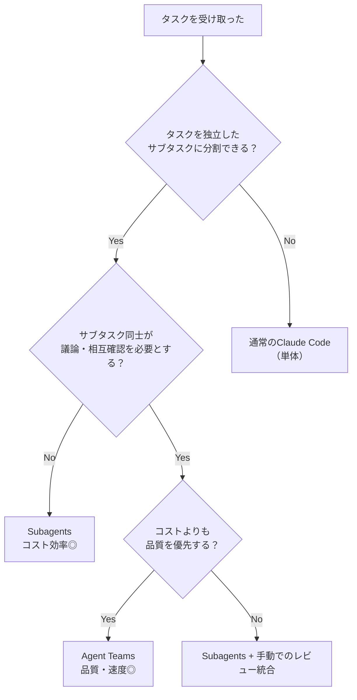

## はじめに

Claude Codeの `subagents`（サブエージェント）は使ったことがある。でも **Agent Teams** は試したことがない——そんな方に向けた記事です。

2026年2月、Anthropicは **Claude Code Agent Teams** を正式リリースしました。複数のAIインスタンスが「チーム」を組み、並列・協調しながら開発タスクをこなす仕組みです。

この記事を読むと以下が身につきます：

- Agent TeamsとSubagentsの違いと使い分け基準
- Agent Teamsのセットアップ手順（3分で完了）
- 実践的なユースケースと指示の出し方
- コストを抑えながら効果を最大化するコツ

**対象読者**: Claude Codeを日常的に使っている方（subagentsの概念を知っている方）

---

## Agent TeamsとSubagentsは何が違うのか

まず根本的な違いを整理します。

### Subagents：「お使いに行かせる部下」

```
あなた
  └── Claude（メイン）
        ├── subagent A → タスクA実行 → 結果を親に返す
        ├── subagent B → タスクB実行 → 結果を親に返す
        └── subagent C → タスクC実行 → 結果を親に返す
```

各subagentはメインエージェントに結果を返すだけ。**エージェント同士は会話しない**。

### Agent Teams：「プロジェクトチーム」

```
あなた
  └── Team Lead（Claude）
        ├── Teammate A ←→ Teammate B（直接メッセージング）
        └── Teammate C ←→ Teammate A（直接メッセージング）
              ↕              ↕
          共有タスクリスト（.claude/teams/）
```

Team Leadが全体を統括し、Teammatesは**独立したセッションとして動きながら互いに直接通信**できます。

### 比較表

| 比較項目 | Subagents | Agent Teams |
|---------|-----------|-------------|
| 実行場所 | 単一セッション内 | 複数の独立セッション |
| エージェント間通信 | なし（親経由のみ） | **直接メッセージング可能** |
| コンテキスト管理 | 完了後は破棄 | 各自が独自のコンテキストを保持 |
| 向いているタスク | 依存関係の薄いバッチ処理 | 議論・相互レビューが必要なタスク |
| コスト | 低 | 人数×単独分のトークン消費 |

:::message
**選択の目安**: タスクが「並列で分散処理できる単純作業」ならSubagents、「役割ごとに専門家が議論しながら進めるべき複雑作業」ならAgent Teamsです。
:::

---

## セットアップ：3分で完了

### 機能の有効化

Agent Teamsは現時点で**実験的機能**のため、明示的に有効化が必要です。

```bash
# 方法1: ~/.claude/settings.json に追記（推奨）
```

```json
{
  "env": {
    "CLAUDE_CODE_EXPERIMENTAL_AGENT_TEAMS": "1"
  }
}
```

```bash
# 方法2: 環境変数（セッションごと）
export CLAUDE_CODE_EXPERIMENTAL_AGENT_TEAMS=1

# 方法3: 起動引数
claude --experimental-agent-teams
```

### 操作モードの選択

| モード | 特徴 | おすすめ場面 |
|-------|------|------------|
| **In-processモード** | 単一ターミナルでメンバーを切り替え | 小規模チーム・普段使い |
| **Split panesモード** | tmux/iTerm2で各AIが独立ペインに表示 | 大規模チーム・ライブ感を重視 |

### キーボードショートカット

| ショートカット | 機能 |
|--------------|------|
| `Shift + ↓ / ↑` | チームメンバーの切り替え |
| `Ctrl + T` | 共有タスクリストの表示 |
| `Enter` | 選択したメンバーのセッションへ移動 |
| `Escape` | 現在の操作を中断 |

---

## 実践：どう指示を出すか

Agent Teamsへの指示は**自然言語でOK**です。Claude Codeが自動的にTeam Leadと各Teammatesの役割を割り当てます。

### ケース1：PRレビュー（最も手軽な入門）

```
3人のチームでこのPRをレビューしてください。
- Reviewer A：設計・アーキテクチャの観点
- Reviewer B：コードの品質・可読性の観点
- Reviewer C：テストカバレッジ・セキュリティの観点

レビュー結果を統合して、優先度付きで改善点をまとめてください。
```

**効果**: 1人のAIに頼むより多角的なフィードバックが得られ、観点の抜け漏れが減ります。

### ケース2：クロスレイヤー機能開発

```
ユーザー認証機能を3名のチームで実装してください。
- Frontend担当：Reactでのログインフォームとトークン管理
- Backend担当：JWTベースの認証APIエンドポイント
- Test担当：E2Eテストとセキュリティテスト

各担当は互いの実装を確認し合いながら進めてください。
```

**効果**: フロント・バック・テストが同時進行し、インタフェースのズレを早期に検出できます。

### ケース3：仮説検証型バグ調査

```
本番で発生している「ログイン後に500エラーが出る」バグを調査してください。

- Agent A：ネットワーク層（リクエスト/レスポンス）の調査
- Agent B：データベース接続・クエリの調査
- Agent C：認証・セッション管理の調査

各Agentは独立して調査し、発見した手がかりを共有しながら絞り込んでください。
```

**効果**: 複数の仮説を並列で検証でき、根本原因の特定が大幅に速くなります。

---

## 使いどころの判断フローチャート



:::message alert
**コストに注意**: Agent Teamsはメンバー数×通常使用分のトークンを消費します。大規模チームを長時間使う場合はMax/Proプランを推奨します。小規模なタスクはSubagentsで十分なことも多いです。
:::

---

## 注意点・ハマりポイント

### 1. タスク分解の設計が成否を分ける

約40%のAgent Teams利用が失敗するとされていますが、その多くは**タスク分解の不備**が原因です。

**NGな指示例**:
```
チームでこのプロジェクトをリファクタリングして
```

**OKな指示例**:
```
以下の役割分担でリファクタリングしてください：
- Agent A：src/api/ 配下のエンドポイントを担当
- Agent B：src/services/ 配下のビジネスロジックを担当
- Agent C：テストコードの更新を担当

変更前にAgent A・Bは互いのインタフェース定義を共有し合意してから実装を進めてください。
```

役割・担当範囲・完了条件を明確に定義するほど成功率が上がります。

### 2. 現時点での制約（実験的機能）

- **1セッション1チームのみ**: 複数チームの同時運用は不可
- **Teammates自身はチームを作れない**: Team Leadのみがチームを作れる
- **セッション中断・再開の不具合**: セッションが途切れた場合の復旧が不安定なことがある
- **レガシーコードとの相性**: 非決定的な動作（グローバル状態など）を持つコードは失敗しやすい

### 3. 最初の一歩はPRレビューから

「何から試せばいいかわからない」という方は、まず**PRレビューのAgent Teams活用**をおすすめします。理由は：

- タスク分解が自然にできる（観点を分ければいい）
- コードを書かせないので非決定性の問題が起きにくい
- 失敗しても損失が少ない

2〜3名のチームから始めて、使い勝手を掴んでから大規模チームに挑戦するのがベストプラクティスです。

---

## まとめ

| ポイント | 内容 |
|---------|------|
| **何が嬉しいか** | 複数の専門家AIが並列・協調して複雑タスクをこなせる |
| **Subagentsとの違い** | AIエージェント同士が直接通信・議論できる |
| **セットアップ** | `settings.json` に1行追加するだけ |
| **最初の使いどころ** | PRの多観点レビュー |
| **成功の鍵** | 役割・担当範囲・完了条件の明確な定義 |
| **コスト注意** | 人数分のトークンがかかるのでMax/Proプラン推奨 |

Agent Teamsは「どう使うか」の設計力が問われる機能です。まずは小さなチームから試して、自分なりの使いどころを見つけてみてください。

---

## 参考リンク

- [Claude Code 公式ドキュメント](https://docs.anthropic.com/claude-code)
- [Zenn: Claude Code のAgent Teamsで複数AIが協調するチームを作ろう](https://zenn.dev/long910/articles/2026-02-23-claude-code-agent-teams)
- [Zenn: Claude CodeのAgent Teamsを徹底解説 — Subagentsとの違いから使い所まで](https://zenn.dev/kg_filled/articles/9c557184c13a52)
- [DevelopersIO: Claude Code Agent Teamsの細かい運用上の注意点をまとめてみた](https://dev.classmethod.jp/articles/claude-code-agent-teams-guide/)
