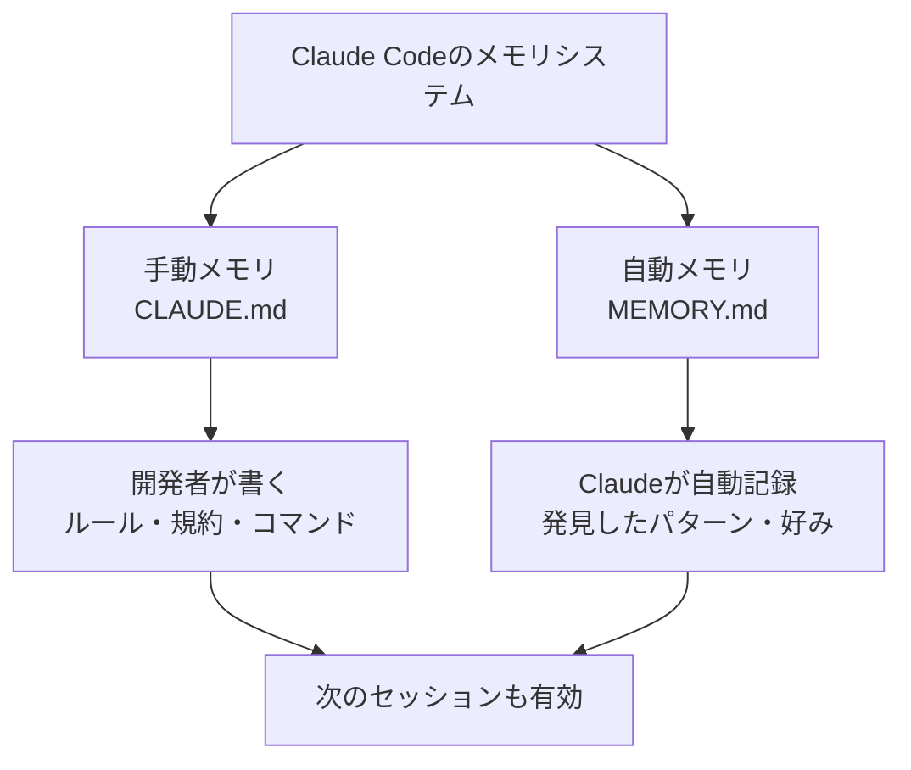
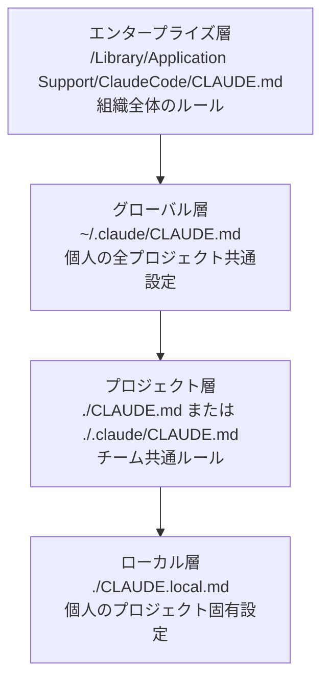
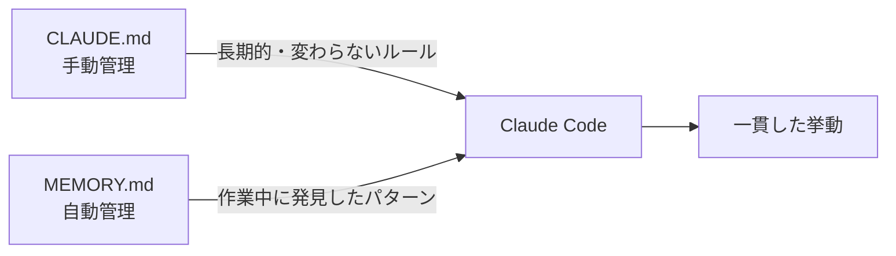

## はじめに

Claude Codeを使い始めたとき、私は毎回こんな説明をしていた。

「このプロジェクトはTypeScriptで書いてて、インデントはスペース2つ、テストはVitestを使ってて、コミットメッセージはfeat/fix/docsのプレフィックスをつけて……」

新しいチャットセッションを開くたびに、この"おまじない"を繰り返していた。正直、かなりストレスだった。

**CLAUDE.mdを設定してからは、そのおまじないが一切不要になった。**

この記事では、Claude Codeの「記憶」を設計するCLAUDE.mdについて、

- Claude Codeのメモリシステム全体像（自動メモリとの違い）
- 4層の階層構造と使い分け
- 「何を書くべきか・書くべきでないか」の判断基準
- @importとrules/ディレクトリによるモジュール化
- コピーして使える実例テンプレート3選
- ハマりポイントと注意事項

を実例とともに解説する。

**対象読者**: Claude Codeを使い始めた〜使い慣れてきたが、CLAUDE.mdを活用しきれていない開発者

:::message
既存のClaude Code関連記事（[Agent Teams実践ガイド](https://zenn.dev/biki/articles/claude-code-agent-teams-practical)・[Hooks入門](https://zenn.dev/biki/articles/claude-code-hooks-workflow-automation)・[Sandbox完全理解](https://zenn.dev/biki/articles/claude-code-sandbox-practical-guide)）の知識がなくても読めます。
:::

---

## CLAUDE.mdとは何か：Claude Codeの「記憶」

Claude Codeには「**セッションをまたいで情報を保持する**」仕組みがある。それがメモリシステムだ。

メモリシステムには大きく2種類がある。



| 種類 | ファイル名 | 作成者 | 内容 |
|------|-----------|--------|------|
| 手動メモリ | CLAUDE.md | 人間が書く | ルール・規約・コマンド・注意事項 |
| 自動メモリ | MEMORY.md | Claudeが自動生成 | 発見したパターン・学習した好み |

**CLAUDE.mdは「開発者がClaudeに伝えておきたいことを明示的に書く場所」**だ。

ビフォーアフターで比較するとわかりやすい。

| | CLAUDE.mdなし | CLAUDE.mdあり |
|--|--------------|--------------|
| 毎回の指示 | 「TypeScriptで、スペース2つで、テストはVitestで……」 | 不要（自動で把握） |
| チームの一貫性 | メンバーごとにClaudeの挙動がバラバラ | 全員が同じルールのClaudeを使える |
| コスト効率 | 毎回の説明でトークン消費 | 最初のセッションから必要な文脈が入っている |

---

## 階層構造を理解する：4つのレイヤー

CLAUDE.mdには4つのレイヤー（階層）がある。**より具体的（下位）なファイルが優先**される。



| レイヤー | パス | 適用範囲 | 主な用途 |
|---------|------|---------|---------|
| エンタープライズ | `/Library/Application Support/ClaudeCode/CLAUDE.md`（macOS） | 組織全体 | セキュリティ方針・禁止事項 |
| グローバル | `~/.claude/CLAUDE.md` | 個人の全PJ | 言語設定・個人の好みスタイル |
| プロジェクト | `./CLAUDE.md` | チーム全員 | 技術スタック・規約・コマンド |
| ローカル | `./CLAUDE.local.md` | 自分だけ | 個人ワークフロー・実験的設定 |

### 実際にどう使い分けるか

私が採用しているのは次のパターンだ。

**グローバル（`~/.claude/CLAUDE.md`）**:
```markdown
# 個人設定
## 言語
- 日本語で回答する
- コードコメントも日本語

## コミット規約（全プロジェクト共通）
- feat: 新機能
- fix: バグ修正
- docs: ドキュメントのみの変更
- refactor: リファクタリング

## 好みのスタイル
- TypeScript strict mode
- async/awaitのみ（.then()禁止）
- テストはVitestを優先
```

**プロジェクト（`./CLAUDE.md`）**:
```markdown
# ECサイトバックエンドAPI

## 概要
Node.js + Express + PostgreSQL + Prisma構成のREST API。
認証はJWT、決済はStripe SDK経由。

## コマンド
- `npm run dev`: 開発起動（port 3001）
- `npm test`: Jest全テスト実行（PR前必須）
- `npm run migrate`: DBマイグレーション実行

## 注意事項
- /src/generated/ は自動生成ファイル・直接編集禁止
- DBマイグレーション後は必ず `npm run seed` を実行
```

こうすることで、「日本語で回答」はすべてのプロジェクトに適用しつつ、プロジェクト固有のルールは`./CLAUDE.md`にまとめられる。

---

## 何を書くべきか・書いてはいけないか

CLAUDE.mdで最もよくある失敗は「**長くなりすぎること**」だ。

理由は単純で、CLAUDE.mdの内容は毎回コンテキストウィンドウを消費する。長すぎると：
- トークンコストが増加する
- 重要な指示が埋もれてClaudeのパフォーマンスが下がる

**目安は200行以内、できれば50〜100行**が理想だ。

### ✅ 書くべき5カテゴリ

| カテゴリ | 例 | なぜ書くか |
|---------|-----|----------|
| よく使うコマンド | `npm test` で全テスト実行 | 毎回説明するのが面倒 |
| プロジェクト固有の構造 | `/src/repositories/` のみDBアクセス可 | Claudeがデフォルトで知らない |
| 標準と異なる規約 | タブではなくスペース2つ | デフォルトと違う場合のみ |
| ハマりポイント・禁止事項 | `/src/generated/` 直接編集禁止 | 過去の失敗を繰り返さないため |
| 検証方法 | 変更後は必ず `npm test` を実行 | 自動で確認してほしい |

### ❌ 書いてはいけないもの

| 書きがちなもの | 書いてはいけない理由 |
|--------------|------------------|
| 「きれいなコードを書いて」 | 曖昧すぎる・Claudeはデフォルトで意識している |
| 一般的なベストプラクティス | Claudeはすでに知っている |
| 詳細な技術ドキュメント全文 | @importで参照すれば良い |
| APIキー・パスワード・機密情報 | **絶対禁止** |
| 「わかりやすく説明して」 | これはその都度プロンプトで伝えるべき |

:::message alert
CLAUDE.mdに機密情報（APIキー・パスワード・個人情報）を絶対に入れないこと。プロジェクトをGit管理している場合、誤ってリモートにpushしてしまうリスクがある。
:::

---

## @importとrules/ディレクトリでモジュール化する

プロジェクトが大きくなるとCLAUDE.mdも肥大化しやすい。そんなときは **@import** と **rules/ ディレクトリ**で分割する。

### @importの使い方

```markdown
# CLAUDE.md（メインファイル）

## プロジェクト概要
ECサイトバックエンドAPI（Node.js + Express + Prisma）

## コマンド
- `npm run dev`: 開発起動
- `npm test`: テスト実行

## 詳細ルール
@.claude/rules/api-design.md
@.claude/rules/testing.md
@.claude/rules/git.md
```

**ポイント**:
- `@ファイルパス` で他のMarkdownファイルを参照できる
- 最大5階層まで再帰的にインポート可能
- メインのCLAUDE.mdはコマンドと概要だけに絞り、詳細は分割ファイルへ

### ディレクトリ構造例

```
プロジェクトルート/
├── CLAUDE.md           ← メインエントリ（概要・コマンドのみ）
├── CLAUDE.local.md     ← 個人設定（.gitignoreに追加推奨）
└── .claude/
    ├── rules/
    │   ├── api-design.md    ← API設計指針
    │   ├── testing.md       ← テスト方針
    │   └── git.md           ← Git規約・コミットメッセージ
    └── skills/              ← 再利用可能なワークフロー定義
```

### モノレポでの活用

モノレポ構成では、サブディレクトリごとにCLAUDE.mdを配置することで**文脈を自動切り替え**できる。

```
monorepo/
├── CLAUDE.md          ← 共通ルール（モノレポ全体）
├── packages/
│   ├── frontend/
│   │   └── CLAUDE.md  ← フロントエンド固有ルール（Next.js・Tailwind）
│   └── backend/
│       └── CLAUDE.md  ← バックエンド固有ルール（Prisma・Express）
```

Claude Codeがfrontend/配下のファイルを編集するとき、frontend/CLAUDE.mdが自動的に優先適用される。

---

## コピーして使える実例テンプレート3選

実際に私が使っているCLAUDE.mdのテンプレートを紹介する。コピーして自分のプロジェクトに合わせてカスタマイズしてほしい。

### テンプレート①：Webアプリ（TypeScript + Next.js）

```markdown
# [プロジェクト名] — Next.js Webアプリ

## 概要
[1〜2行でアプリの概要・技術スタック]
例: React + Next.js 15 + TypeScript + Prisma + PostgreSQL構成のSaaSアプリ。

## コマンド
- `npm run dev`: 開発サーバー起動（localhost:3000）
- `npm test`: Vitestでテスト実行（変更後必須）
- `npm run build`: プロダクションビルド確認
- `npx prisma migrate dev`: DBマイグレーション

## 構造
- `/src/app/` — Next.js App Router（ページ・レイアウト）
- `/src/components/` — 再利用可能なUIコンポーネント
- `/src/lib/` — ユーティリティ・型定義
- `/src/generated/` — 自動生成ファイル（編集禁止）

## 規約
- スペース2つインデント（タブ不可）
- async/awaitのみ（.then()禁止）
- 全日付はUTCで処理
- Zodによるスキーマバリデーション必須

## 禁止事項
- `/src/generated/` への直接変更
- `any` 型の使用（`unknown` に置き換え）
- console.log（loggerを使うこと）

## 検証手順
変更後は必ず `npm test` を実行してグリーンを確認すること。
```

### テンプレート②：Pythonスクリプト・ライブラリ

```markdown
# [プロジェクト名] — Python

## 概要
[目的・使用ライブラリ]
例: 立花証券APIを使った日本株自動売買スクリプト（Python 3.11 + requests + pandas）。

## コマンド
- `python -m venv .venv && source .venv/bin/activate`: 仮想環境起動
- `pip install -e .`: 依存パッケージインストール
- `python -m pytest`: テスト実行
- `python -m src.main --dry-run`: ドライラン実行

## 構造
- `src/` — メインロジック
- `tests/` — pytestテスト
- `config/` — 設定ファイル（YAML）
- `.env` — 認証情報（Gitにコミット禁止）

## 規約
- 型ヒント必須（mypy strict）
- docstringはGoogle形式
- 変数名・関数名は英語スネークケース

## 注意事項
- `.env` ファイルをGitにコミットしない（機密情報あり）
- APIレスポンスはShiftJIS — `response.encoding = 'shift_jis'` で処理
- 本番実行前は必ず `--dry-run` で確認

## 検証
`python -m pytest` を全テスト通過してからコミットすること。
```

### テンプレート③：個人用グローバル設定（`~/.claude/CLAUDE.md`）

```markdown
# 個人設定（全プロジェクト共通）

## 言語・コミュニケーション
- 日本語で回答する
- 技術的なコードコメントも日本語
- 説明は「なぜ」→「どうやるか」の順番で

## コミットメッセージ規約
- `feat:` 新機能
- `fix:` バグ修正
- `docs:` ドキュメントのみ
- `refactor:` リファクタリング（機能変更なし）
- `test:` テストの追加・修正
- `chore:` ビルド設定・依存パッケージ更新

## 好みのスタイル
- TypeScript strict mode
- async/awaitのみ
- 関数型スタイル優先（副作用は明示的に）
- テストはVitestまたはpytest

## 作業前の確認事項
変更を始める前に必ず:
1. 現状を把握する（既存コードを読む）
2. 計画を立ててから実装する
3. テストを書いてから実装コードを変更する
```

---

## ハマりポイント・注意事項

実際にCLAUDE.mdを運用して遭遇した問題と解決策をまとめる。

### ❶ 長すぎるCLAUDE.mdが逆効果になった

最初、「すべての情報をCLAUDE.mdに書けば完璧なはず」と思って400行近いCLAUDE.mdを作った。

**結果**: Claude Codeの応答が遅くなり、コスト増大。長い指示の中で重要なルールが埋もれて無視されることも。

**解決策**:
- 200行以内に削る（重要度の低い指示を削除）
- 詳細ルールは @import で分割ファイルに移動
- 「Claudeがデフォルトで知っていること」は書かない

:::message alert
CLAUDE.mdが長くなるほどコンテキストウィンドウを消費し、トークンコストが上がる。「削ること」も重要なメンテナンス作業だ。
:::

### ❷ 古いルールが残って誤動作した

プロジェクトの技術スタックを変えたとき（Jestからvitestに移行）、CLAUDE.mdのコマンド記述を更新し忘れた。

**結果**: ClaudeがJestのコマンドを使い続け、テストが通らない状態でコミットされた。

**解決策**:
- 技術変更時にCLAUDE.mdも必ず更新する
- 月に1回程度CLAUDE.mdを読み直し、古い情報を削除する
- バージョン番号は「特定バージョンが必要な場合のみ」書く

### ❸ チームのGit管理どうする問題

`./CLAUDE.local.md`（個人設定）を.gitignoreに入れるべきか悩んだ。

**結論と判断基準**:

| ファイル | Git管理 | 理由 |
|---------|---------|------|
| `./CLAUDE.md` | ✅ コミットする | チーム共通ルール・新メンバーにも適用したい |
| `./CLAUDE.local.md` | ❌ .gitignoreに追加 | 個人設定・他人には不要 |
| `~/.claude/CLAUDE.md` | ❌ ローカルのみ | 完全に個人の設定 |

### ❹ 自動メモリが蓄積されすぎた

Claude Codeの自動メモリ（MEMORY.md）が気づかないうちに膨れ上がり、古い情報が蓄積されていた。

**解決策**:
```bash
/memory
```
`/memory`コマンドで現在ロードされているメモリを確認・編集できる。定期的に確認して古いエントリを削除する。

---

## 自動メモリ（MEMORY.md）との使い分け戦略

CLAUDE.mdと自動メモリは役割が異なる。適切に使い分けることで最大の効果が得られる。



**CLAUDE.mdに書くべきもの**（変わらないルール）:
- プロジェクトのコマンド・構造・規約
- 禁止事項・ハマりポイント
- チームの合意事項

**自動メモリに任せるもの**（動的に変わる情報）:
- セッション中に発見したバグのパターン
- 「さっきの方法より〜の方がいい」という発見
- タスク固有の文脈

### /memoryコマンドと#ショートカット

```
# このルールを覚えておいて：/src/utils/はpure functionのみ
```

チャット中に`#`から始めるとクイックメモとして自動メモリに追加できる。セッションをまたいで引き継ぎたい発見があったときに使える。

---

## まとめ

CLAUDE.mdの要点を振り返る。

| テーマ | ポイント |
|-------|---------|
| 何をするものか | Claudeへの「永続的な指示」を書く場所 |
| 階層構造 | グローバル→プロジェクト→ローカルの4層 |
| 何を書くか | コマンド・構造・プロジェクト固有規約・禁止事項 |
| 何を書かないか | 一般的なルール・機密情報・冗長な説明 |
| 理想的な長さ | 200行以内（50〜100行が理想） |
| モジュール化 | @importとrules/で分割管理 |
| 自動メモリとの違い | CLAUDE.mdは人間が明示的に管理するルール |

**一番大切なのは「削ること」だ。**

最初は少なく書いて、Claudeに同じことを何度も指示するはめになったら追加する。それが最もコスト効率の良い運用方法だと実感している。

### 次のステップ

CLAUDE.mdをマスターしたら、次は以下の組み合わせが強力だ。

- **[Claude Code Hooks](https://zenn.dev/biki/articles/claude-code-hooks-workflow-automation)** — ツール実行前後の自動処理
- **[Agent Teams](https://zenn.dev/biki/articles/claude-code-agent-teams-practical)** — 複数AIの役割分担
- **[MCPサーバー連携](https://zenn.dev/biki/articles/mcp-python-server-claude-code-guide)** — 外部ツールとの統合

CLAUDE.mdで「記憶」を設計し、HooksやAgent Teamsで「行動」を自動化する。この組み合わせがClaude Code活用の最大化につながる。
