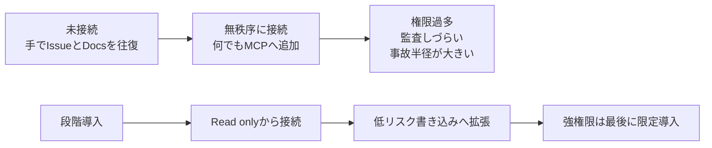
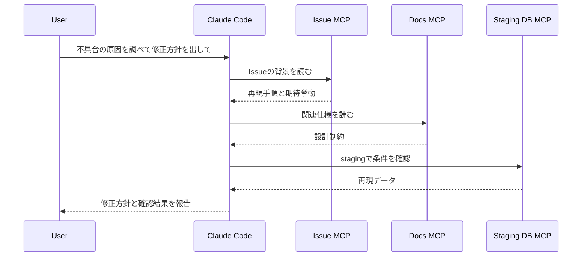

## はじめに

Claude CodeでMCP（Model Context Protocol）を触り始めたとき、私は最初こう考えていました。

- とりあえず便利そうなMCPサーバーを全部つなげば速くなるはず
- `stdio` と `HTTP` の違いは、あとで気にすればよさそう
- まず動かしてから安全性を考えればいい

でも実際に既存記事や公式ドキュメントを読み直してみると、速く効くのは「たくさんつなぐこと」ではなく、**どの順番で・どの権限で・どの境界までつなぐかを決めること**でした。

この記事では、私がClaude Codeの既存記事群を見直しながら整理した、**MCPを安全に運用へ載せるための判断軸**をまとめます。

この記事で得られるものは次の3つです。

- `stdio` と `HTTP` をどう使い分けるか
- docs / Issue / DB をどの順番でつなぐと事故りにくいか
- 権限境界、allow/deny、human-in-the-loop をどう考えるか

**対象読者**:
Claude Codeの基本操作は分かっていて、次の一歩として「MCPを入れたいが、どこから広げるべきか」で迷っている方。

**TL;DR**:
私は最初、MCPを“接続数の勝負”として見ていました。でも実際は逆で、**読み取り専用から始め、低リスク書き込みを経て、強い権限は最後に回す**ほうが運用しやすかったです。`stdio` と `HTTP` も性能ではなく**信頼境界（どこまで同じ権限で扱ってよいか）**で選ぶと判断しやすくなります。

---

## なぜMCPは便利なのに怖いのか

MCPは、Claude Codeを外部ツールへつなぐ標準プロトコルです。MCP公式では「AI向けのUSB-C」のようなものと説明されています。

この比喩がうまいのは、**つなげる相手が増えるほど便利になる一方で、差し込む先を間違えると事故も増える**ところまで含んでいるからです。

Claude Codeの公式ドキュメントでも、MCP経由で次のようなことができると説明されています。

- JiraやIssue trackerから仕様を読む
- 監視ツールを見て異常を調べる
- データベースを問い合わせる
- 外部APIや社内ツールをまたいで作業する

ここだけ見ると夢があります。私も最初は「じゃあ全部つなごう」と思いました。

ただ、実際に構成を考え始めると、次の3つが一気に重くなります。

| 問題 | 何が起きるか | 後から痛くなる点 |
|---|---|---|
| 権限が広すぎる | 書き込み可能なツールを気軽に呼べる | 本番事故の半径が大きい |
| 接続方式を雑に決める | ローカル/共有の境界が曖昧になる | 誰が責任を持つか不明になる |
| 何でも一度に載せる | Claude Codeが触れる道具が急に増える | 期待しないツール呼び出しやレビュー負荷が増える |



私が一番腹落ちしたのは、**MCPは「機能追加」ではなく「運用面のインフラ追加」だ**と捉え直したときでした。

だから、最初の論点は「何をつなげるか」ではなく、**どこまで信頼してよい接続か**です。

---

## MCPの基本: Tools / Resources / Prompts と `stdio` / `HTTP`

MCPには大きく3つの提供面があります。

| 要素 | 役割 | まず覚えるべきこと |
|---|---|---|
| Tools | Claude Codeが呼び出す操作 | 最も運用影響が大きい |
| Resources | 読み取り専用の情報源 | 段階導入の最初に向く |
| Prompts | 再利用する指示テンプレート | 整理用として便利 |

私は最初、MCPと聞くと「サーバーを自作する話」だと思っていました。

でも、Claude Code運用で最初に必要なのはそこではありません。むしろ先に決めるべきなのは、**この接続をローカルに閉じるのか、共有サーバーとして扱うのか**でした。

### `stdio` は「ローカルで高信頼な道具」に向く

`stdio` はローカルプロセスとしてMCPサーバーを起動する方式です。既存の自作MCP記事でも、この形式でClaude Codeへ登録する例がよく出てきます。

```bash
claude mcp add --transport stdio my-local-tool -- python /path/to/server.py
claude mcp list
```

私が `stdio` を選ぶ基準はかなりシンプルです。

- 自分の手元だけで閉じたい
- ローカルファイルや開発用DBなど、高信頼な範囲に限る
- チーム共有より、まず試すことを優先したい

反対に、**「便利だから `stdio` でいいか」は危険**だと感じました。ローカル権限で直接動くぶん、間違った接続先や強いツールを足したときの事故半径が読みにくいからです。

### `HTTP` は「共有・統制・認証」が必要な接続に向く

HTTP型のMCPサーバーは、共有基盤や社内向けエンドポイントとして扱いやすいです。

```json
{
  "mcpServers": {
    "docs-readonly": {
      "type": "http",
      "url": "https://example.internal/mcp/docs",
      "headers": {
        "X-API-Key": "${DOCS_MCP_API_KEY}"
      }
    }
  }
}
```

私はこの形式を見てから、`HTTP` は「遅い/速い」で選ぶものではなく、**認証、監査、配布、責任分界の置き場所**で選ぶものだと理解しました。

整理すると次の比較がしっくりきます。

| 観点 | `stdio` | `HTTP` |
|---|---|---|
| 向いている場面 | 個人の検証、ローカル完結 | チーム共有、統制が必要な接続 |
| 権限境界 | ローカル実行に寄る | ネットワーク境界と認証を設計しやすい |
| 導入の軽さ | 軽い | 準備はやや重い |
| 監査しやすさ | 工夫が必要 | 比較的やりやすい |

### `scope` も一緒に決めると運用がぶれにくい

Claude CodeのMCP docsを読んでいて、実運用で地味に大事だと感じたのが `scope` です。

- `local`: 今のプロジェクト配下でだけ使う。個人検証向け
- `project`: `.mcp.json` に保存してチームで共有する
- `user`: `~/.claude.json` に保存して、複数プロジェクトで使う

たとえば、私は次のように分けるのがよさそうだと感じました。

```bash
# 個人検証なら local
claude mcp add --transport http docs-readonly --scope local https://example.internal/mcp/docs

# チームで共有するなら project
claude mcp add --transport http issue-tracker --scope project https://example.internal/mcp/issues
```

特に `project` スコープは「便利だから共有」ではなく、**チーム全員が使ってよい接続だけを載せる**くらいがちょうどいいです。公式ドキュメントでも、`.mcp.json` のプロジェクトスコープ利用前には承認が入ると説明されています。

:::message
最初の1本は、docs検索やIssue参照のような**読み取り中心**の接続にすると判断ミスが起きにくいです。
:::

---

## 実際にやってみた: 読み取り専用から始める段階導入パターン

ここからは、私が「もし今の自分がゼロからMCPを増やすならこうする」という順番を書きます。

ポイントは、**接続対象で分類するのではなく、壊したときの影響で分類すること**です。

### 1. まずは docs / Issue の read-only から始める

最初に向いているのは、仕様や背景を取りに行く接続です。

- Issue trackerで要件を読む
- 社内ドキュメントで設計背景を確認する
- 監視情報を読むだけのクエリを流す

この層は、たとえ呼び出しが増えても「読みに行くだけ」で済むので、Claude Codeに何を見せるかの整理に集中できます。

私なら、最初の導入ゴールをここに置きます。

```text
Claude CodeがIssueとDocsを読めるようになり、
人間がブラウザを行き来せずに実装方針を決められる状態
```

### 2. 次に staging / sandbox の低リスク書き込みを追加する

次の層でやるのは、失敗しても被害が限定される書き込みです。

- staging DBへの確認クエリ
- sandbox APIへのテスト送信
- 検証用Issueやコメントの作成

私はここで初めて「書き込みを許す意味がある」と感じました。

読み取りだけだと便利止まりですが、低リスク環境への書き込みまで許すと、**調査 → 仮説 → 検証**が1つの流れになります。



### 3. 強い権限は最後に、人間レビュー前提で足す

ここでいう強い権限は、たとえば次のようなものです。

- 本番に近い環境への更新
- 外部サービスへの実行系API
- 取り消しにくい操作

この層まで来ると、私は「Claude Codeに任せるか」ではなく、**どの時点で人間の確認を挟むか**を先に決めるべきだと考えています。

たとえば、こんな線引きが現実的です。

```text
Read only        : Claudeが自律で使ってよい
Low-risk write   : 実行前に要約を出させる
Strong write     : 人間の明示承認があるときだけ許可する
```

この順番にしておくと、接続先が増えても「何をどこまで任せるか」を会話で毎回ゼロから説明しなくて済みます。

---

## allow/deny と managed 設定で“つなぎすぎ”を防ぐ

Claude CodeのMCPドキュメントには、管理者向けに `managed-mcp.json` や allow/deny の考え方が用意されています。

ここが面白かったのは、**MCPは追加方法だけでなく、止め方も標準化されている**ことです。

たとえば組織で厳格に管理したいなら、`managed-mcp.json` で排他的に構成できます。逆に、ある程度は各自に任せつつ、許可リスト・拒否リストで境界を切ることもできます。

```json
{
  "allowedMcpServers": [
    { "serverName": "github" },
    { "serverUrl": "https://mcp.company.com/*" }
  ],
  "deniedMcpServers": [
    { "serverName": "dangerous-server" }
  ]
}
```

私はこの仕組みを見て、「MCP導入は便利なサーバー探し」より先に、**追加できるものの上限を決める作業**だと感じました。

とくにチームで使うなら、最初から次の3点だけでも決めておくとかなり楽です。

- 個人が自由に追加してよいのはどこまでか
- `stdio` を許すなら、どのコマンドだけ許すか
- HTTP接続を許すなら、どのURLパターンだけ許すか

この整理がないまま便利なMCPサーバーを増やすと、あとで「その接続、誰が責任持つの？」という話に戻ります。

---

## ハマりポイント・注意事項

私が今回いちばん強く感じたハマりポイントは、**“MCPを入れる” と “MCPを運用できる” は別物**だということです。

### 1. `stdio` は簡単に見えるぶん、境界を忘れやすい

自作MCP記事の体験が分かりやすいので、最初は `stdio` に寄りがちです。私もそうでした。

でも、それは「簡単に始められる」だけで、「雑に広げてよい」ではありません。

:::message alert
`stdio` で強い権限のツールを足すと、ローカル実行の気軽さに対して事故半径が大きくなります。最初は read-only か、開発用の低リスク接続だけに絞るのがおすすめです。
:::

### 2. ツールが増えるほど、判断も増える

MCPは便利ですが、道具が増えるほどClaude Codeに渡す前提も増えます。

- この接続は読んでよいだけか
- 書いてよいか
- 今回のタスクで本当に必要か

ここを決めずに足していくと、あとでレビューのたびに「そのツール呼び出し、必要だった？」が増えます。

### 3. 秘密情報を設定ファイルへ直書きしない

HTTP型の設定例ではヘッダーにAPIキーを渡せますが、だからといって値をベタ書きしてよいわけではありません。

私は記事をまとめる段階で、**`${ENV_VAR}` で外に出すのが前提**だと改めて認識しました。接続設計の話と秘密管理の話は、切り離さないほうが安全です。

---

## まとめ

最後に、私ならどう導入するかを表にまとめます。

| フェーズ | 接続対象 | 推奨方式 | 人間確認 | 目的 |
|---|---|---|---|---|
| 1 | docs / Issue / 監視の参照 | `HTTP` または安全な `stdio` | ほぼ不要 | 背景と仕様を読む |
| 2 | staging DB / sandbox API | `HTTP` 推奨 | 実行前要約あり | 仮説検証を回す |
| 3 | 本番系・強権限操作 | 厳格管理された接続 | 必須 | 限定的に自動化する |

MCPは、Claude Codeを一気に強くしてくれる機能です。

ただ、実際に使いやすさを決めるのは「何本つないだか」ではなく、**接続方式・権限境界・導入順をどれだけ先に設計したか**でした。

もし今から始めるなら、私は次の順番をおすすめします。

1. まず docs / Issue の read-only を1本つなぐ
2. 次に staging の低リスク書き込みを1本だけ足す
3. 強い権限の接続は、allow/deny や managed 設定を先に決めてから入れる

これだけでも、MCPは「危ない便利機能」ではなく、**レビュー可能な運用基盤**として扱いやすくなります。

## 次に読む記事

- [PythonでMCPサーバーを自作してClaude Codeに接続する実践ガイド](https://zenn.dev/biki/articles/mcp-python-server-claude-code-guide)
- [Claude Code Sandboxを完全理解する ─ 仕組み・設定・ハマりどころまで](https://zenn.dev/biki/articles/claude-code-sandbox-practical-guide)
- [CLAUDE.mdを制する者がClaude Codeを制す：階層設計から実例テンプレートまで](https://zenn.dev/biki/articles/claude-code-claude-md-guide)
