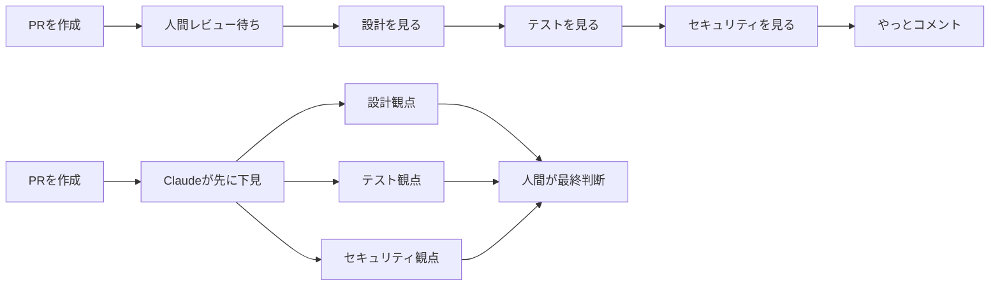
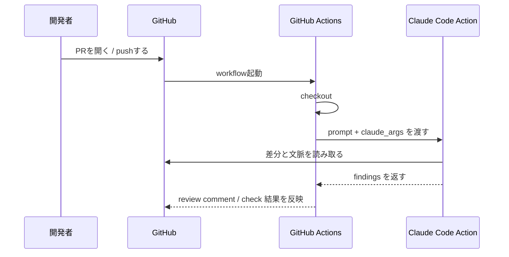
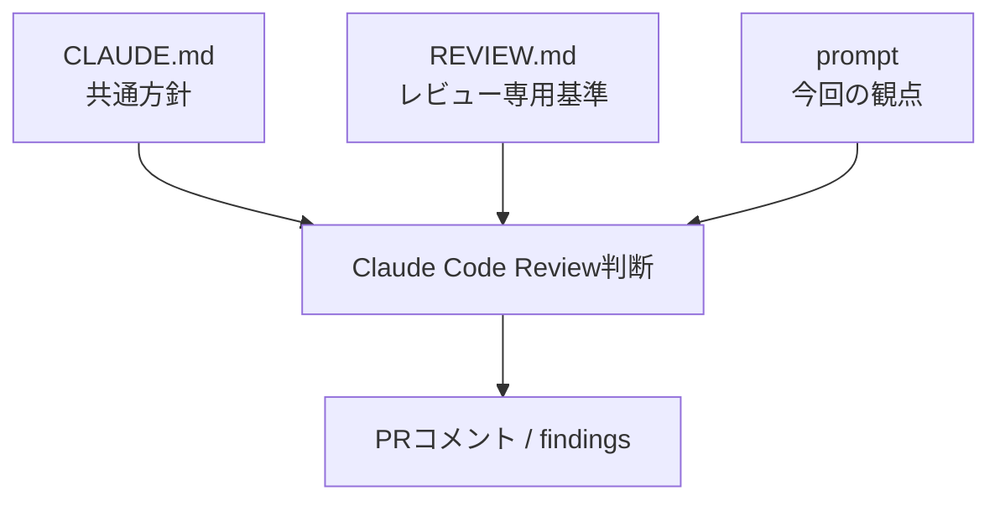

## はじめに

PRレビューが詰まるとき、だいたい同じことが起きています。

- 設計も見る
- テストも見る
- セキュリティも見る
- しかもレビュー担当は1人

私も最初は「Claude Codeにレビューを頼めば全部解決するのでは」と考えました。

でも実際に公式ドキュメントと `anthropics/claude-code-action` を読み比べてみると、重要なのは **AIに丸投げすることではなく、レビュー観点を分業して repo に残すこと** でした。

この記事では、Claude Codeを使って次の3つを整理します。

- GitHub Code Review と GitHub Actions のどちらを選ぶべきか
- GitHub Actions で PR レビューを自動化する最小構成
- `CLAUDE.md` / `REVIEW.md` / `prompt` でレビュー観点を育てる方法

**対象読者**:

- Claude Codeを触ったことがある
- GitHub Actions の YAML を読める
- PRレビューの属人化や待ち時間に困っている

TL;DR を先に書くと、**「すぐ始めたいなら GitHub Code Review」「運用ルールまで自分で握りたいなら GitHub Actions + REVIEW.md」** です。

---

## なぜPRレビューは待ちやすいのか

私が一番しっくりきたのは、PRレビューを「1人の万能担当に全部載せていた」と捉え直したことでした。

人のレビューが悪いわけではありません。

ただ、1本のPRに対して「設計の筋がいいか」「テストが足りるか」「秘密情報を漏らしていないか」を全部同時に見るのは、どうしても重くなります。

Claude Codeを入れると、この負荷を **観点ごとに分けて先に拾う** ことができます。



ここで最初に整理しておきたいのが、Claude Codeには **managed** と **self-hosted** の2つの選択肢があることです。

| 方式 | 何を使うか | 向いているケース |
|---|---|---|
| managed | GitHub Code Review | すぐ導入したい、専用のレビュー機能を使いたい |
| self-hosted | GitHub Actions + `anthropics/claude-code-action@v1` | trigger、prompt、権限、運用ルールを自分で設計したい |

公式の [GitHub Code Review](https://code.claude.com/docs/en/code-review) は、**specialized agents が差分を並列に見て inline comment を返す** 仕組みです。

一方、[GitHub Actions 連携](https://code.claude.com/docs/en/github-actions) は、Claude Codeを自分のCIに載せる方式です。

今回の私は「レビュー観点を文章で管理したい」「既存のActions運用に載せたい」と思ったので、後者を選びました。

---

## 実際にやってみた: GitHub Actions の最小構成

最初に押さえたのは、**今の公式サンプルは `@v1` と `prompt` / `claude_args` が前提** だという点でした。

昔のbeta記事だと `direct_prompt` や `mode` が出てきますが、今から書くならそこは追わない方が読み手に優しいです。

セットアップ自体は2通りあります。

| 方法 | 使いどころ |
|---|---|
| `/install-github-app` を terminal から実行 | いちばん手早い |
| 手動で GitHub App と Secret を設定 | 権限や構成を自分で把握したい |

ここで1つだけ先に補足すると、**GitHub App に与える権限** と **workflow の `permissions`** は別物です。

前者はClaudeがリポジトリやPRに触るためのインストール権限、後者はGitHub Actionsジョブが何をできるかの実行権限です。

私が記事用に整理した最小構成はこんな YAML でした。

```yaml
name: Claude PR Review

on:
  pull_request:
    types: [opened, synchronize, reopened]

jobs:
  review:
    if: github.event.pull_request.draft == false
    runs-on: ubuntu-latest
    timeout-minutes: 15
    permissions:
      contents: read
      pull-requests: write

    steps:
      - uses: actions/checkout@v4
        with:
          fetch-depth: 0

      - uses: anthropics/claude-code-action@v1
        with:
          anthropic_api_key: ${{ secrets.ANTHROPIC_API_KEY }}
          prompt: |
            Review this pull request from three angles:
            1. architecture and design risks
            2. missing tests or brittle edge cases
            3. security and secret handling
            Post only actionable findings.
          claude_args: |
            --max-turns 5
            --model claude-sonnet-4-6
```

この構成で私が残したかったのは次の4点です。

1. `draft` PR では動かさない  
2. `timeout-minutes` を付ける  
3. permissions を最小限に寄せる  
4. prompt で「設計 / テスト / セキュリティ」を最初から明示する  

`prompt` を曖昧にすると、レビューが「それっぽい一般論」になりやすいです。

逆に、観点を3つに絞るだけでコメントの粒度がかなり安定します。

実行イメージはこんな流れになります。



:::message
まずは **opened / synchronize / reopened** だけに絞って回すのがおすすめです。最初から複雑な trigger を増やすと、ノイズとコストのどちらが悪さをしているのか切り分けづらくなります。
:::

---

## 実際にやってみた: レビュー観点を repo に落とし込む

GitHub Actions の YAML だけで全部やろうとすると、だんだんつらくなります。

私も最初は prompt に全部書こうとして、レビュー方針が肥大化しました。

そこで整理し直したのが、**`CLAUDE.md` と `REVIEW.md` に役割を分ける** ことでした。

| ファイル / 入力 | 役割 | 何を書くか |
|---|---|---|
| `CLAUDE.md` | Claude Code 全体の共通方針 | 技術スタック、禁止事項、プロジェクト背景 |
| `REVIEW.md` | レビュー専用ルール | 必ず見る項目、スキップする項目 |
| `prompt` | そのワークフロー固有の指示 | 今回のレビュー観点、出力の粒度 |



私なら `REVIEW.md` はまずこの程度から始めます。

```md
# Code Review Guidelines

## Always check
- New API endpoints have integration tests
- Error messages do not leak internal details
- Config changes do not silently widen permissions

## Skip
- Generated files
- Lockfile-only changes
- Wording-only documentation fixes
```

ポイントは、**レビュー担当の頭の中にある暗黙知を文章にすること** です。

たとえば「新しいAPIにはテストが欲しい」は、人によって強さが違います。

でも `REVIEW.md` に書いてしまえば、少なくとも Claude は毎回その基準で見てくれます。

`CLAUDE.md` には、もっと広い前提を書いておくと相性がいいです。

`REVIEW.md` は **repo ルートに置いて auto-discover される** ので、workflow 側で特別な読み込み設定を追加しなくてよいのも楽でした。

```md
# Project Notes

- Backend is Node.js + TypeScript
- Use structured logging instead of ad-hoc console output
- Keep GitHub Actions permissions minimal by default
- Explain breaking changes in pull request descriptions
```

この分け方にしてから、私の中でレビュー設計がかなり楽になりました。

「共通ルールは `CLAUDE.md`」「レビューだけの基準は `REVIEW.md`」「今回の回し方は workflow の prompt」という切り分けができるからです。

---

## 実際にやってみた: managed review と self-hosted review の選び方

ここは実際に調べていて意外だったところです。

最初の私は「Claude CodeでPRレビューするなら、全部 GitHub Actions に寄せるのが正解だろう」と思っていました。

でも [Code Review の公式ドキュメント](https://code.claude.com/docs/en/code-review) を読むと、**managed review 側も specialized agents を使った本格的なレビュー機能** になっています。

なので、選び方はこう考えるのが自然でした。

| こういう状況 | 向いている選択 |
|---|---|
| まずは最短で導入したい | GitHub Code Review |
| GitHub Actions にレビュー運用を載せたい | Claude Code Action |
| `REVIEW.md` や prompt を細かく育てたい | Claude Code Action |
| 人が `@claude review` で呼ぶ運用も欲しい | GitHub Code Review |
| 既存のCIルールと一体化したい | Claude Code Action |

私は **「待ち時間を減らす」よりも「レビュー基準を repo に残す」** 方を優先したかったので、記事の軸も self-hosted 寄りにしました。

この違いを書いておくと、読者が「で、結局どっちを使えばいいの？」で迷いにくくなります。

---

## ハマりポイント・注意事項

ここは、実際に構成を組みながら「先に知りたかった」と思ったポイントです。

### 1. 最初から review 観点を増やしすぎるとノイズが増える

私は最初、設計・テスト・セキュリティ・可読性・命名・パフォーマンス……と全部盛りにしようとしました。

すると、読者に見せたい「本当に直すべきコメント」より、一般論の比率が上がります。

**最初は3観点くらいに絞る** 方が安定しました。

### 2. permissions を広げすぎると急に怖くなる

Claude Code Action は便利ですが、便利だからこそ permissions を雑に足したくなります。

最初に `contents: write` まで欲しくなったのですが、今回の目的はレビューなので **`contents: read` と `pull-requests: write` から始める** のが落ち着きました。

### 3. push ごとに回すとコスト感が変わる

managed review も self-hosted review も、PRの大きさと回数でコストが変わります。

細かく push するチームでは、便利さの割に「思ったより回数が多い」と感じやすいです。

:::message alert
自動レビューは便利ですが、**最初から every push で常時運用にしない方が安全** です。まずは対象ブランチや draft 除外、`timeout-minutes`、レビュー観点の絞り込みを入れてから広げるのが失敗しにくいです。
:::

### 4. GitHub Actions で sub-agents 前提の記事を書くとズレやすい

今回の私自身の反省でもあります。

最初は「sub-agents を前面に出した記事にしよう」と考えていたのですが、GitHub Actions の公式ドキュメントの主軸はそこではありませんでした。

結果的に、**「specialized agents がどう動くか」より「レビュー観点をどう設計するか」** に寄せた方が、一次情報とも整合しやすくなりました。

---

## まとめ

Claude CodeでPRレビューを自動化するときに大事なのは、AIを増やすことより **観点を分けること** でした。

最後に、今回の要点を表でまとめます。

| 論点 | 今回の結論 |
|---|---|
| 何から始めるか | まずは GitHub Actions の最小構成から |
| 何をAIに任せるか | 設計・テスト・セキュリティの下見 |
| どこにルールを書くか | 共通方針は `CLAUDE.md`、レビュー専用は `REVIEW.md` |
| 何に気をつけるか | permissions、コスト、観点の広げすぎ |
| managed と self-hosted の違い | 手早さなら managed、運用設計なら self-hosted |

私なら次の順番で導入します。

1. 最小 workflow を置く  
2. `REVIEW.md` を1枚作る  
3. コメントが noisy なら prompt を削る  
4. それでも合わなければ managed review と比較する  

「Claude Codeを導入する」だけで止まらず、**レビュー基準を repo に残す** ところまで進めると、チームで使う価値が一気に上がります。

## 次に読む記事

- [CI/CDにAIを組み込む！GitHub Copilot CLI × GitHub Actions 実践入門](https://zenn.dev/biki/articles/github-actions-copilot-cli)
- [Claude Code Hooksで開発を自動化する：PreToolUse/PostToolUse 実践入門](https://zenn.dev/biki/articles/claude-code-hooks-workflow-automation)
- [CLAUDE.mdを制する者がClaude Codeを制す：階層設計から実例テンプレートまで](https://zenn.dev/biki/articles/claude-code-claude-md-guide)
