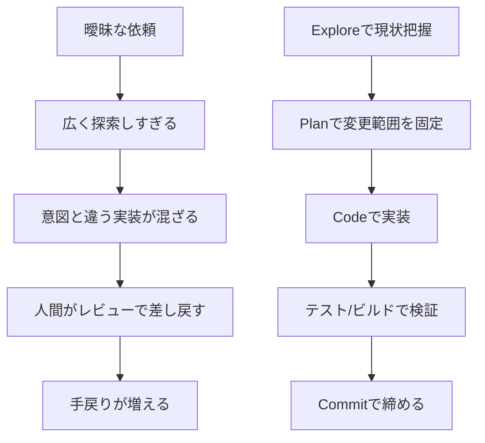
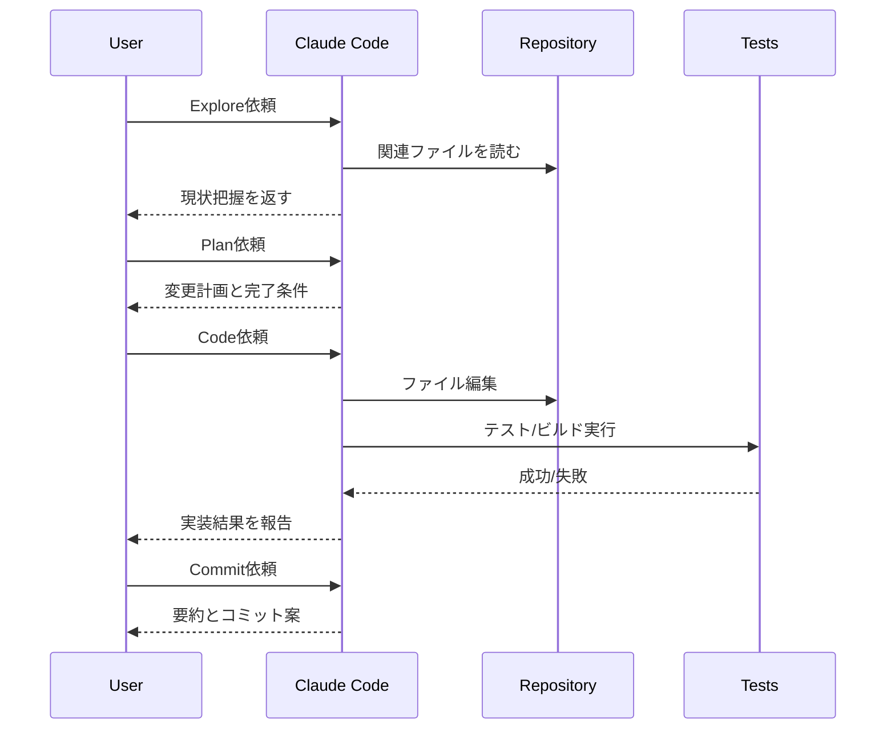

## はじめに

Claude Codeを使っていると、こんな感覚にならないでしょうか。

- 小さい修正はかなり速い
- でも、複数ファイルにまたがる変更になると急に精度がぶれる
- うまくいく日と、手戻りが多い日の差が大きい

私もまさにこの状態でした。

Hooks や `CLAUDE.md`、Skills を個別に触っていたので「機能は知っている」のですが、**どういう順番で使うと安定するか**は別の話でした。

そこで最近は、Anthropic公式のベストプラクティスをベースに、**Explore → Plan → Code → Commit** の4段階で依頼する形に寄せています。これに変えてから、特に大規模改修のときのブレがかなり減りました。

この記事では、私が実際にやって効果があった運用をまとめます。

- Claude Codeの精度がぶれやすい理由
- Explore → Plan → Code → Commit の使い分け
- `CLAUDE.md`・Hooks・Skills をどこに差し込むか
- 手戻りを減らすための検証ループの作り方

**対象読者**: Claude Codeの基本操作は知っていて、次の一歩として「実務で安定して使うコツ」を知りたい人

:::message
この記事は、Claude Codeの新機能紹介ではなく**運用設計のガイド**です。
`CLAUDE.md` や Hooks の詳しい書き方は、記事末尾の関連記事にまとめています。
コマンド例は **2026-03時点の Claude Code 公式ドキュメント** を前提にしています。
:::

---

## なぜ精度がぶれるのか：Claude Codeは「機能」より「運用」が重要

Claude Codeは、単なる補完ツールというより**自律的に探索・計画・実装するエージェント**です。

便利な一方で、雑に頼むとそのまま雑に進みます。

Anthropic公式のベストプラクティスでも、重要なのは個別機能そのものより次の2点だと整理されています。

- **コンテキスト管理**: 長すぎる指示や広すぎる依頼は精度を落とす
- **検証手段**: Claude自身に「これで正しい」と確かめる方法を渡す

私が失敗していた頃は、だいたいこんな依頼をしていました。

```text
この機能をいい感じにリファクタして、ついでにテストも整えて。
```

これだと、Claude Codeから見ると次が曖昧です。

- どこまで探索してよいのか
- 何を「完了」とみなすのか
- どのテストを回せばよいのか
- 既存パターンを守るべきか、新しく作ってよいのか

その結果、実装自体は速くても、レビューで差し戻す回数が増えました。



要するに、Claude Codeの精度は「モデルの気分」より、**こちらがどれだけ運用を設計したか**でかなり変わります。

---

## 実際にやってみた: Explore → Plan → Code → Commit の4段階で依頼する

私が今いちばん効いていると感じているのは、1回の依頼を4段階に分けることです。

### 1. Explore: まずコードベースを読ませる

ここでの目的は、**いきなり直させないこと**です。

Anthropic公式でも、複数ファイルにまたがる変更では Plan Mode を使って、探索と編集を分離することが推奨されています。

私はまず、Plan Mode でこんな依頼を投げます。

```bash
# 新しいセッションを Plan Mode で始める例
claude --permission-mode plan
```

既に開いているセッションなら、`Shift+Tab` で Plan Mode に切り替える使い方でも大丈夫です。

```text
src/auth を読んで、現在のログインフローとトークン更新の流れを要約して。
そのうえで、今回の変更に関係するファイルだけを洗い出して。
```

この段階では、まだ修正を頼みません。

「現状把握だけ」を切り出すと、Claude Codeの返答がかなり読みやすくなります。

### 2. Plan: 変更範囲と完了条件を固定する

Explore の次は、同じく Plan Mode のまま計画を作らせます。

```text
OAuthログインを追加したい。
既存の認証フローを壊さない前提で、どのファイルをどう変更するか計画を作って。
テストと確認項目も含めて。
```

ここで大事なのは、**実装前に完了条件を言語化すること**です。

例えば私は、計画の時点で次を入れるようにしています。

- 変更対象ファイル
- 既存実装のどのパターンに合わせるか
- 実行するテスト
- 成功条件（例: build 成功、既存テスト通過、回帰なし）

### 3. Code: 実装は計画に沿ってやらせる

計画が固まったら、はじめて実装に進みます。

```text
さっきの計画に沿って実装して。
変更後は npm test と npm run typecheck を実行して、失敗があれば修正して。
```

この順番にすると、Claude Codeが勝手に探索をやり直して脱線することが減りました。

特に複数ファイル変更では、**「実装フェーズで考え直させない」** のが効きます。

### 4. Commit: 最後にコミット単位まで閉じる

最後はコミットです。

```text
変更内容を3行で要約して。
そのあと説明的なコミットメッセージ案を出して。
```

コミットまで1つの流れにしておくと、「どこまで終わったのか」が曖昧になりません。



### 小さい修正なら4段階を全部やらなくていい

ここは誤解しやすいポイントです。

typo修正、ログ追加、文言修正のような**差分を一文で説明できる小タスク**なら、毎回 Plan Mode を挟む必要はありません。

私の基準はシンプルで、次のどちらかに当てはまるなら Explore/Plan を入れます。

- 3ファイル以上に触る
- 既存フローを壊す可能性がある

この基準だけでも、過剰な儀式感はかなり減ります。

---

## 実際にやってみた: 検証ループを先に渡すと精度が一段上がる

Claude Codeを使っていて一番変化を感じたのは、**「何を作るか」より先に「どう検証するか」を渡す**ようになってからです。

公式ドキュメントでも、検証手段を与えることが最もレバレッジの高い実践として紹介されています。

以前の私は、こんな頼み方をしていました。

| 頼み方 | 起こりがちなこと |
|---|---|
| 「ログインバグを直して」 | とりあえず辻褄が合う修正になりがち |
| 「この見た目をよくして」 | 主観的な変更が増えてレビューが重い |
| 「リファクタして」 | どこまでやるべきかが曖昧 |

今は、最低でも次のどれかをセットで渡します。

- 実行すべきテスト
- 期待する出力
- UIならスクリーンショット比較
- 再現手順
- 「根本原因を直すこと」という制約

たとえばバグ修正なら、私はこんな形にしています。

```text
セッションタイムアウト後にログインが失敗する不具合を直して。
src/auth のトークン更新周りを確認し、まず失敗を再現するテストを書いて。
修正後はそのテストと関連テストを実行して、エラーを隠すのではなく根本原因に対処して。
```

この一文を入れるだけで、Claude Codeの動きがかなり変わります。

- 先にテストを書く
- 表面上の回避策を避ける
- 実装後に自分で確かめる

つまり、人間が最後の品質ゲートを全部背負わなくてよくなります。

---

## 実際にやってみた: `CLAUDE.md`・Hooks・Skills をどこに差し込むか

ここは私が最初に混乱したところでした。

全部便利そうに見えるので、最初は「とりあえず `CLAUDE.md` に何でも書く」状態になりがちです。

でも、実際には役割がかなり違います。

| 仕組み | 役割 | 私の使いどころ | 入れすぎると起きること |
|---|---|---|---|
| `CLAUDE.md` | 毎回読む共有メモ | コマンド、設計制約、禁止事項 | 長すぎて重要ルールが埋もれる |
| Hooks | 決定論的な命令 | フォーマット、危険コマンド防止、通知 | 便利だが過剰だと運用が重い |
| Skills | 必要時だけ読む手順書 | 調査、レビュー、公開など再利用ワークフロー | 粒度が大きすぎると再利用しづらい |

私が今しっくりきているのは、次の分け方です。

```text
常時必要なもの → CLAUDE.md
絶対に強制したいもの → Hooks
特定タスクでだけ使う手順 → Skills
```

### `CLAUDE.md` は短いほど効く

公式の Memory ドキュメントでも、`CLAUDE.md` は短く・具体的に・200行以下を目安にすることが推奨されています。

私も以前は、プロジェクトの背景説明や設計思想を全部入れようとしていました。

でもこれをやると、**毎回読むには重すぎるファイル**になります。

今は次のような最低限に寄せています。

```md
# Workflow
- 変更後は npm test と npm run typecheck を実行する
- まず関連実装を探索し、既存パターンに合わせる

# Structure
- API handlers は src/api/handlers/ に置く
- DB access は src/repositories/ 経由に限定する

# Guardrails
- generated 配下は直接編集しない
```

これ以上に細かい作業手順は、Skills 側に逃がしたほうが安定しました。

### Hooks は「守ってほしい」ではなく「必ず実行したい」に使う

Hooks は、Claudeへのお願いではなく**命令**です。

たとえば私なら、次のようなものをHooksに寄せます。

- ファイル編集後のフォーマッタ実行
- 危険コマンドのブロック
- 長時間タスク完了時の通知

「毎回やってほしいけれど、プロンプトで言い続けるのは面倒」なものは Hooks 向きです。

### Skills は“何度もやる仕事”を資産化する

Skills が向いているのは、毎回説明するには長いけれど、常時ロードするには重い手順です。

例えば私は、次のようなワークフローを Skills に寄せています。

- 既存記事を読みながらテーマ重複を避ける
- 4軸レビューで公開前チェックを行う
- 投稿後にURLまで検証する

ASCII で描くと、頭の中の整理はこんな感じです。

```text
[毎回読む]
  CLAUDE.md

[イベントで強制する]
  Hooks

[必要なときだけ読む]
  Skills
```

この切り分けができると、Claude Codeに与えるコンテキストがかなりスリムになります。

---

## ハマりポイント・注意事項

ここは実際に何度も失敗しました。

### 1. 小さい修正にも毎回 Plan を挟んで疲れる

最初は「Plan Mode が大事なら毎回使おう」と思っていました。

でも、ログ1行の追加まで Plan を挟むと、さすがに重いです。

今は「変更対象が広いか」「既存フローを壊す可能性があるか」で使い分けています。

### 2. `CLAUDE.md` に全部書いてしまう

これも本当にやりがちでした。

一度、運用ルール・アーキテクチャ説明・手順書・参考リンクを全部 `CLAUDE.md` に詰め込んだことがあります。すると、Claude Codeが一部の重要ルールを平気で取りこぼすようになりました。

理由は単純で、**毎回読むには長すぎた**からです。

:::message alert
`CLAUDE.md` は「便利なメモ置き場」ではなく、**毎回読む最重要ルールだけを置く場所**です。
長くなったら、Skills や `@import`、`.claude/rules/` に逃がしたほうが安定します。
:::

### 3. 検証を渡さず、最後に自分が全部見ることになる

これは一番コストが高い失敗でした。

「実装して終わり」にすると、レビュー時に毎回次の確認を人間がやることになります。

- ちゃんと動くか
- 既存テストは壊れていないか
- 表面的な回避策になっていないか

最初にテストや期待出力を渡しておけば、Claude Code自身がかなり前工程で潰してくれます。

---

## まとめ

最後に、私が今のところ一番しっくりきている使い分けを表でまとめます。

| フェーズ | 人間が渡すもの | Claude Codeに期待すること |
|---|---|---|
| Explore | 対象範囲、知りたいこと | 現状把握、関連ファイルの洗い出し |
| Plan | 制約、完了条件、検証方法 | 変更計画、テスト計画 |
| Code | 確定した計画 | 実装、自己検証、修正 |
| Commit | 要約の粒度、メッセージ方針 | 差分整理、コミット案作成 |

Claude Codeで手戻りを減らしたいなら、まず覚えるべきは新機能の数ではなく、**依頼の順番**だと思っています。

私自身、Hooks や Skills を増やす前に、Explore → Plan → Code → Commit と検証ループを意識するだけでかなり改善しました。

次に試すなら、普段やっている1つのタスクを次の順で頼み直してみてください。

1. まず Explore だけ頼む
2. 次に Plan で完了条件を固定する
3. Code ではテスト実行まで含める
4. 最後に要約とコミット案で締める

これだけでも、Claude Codeの「たまにすごい」から「だいたい安定する」への変化を感じやすいはずです。

## 参考リンク

- [Claude Code Best Practices](https://code.claude.com/docs/ja/best-practices)
- [Claude Code Common Workflows](https://docs.anthropic.com/ja/docs/claude-code/common-workflows)
- [Claude Code Memory](https://docs.anthropic.com/ja/docs/claude-code/memory)

## 次に読む記事

- [CLAUDE.mdを制する者がClaude Codeを制す：階層設計から実例テンプレートまで](https://zenn.dev/biki/articles/claude-code-claude-md-guide)
- [Claude Code Hooksで開発を自動化する：PreToolUse/PostToolUse 実践入門](https://zenn.dev/biki/articles/claude-code-hooks-workflow-automation)
- [Claude Code Skills実践ガイド：SKILL.mdで定型作業をチームの武器にする](https://zenn.dev/biki/articles/claude-code-skills-practical-guide)
