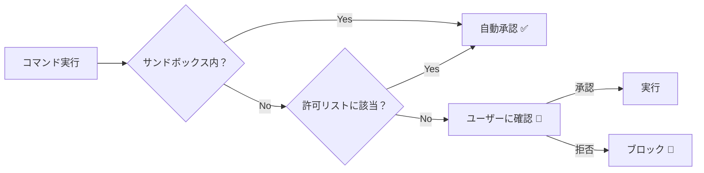
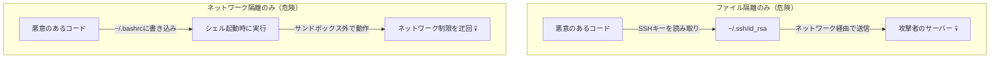
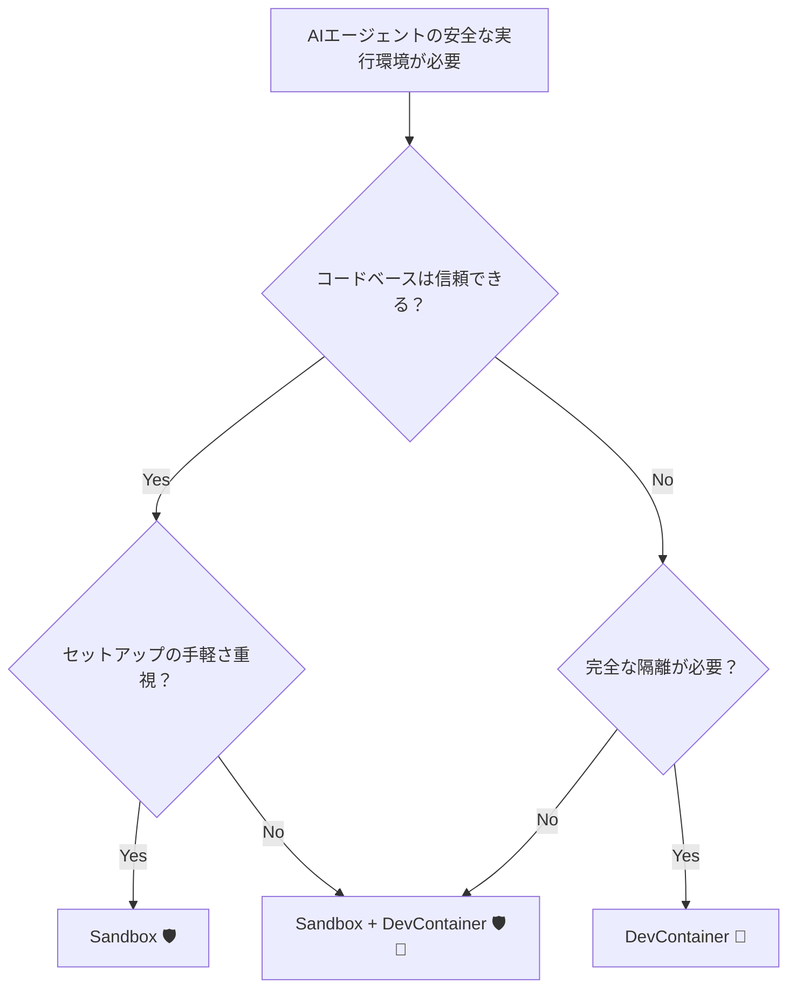

## はじめに

Claude Codeを使っていて、こんな経験はありませんか？

- `npm run test` を実行するたびに「承認しますか？」と聞かれる
- 何十回もApproveを押し続けて、最後のほうはもう中身を読んでいない
- 「このコマンド、本当に安全？」と不安になりつつもOKを押してしまう

これが**承認疲れ（Approval Fatigue）**です。セキュリティのための仕組みが、逆にセキュリティリスクを生んでいる皮肉な状況。

Claude Code Sandboxは、この問題を根本から解決します。**「安全な範囲を先に定義し、その中ではAIが自由に動ける」**── そんなアプローチで、Anthropic社内ではパーミッションプロンプトを**84%削減**しました。

この記事では、Sandboxの仕組みを理解し、実際に設定して使いこなすところまでを解説します。

:::message
**対象読者**: Claude Codeを使っている（または使い始めたい）開発者
**前提知識**: ターミナル操作の基本、Claude Codeの基本的な使い方
:::

---

## Sandboxが解決する課題

### 従来のパーミッションモデルの限界

Claude Codeはデフォルトで**読み取り専用**です。ファイル編集やコマンド実行のたびにユーザーの承認が必要です。

```
Claude: npm run test を実行してもいいですか？ → [承認]
Claude: src/index.ts を編集してもいいですか？ → [承認]
Claude: npm run build を実行してもいいですか？ → [承認]
Claude: git diff を実行してもいいですか？ → [承認]
... 以下延々と続く
```

この仕組みには3つの問題があります。

| 問題 | 説明 |
|------|------|
| **承認疲れ** | 何十回も承認していると、内容を確認せずに承認するようになる |
| **生産性低下** | AIの自律的な作業が中断され、開発速度が落ちる |
| **逆にセキュリティリスク** | 疲れて承認した中に危険なコマンドが紛れ込む可能性 |

### Sandboxのアプローチ

Sandboxは発想を逆転させます。

> 「毎回聞く」のではなく、**「安全な範囲を先に定義する」**



---

## 二重の隔離 ─ なぜファイルとネットワークの両方が必要か

Claude Code Sandboxの核心は、**ファイルシステム隔離**と**ネットワーク隔離**の2層構造です。

「ファイルだけ制限すればいいのでは？」と思うかもしれませんが、片方だけでは不十分です。



| 隔離 | なしの場合のリスク |
|------|-------------------|
| ネットワーク隔離なし | SSHキーやAPIトークンを外部に送信される |
| ファイルシステム隔離なし | `.bashrc` 等を改ざんしてサンドボックス外から攻撃 |

**両方あって初めて安全**。これがClaude Code Sandboxの設計思想です。

---

## OS レベルの強制 ─ アプリレベルとの決定的な違い

### なぜOSレベルなのか

アプリケーションレベルの制限は「お願いベース」です。AIが生成したスクリプトが新しいプロセスを起動すれば、その制限を簡単に迂回できてしまいます。

一方、OSレベルの制限は**物理的な壁**です。Claude Codeが起動したすべての子プロセス（`npm`、`kubectl`、`terraform` など）にも自動的に制限が継承されます。

### OS別の実装

| OS | 技術 | 概要 |
|----|------|------|
| **macOS** | Seatbelt（sandbox-exec） | iOSアプリのサンドボックスと同じ技術基盤 |
| **Linux / WSL2** | Bubblewrap（bwrap） | Flatpakでも使われるコンテナ隔離技術 |
| **WSL1** | ❌ 非対応 | カーネル機能が不足。WSL2にアップグレードが必要 |
| **Windows** | ❌ 未対応（計画中） | 将来サポート予定 |

:::message alert
**WSL1ユーザーへ**: BubblewrapはWSL2のカーネル機能が必要です。`wsl --set-version <distro> 2` でWSL2にアップグレードしてください。
:::

---

## セットアップ ─ 5分で始める

### 前提条件のインストール

**macOS**: 追加インストール不要（Seatbeltはビルトイン）

**Ubuntu / Debian**:

```bash
sudo apt-get install bubblewrap socat
```

**Fedora**:

```bash
sudo dnf install bubblewrap socat
```

### Sandboxの有効化

Claude Code内で以下のコマンドを実行するだけです。

```
> /sandbox
```

メニューが表示され、サンドボックスモードを選択できます。

| モード | 動作 |
|--------|------|
| **Auto-allow** | サンドボックス内のコマンドは自動承認。境界外のアクセスは通常のパーミッションフローへ |
| **通常パーミッション** | サンドボックス内でも承認が必要。より厳格だがプロンプトは多い |

**おすすめは Auto-allow モード**。サンドボックスの恩恵を最大限に受けられます。

---

## settings.json の設定 ─ 実践編

### 基本設定

```json
{
  "sandbox": {
    "enabled": true,
    "autoAllowBashIfSandboxed": true
  }
}
```

これだけで、カレントディレクトリ以下への書き込みと、承認済みドメインへのネットワークアクセスが自動許可されます。

### ファイルシステムの設定

プロジェクトによっては、ワーキングディレクトリ外への書き込みが必要なケースがあります。

```json
{
  "sandbox": {
    "enabled": true,
    "filesystem": {
      "allowWrite": [
        "~/.kube",
        "//tmp/build",
        "~/.npm"
      ],
      "denyRead": [
        "./secrets/**",
        "~/.ssh/**"
      ],
      "denyWrite": [
        "~/.bashrc",
        "~/.zshrc"
      ]
    }
  }
}
```

:::message
**パスプレフィックスに注意！** 意味がそれぞれ異なります。

| プレフィックス | 意味 | 例 |
|---|---|---|
| `//` | ファイルシステムルートからの絶対パス | `//tmp/build` → `/tmp/build` |
| `~/` | ホームディレクトリ相対 | `~/.kube` → `$HOME/.kube` |
| `/` | **設定ファイルのディレクトリ**相対 | `/build` → `$SETTINGS_DIR/build` |
| `./` | カレントディレクトリ相対 | `./output` |

`/tmp` と書くと設定ファイルのディレクトリからの相対パスになります。絶対パスにしたい場合は `//tmp` と書きましょう。
:::

### パーミッションルールとの組み合わせ

`sandbox` 設定と `permissions` は**補完関係**にあります。

```json
{
  "sandbox": {
    "enabled": true,
    "autoAllowBashIfSandboxed": true
  },
  "permissions": {
    "allow": [
      "Bash(npm run test:*)",
      "Bash(npm run build:*)",
      "Bash(go build:*)",
      "WebFetch(domain:github.com)"
    ],
    "deny": [
      "Bash(rm -rf *)",
      "Bash(sudo *)",
      "Read(./.env*)"
    ],
    "ask": [
      "Bash(git push:*)",
      "Bash(git reset:*)"
    ]
  }
}
```

**権限の優先順位**: `Deny` > `Ask` > `Allow`

プロジェクト設定で `deny` されたものは、ユーザー設定で `allow` しても拒否されます。これはセキュリティ上の重要な設計です。

### 設定ファイルの配置場所

| スコープ | パス | 用途 |
|---------|------|------|
| グローバル | `~/.claude/settings.json` | 全プロジェクト共通のルール |
| プロジェクト | `.claude/settings.json` | プロジェクト固有のルール |
| ローカル | `.claude/settings.local.json` | 個人的なオーバーライド（gitignore推奨） |
| マネージド | 組織設定 | エンタープライズポリシーの強制 |

**マージルール**: `allowWrite` / `denyWrite` / `denyRead` は複数スコープの値が**マージ**されます。上位スコープの値を下位で上書きすることはできません。

---

## ハマりどころと対処法

### 1. `kubectl` / `terraform` が動かない

```
Error: unable to write to ~/.kube/config
```

**原因**: デフォルトではワーキングディレクトリ外への書き込みが拒否される。

**対処**: `allowWrite` に追加する。

```json
{
  "sandbox": {
    "filesystem": {
      "allowWrite": ["~/.kube", "~/.terraform.d"]
    }
  }
}
```

:::message
`excludedCommands` でコマンドをサンドボックスから除外する方法もありますが、`allowWrite` で必要なパスだけ許可するほうがセキュリティ的に推奨されます。
:::

### 2. npm install が外部パッケージを取得できない

**原因**: ネットワーク隔離により、npmレジストリへのアクセスがブロックされている。

**対処**: 初回アクセス時にドメイン許可のプロンプトが表示されるので、`registry.npmjs.org` を許可する。または `settings.json` の `allowedDomains` に事前追加する。

### 3. Docker socket経由の権限昇格

```json
// ⚠️ 危険な設定
{
  "sandbox": {
    "network": {
      "allowUnixSockets": ["/var/run/docker.sock"]
    }
  }
}
```

:::message alert
**Docker socketへのアクセスを許可すると、サンドボックスを事実上無効化できます。** Docker socketを通じてホストシステムに完全アクセスが可能になるため、本当に必要な場合のみ許可し、代わりにDevContainerの使用を検討してください。
:::

### 4. Docker内で Sandbox を使う場合の注意

Docker環境内でClaude Code Sandboxを使う場合、`enableWeakerNestedSandbox` オプションが必要になることがあります。

```json
{
  "sandbox": {
    "enableWeakerNestedSandbox": true
  }
}
```

:::message alert
このオプションは**セキュリティを大幅に弱めます**。Docker自体が隔離を提供している場合にのみ使用してください。
:::

---

## Sandbox vs DevContainer ─ どう使い分ける？

「Sandboxがあるなら、DevContainerは不要？」── そうとも限りません。

| 観点 | Claude Code Sandbox | Docker DevContainer |
|------|-------------------|-------------------|
| **セットアップ** | `/sandbox` で即有効 | Dockerfile + devcontainer.json |
| **隔離レベル** | OS機能ベース（強い） | コンテナレベル（最強） |
| **起動速度** | 即座 | コールドスタートあり |
| **リソース消費** | 最小限 | やや多い |
| **環境再現性** | ホスト環境に依存 | 完全に再現可能 |
| **チーム共有** | settings.json で共有 | devcontainer.json で共有 |

### 使い分けの指針



**ポイント**: 両者は**併用できる**。DevContainer内でSandboxを有効にすれば、二重の防御層が得られます。

---

## オープンソースランタイム ─ 自分のエージェントにも使える

Claude Code Sandboxのランタイムは**オープンソース**で公開されています。Claude Code以外のAIエージェントやMCPサーバーにも適用可能です。

```bash
# MCPサーバーをサンドボックス化して実行
npx @anthropic-ai/sandbox-runtime <command-to-sandbox>
```

GitHub: [anthropic-experimental/sandbox-runtime](https://github.com/anthropic-experimental/sandbox-runtime)

自作のAIエージェントを開発している方は、このランタイムを統合することで同等のセキュリティを実現できます。

---

## まとめ

Claude Code Sandboxは、**「承認疲れ」という現実的な問題をOSレベルの技術で解決**するアプローチです。

| ポイント | 内容 |
|---------|------|
| 何を解決するか | 承認プロンプトの多さ（84%削減） |
| 仕組み | ファイルシステム + ネットワークの二重隔離 |
| 技術基盤 | macOS Seatbelt / Linux Bubblewrap |
| 始め方 | `/sandbox` コマンドで即有効化 |
| カスタマイズ | `settings.json` で柔軟に設定 |
| 注意点 | Docker socket許可・WSL1非対応・パスプレフィックス |

### 次のステップ

1. まずは `/sandbox` で有効化してみる
2. `settings.json` でプロジェクトに合った設定を追加
3. チームで `settings.json` を共有してポリシーを統一
4. 必要に応じてDevContainerとの併用を検討

:::message
**公式リソース**
- [Claude Code Sandbox 公式ドキュメント](https://code.claude.com/docs/en/sandboxing)
- [Anthropicエンジニアリングブログ](https://www.anthropic.com/engineering/claude-code-sandboxing)
- [サンドボックスランタイム（OSS）](https://github.com/anthropic-experimental/sandbox-runtime)
:::
