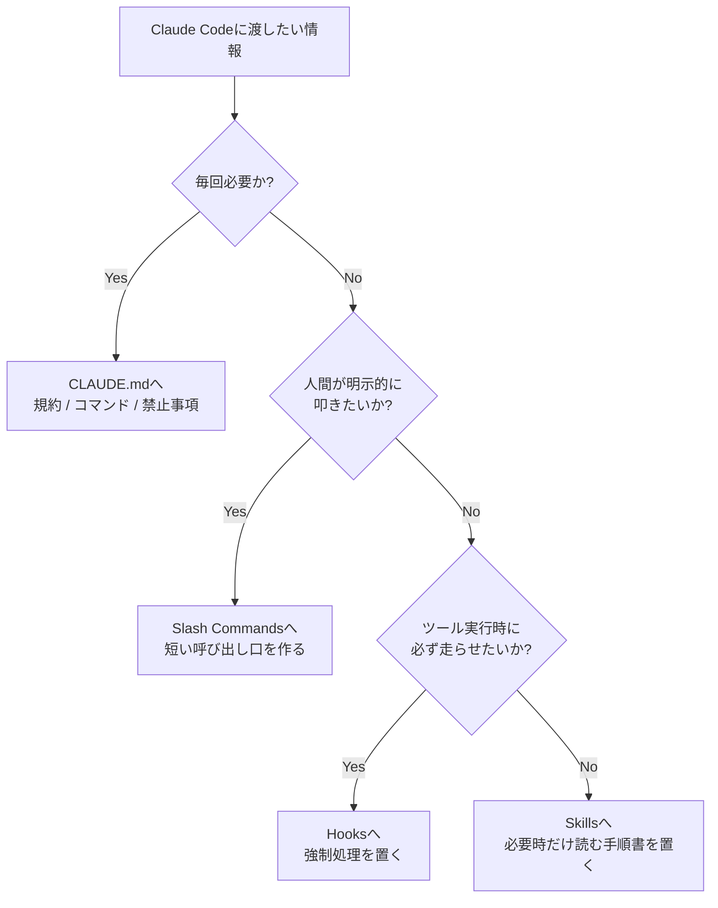
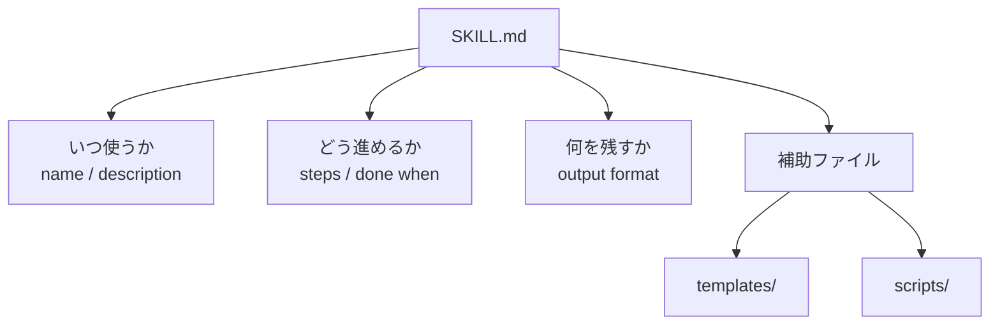

## はじめに

Claude Codeを使い込むほど、私は同じことを何度も説明していました。

- 「まず公式ドキュメントを調べて」
- 「最後にレビューしてから公開して」
- 「このプロジェクトではこの順番で進めて」

最初は長文プロンプトをコピペすれば何とかなります。ですが、しばらく続けると**プロンプトが資産ではなく負債**になってきます。

私はこの問題にぶつかったあと、`CLAUDE.md` に何でも詰め込むのをやめて、代わりに **Claude Code Skills** を使って作業フローを部品化するようになりました。すると、毎回の説明コストがかなり減り、同じ品質で繰り返せる作業も増えました。

この記事で得られるものは次の3つです。

- Claude Code Skills が何者で、どんな場面で効くのか
- `SKILL.md` の最小構成と、実務で壊れにくい設計ポイント
- `CLAUDE.md` / Slash Commands / Hooks とどう住み分けるべきか

**対象読者**: Claude Codeの基本操作はできるが、長文プロンプトや定型作業の整理に悩み始めた人

:::message
本記事は2026年3月時点の公開情報と、私が実際にClaude Codeのスキル群を組んで試した経験をもとに書いています。公式ドキュメントは [Claude Code Skills](https://code.claude.com/docs/en/skills) と [Best Practices](https://code.claude.com/docs/en/best-practices) を参照してください。
:::

---

## なぜSkillsが必要か：`CLAUDE.md` に何でも書くと破綻する

Claude Codeには、同じ「設定っぽいもの」でも役割の違う仕組みがいくつかあります。

最初の私はこの違いを理解しておらず、繰り返し作業の手順まで `CLAUDE.md` に押し込んでいました。すると、セッション開始時に毎回読ませる情報が増え、**本当に大事なルールと、その場だけ必要な手順が混ざってしまう**んですよね。

Skillsを使うようになってから、「常時読ませるべき情報」と「必要になったときだけ読むべき手順」を分けて考えられるようになりました。



### 4つの仕組みの住み分け

| 仕組み | 役割 | 向いていること | 私の判断基準 |
|------|------|----------------|--------------|
| `CLAUDE.md` | 常時読む前提知識 | コーディング規約、よく使うコマンド、禁止事項 | 毎回必要ならここ |
| Slash Commands | 人間が叩くショートカット | 定型プロンプトの短縮 | 自分で呼ぶならここ |
| Hooks | ツール実行時の自動処理 | 自動フォーマット、危険コマンド防止 | 必ず実行したいならここ |
| Skills | 必要時だけ展開するワークフロー | 調査、レビュー、記事執筆、運用手順 | 条件つきで読むならここ |

ここで大事なのが、Skillsは「便利な命令」ではなく**再利用可能な業務フロー**だという点です。

公式ドキュメントでも、Skillsは必要な場面でだけ読み込まれる前提で設計されています。私はこれを、IDEの補完というより「必要になったときだけ開く運用手順書」に近いものだと理解しています。

---

## Claude Code Skillsとは何か：`SKILL.md` が入口になる

Skillsはフォルダ単位で定義します。最小構成なら、まずは `SKILL.md` が1枚あれば始められます。

```text
.claude/
└── skills/
    └── api-research/
        └── SKILL.md
```

中身はただのMarkdownですが、ここに **いつ使うか** と **どう進めるか** を書いていきます。

```markdown
---
name: api-research
description: APIを調査し、要点と注意点をまとめるスキル。
---

# API Research

## Steps
1. 公式ドキュメントを確認する
2. 認証方式と主要エンドポイントを整理する
3. サンプルコードを作る
4. ハマりポイントを一覧化する
```

### `name` より `description` が重要だった

実際にいくつかSkillを作ってみて、いちばん差が出たのは `description` でした。

たとえば次の2つを比べてみます。

```markdown
---
name: useful-skill
description: 便利なスキルです。
---
```

```markdown
---
name: tdd-cycle
description: テストを書いてから実装し、Red-Green-Refactorを回したいときに使うスキル。
---
```

後者のほうが「どんな場面で呼ばれるべきか」が圧倒的に明確です。私は最初、`description` を短く書きすぎてうまく使い分けられず、あとでかなり書き直しました。

### Progressive Disclosureをどう理解したか

Skillsの面白いところは、最初から全部の本文を読ませる前提ではないことです。

私はこれを「引き出し型の知識」と捉えるようにしています。

- `CLAUDE.md` は机の上に出しっぱなしのメモ
- Skills は必要になったときだけ開くファイル

この発想に切り替えると、`CLAUDE.md` を肥大化させずに済みますし、長い手順書も整理しやすくなりました。

---

## 実際にやってみた: 最小のSkillを1つ作る

ここからは、私が最初に試した作り方をそのまま紹介します。

### ステップ1: まずは1責務だけに絞る

最初から「全部入りSkill」を作ると失敗しやすいです。

私は最初、調査・実装・テスト・レビューを1つのSkillに入れようとして、完全に迷子になりました。結局、次のように分けたほうがうまくいきました。

```text
.claude/
└── skills/
    ├── api-research/
    │   └── SKILL.md
    ├── api-implementation/
    │   └── SKILL.md
    └── api-review/
        └── SKILL.md
```

最小の雛形を作るだけなら、私はまず次のコマンドから始めます。

```bash
mkdir -p .claude/skills/api-research
$EDITOR .claude/skills/api-research/SKILL.md
```

`$EDITOR` が面倒なら、最初は手書きで1ファイル作るだけでも十分です。
大事なのは「Skillを作ること」より、**何を1つの責務として切り出すか**を先に決めることでした。

### ステップ2: 完了条件を書く

Skillは手順だけ書くと、再利用したときにブレます。私は**完了条件**を書き始めてから安定しました。

```markdown
# API Research

## Steps
1. 公式ドキュメントを確認する
2. 認証方式を整理する
3. サンプルコードを作る
4. 注意点をまとめる

## Done when
- 主要エンドポイントが表で整理されている
- 認証方式が説明されている
- 動作確認用コード例がある
- ハマりポイントが3つ以上ある
```

この「Done when」があるだけで、Claude Codeに任せたときの終わり方がかなり揃います。

### ステップ3: その場で使うサンプルを一緒に置く

私はMarkdownの指示だけで終わらせるより、テンプレートやスクリプトも同梱するほうが使いやすいと感じました。

```text
my-skill/
├── SKILL.md
├── templates/
│   └── incident-report.md
└── scripts/
    └── collect-logs.sh
```

こうしておくと、「調べて終わり」ではなく「調べた結果をどの形式で残すか」までワークフローに含められます。

### ステップ4: 再利用できたかで検証する

私は最初、1回動いただけで満足していました。でもSkillは、**2回目も同じ品質で使えるか**を見ないと意味がありません。

そこで今は、最低でも次の3点を確認しています。

- 同僚や別セッションが読んでも同じ手順で進められるか
- 完了条件まで見れば「終わったかどうか」を判断できるか
- 出力形式が揃っていて、あとから読めるか

Skillは単発成功より、再利用できることのほうが価値が高いです。

---

## 実際にやってみた: チームで使えるSkillに育てる

最小のSkillが動いたら、次は「自分だけ便利」から「チームで再利用できる」に育てます。

私が意識したのは、`SKILL.md` を単なるメモではなく、**チームの作業標準**として書くことでした。



### チーム運用で効いた3つの工夫

#### 1. output format を固定する

Skillの成果物が毎回バラつくと、読み手がつらいです。

たとえばレビューSkillなら、私は次のような出力を固定するようにしました。

```markdown
## Summary
- 変更の要約

## Risks
- リスク1
- リスク2

## Required fixes
- 必須修正1
- 必須修正2
```

これだけで、あとから見返したときの認知負荷がかなり下がります。

#### 2. 依存関係をSkill側で説明する

大きい作業では、1つのSkillだけで完結しません。

たとえば私は記事執筆のワークフローを分けるとき、

- 調査
- 企画
- 執筆
- レビュー
- 公開

のようにステップを切って、それぞれのSkillが**次に何へ渡すか**まで書くようにしました。

これをやると、ワークフロー全体をあとから見直しやすくなります。

#### 3. 「どこまで自動で判断するか」を明記する

Skillsを使っていて意外と難しかったのがここでした。

自動判断しすぎると暴走しやすく、確認を増やしすぎると毎回止まります。私は、次のように整理すると安定しました。

| 自動判断してよいもの | 確認を残したほうがよいもの |
|--------------------|---------------------------|
| ファイル保存先、整形手順、調査順序 | 本番公開、破壊的操作、外部送信 |

この線引きをSkill本文に書いておくと、あとから挙動を修正しやすいです。

---

## `CLAUDE.md` / Commands / Hooks / Skills をどう使い分けるか

ここは混同しやすいので、私が今使っている基準をもう一度まとめます。

| 置き場所 | 何を書くか | 具体例 |
|---------|------------|--------|
| `CLAUDE.md` | 毎回必要な文脈 | 利用言語、テストコマンド、禁止事項 |
| `.claude/commands/` | 自分で叩く短い入口 | `/review`, `/commit` |
| `.claude/settings.json` の Hooks | 必ず走る処理 | format、危険コマンド防止 |
| `.claude/skills/` | 長い手順書・再利用フロー | 調査、レビュー、記事執筆、運用チェック |

私の感覚では、次の質問で判定すると迷いにくいです。

1. **毎回必要か？** → `CLAUDE.md`
2. **自分で短く呼びたいか？** → Commands
3. **必ず走らせたいか？** → Hooks
4. **必要時だけ詳細手順を読みたいか？** → Skills

この4問でだいたい整理できます。

---

## ハマりポイント・注意事項

Skillsは便利ですが、私は何度か同じ失敗をしました。

### 1. `description` が曖昧で呼ばれない

これは本当にありがちでした。

「便利なスキル」「レビュー用スキル」みたいに書くと、どこで使うのかがぼやけます。私は**誰が見ても発火条件が分かる日本語**にしたほうが安定しました。

### 2. 1つのSkillに責務を詰め込みすぎる

調査も、実装も、テストも、レビューも1つに入れると、結果的に巨大な手順書になります。

読む側もつらいし、直す側もつらいです。私は「1 Skill 1責務」に切ってから保守が一気に楽になりました。

### 3. 手順だけで検証がない

Skillの本文に Steps だけ書いて満足すると、次に使ったときに「どこまでやれば終わりなのか」が分かりません。

完了条件、出力形式、次に渡す先まで書いておくと、かなり壊れにくくなります。

:::message alert
最初から完璧なSkillを作ろうとしないほうがうまくいきます。まずは **1 Skill 1責務** で小さく作り、`description`・完了条件・出力形式の3点だけでも先に固めるのがおすすめです。
:::

---

## まとめ

最後に、この記事の要点を表で振り返ります。

| 論点 | 結論 |
|------|------|
| Skillsは何か | 必要時だけ読む再利用可能なワークフロー |
| `SKILL.md` で重要なもの | `description`、Steps、完了条件、出力形式 |
| どこに効くか | 長文プロンプトの削減、チーム標準化、文脈整理 |
| よくある失敗 | 曖昧なdescription、責務過多、検証不足 |

Claude Codeを使っていて「毎回同じことを説明している」と感じたら、それはSkill化のサインかもしれません。

次の一歩としては、まず自分の繰り返し作業を1つだけ選び、次の最小構成で `SKILL.md` を作ってみるのがおすすめです。

```markdown
---
name: your-skill
description: どんな場面で使うスキルかを具体的に書く。
---

# Skill Title

## Steps
1. 手順1
2. 手順2
3. 手順3

## Done when
- 完了条件1
- 完了条件2
```

ここまで作れれば、もう「長文プロンプトをコピペするだけの運用」からは卒業できます。

さらに深掘りしたい人は、次の資料もおすすめです。

- [Claude Code Skills 公式ドキュメント](https://code.claude.com/docs/en/skills)
- [Claude Code Best Practices](https://code.claude.com/docs/en/best-practices)
- [anthropics/skills リポジトリ](https://github.com/anthropics/skills)
