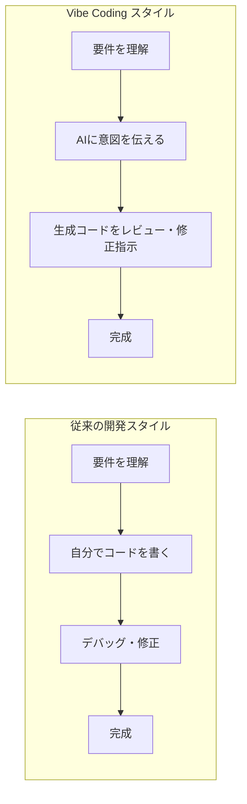
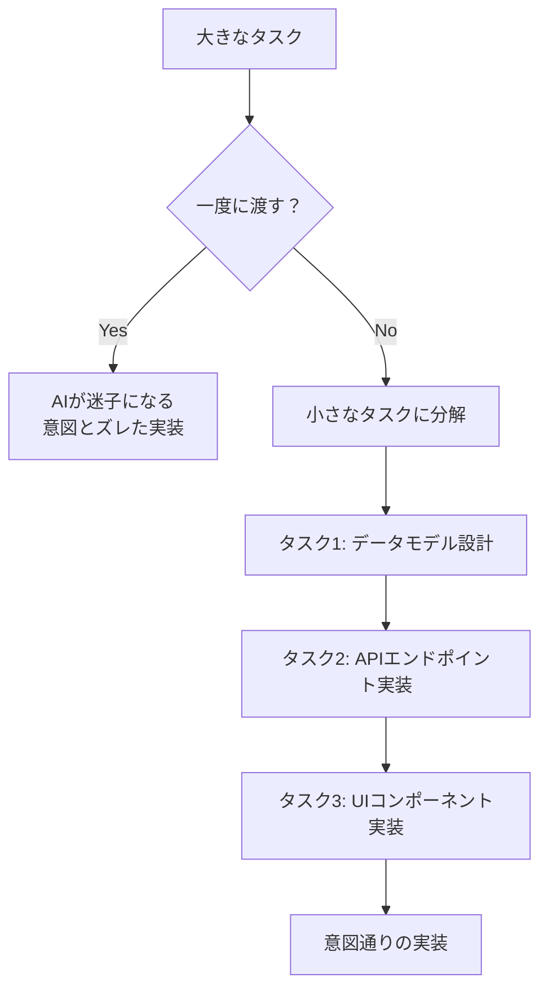
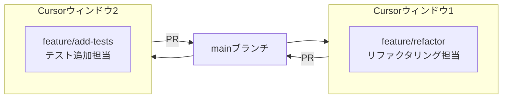

## はじめに

「GitHub Copilotは使ってるけど、Cursorって結局どう違うの？」

そう思っていたのが半年前の自分です。試しにCursorを入れてみたものの、最初は「高機能なCopilot」程度にしか使っていませんでした。

転機は **Vibe Coding** という概念を知ったことでした。

Vibe Codingとは、AIコーディングエディタに「雰囲気（vibe）」で指示を出し、コードを生成・修正させる開発スタイル。人間の役割が「コードを書く人」から「意図を伝えて判断する人」へシフトします。

この記事では、Cursorを半年使い込んで体得した**7つの実践テクニック**と、やらかしてから気づいた**3つの落とし穴**を紹介します。

**この記事で得られること：**
- Vibe Codingで何がどう変わるか、具体的なイメージが持てる
- `.cursor/rules`・Plan Mode・`@記法`など実務で効く7テクニックを習得できる
- 技術的負債・セキュリティリスクなど、よくある失敗を事前に回避できる

**対象読者：**
- CursorをインストールしたけどCopilotと同じ使い方しかしていない人
- Vibe Codingに興味はあるが、実際の使い方がわからない人
- TypeScript/React等のWebフロントエンド開発をしている人

:::message
**TL;DR — テクニック早見表**

| # | テクニック | 効果 |
|---|-----------|------|
| 1 | Plan Modeで計画させてから実装 | 大きなタスクの失敗を減らす |
| 2 | `.cursor/rules`でプロジェクト規約を記憶させる | 命名ブレ・規約違反が激減 |
| 3 | `@記法`でコンテキストを絞り込む | AIの回答精度が上がる |
| 4 | 大きなタスクを小さく分解して渡す | 意図通りの実装になりやすい |
| 5 | 変更前は必ずgit commit | 巻き戻しを安全にできる |
| 6 | 生成コードを必ず読む | ブラックボックス化を防ぐ |
| 7 | マルチエージェントで並列作業（上級） | さらなる高速化 |
:::

---

## Vibe Codingとは何か〜なぜ今これが熱いのか

Vibe Codingは2025年、OpenAIのリサーチャーでもある **Andrej Karpathy** が提唱した開発スタイルです。

> "There's a new kind of coding I call 'vibe coding', where you fully give in to the vibes, embrace exponentials, and forget that the code even exists."

一言で言うと、**「コードそのものより意図・目的を伝えることに集中する」** 開発スタイルです。

従来の開発と比較してみます：



人間がコードを「書く」のではなく「レビューして方向を修正する」役割になります。

**なぜ2026年に熱いか：**
- CursorのAgent Modeが複数ファイルを横断して自律的に編集できるようになった
- AIモデルの精度向上で「雑なプロンプトでもそれなりに動くコードが出る」ようになった
- 個人開発・プロトタイプにおける開発速度が従来の**3〜10倍**という体験談が続出

---

## Cursorのここが違う〜主要機能を理解する

Cursorに入門してまず混乱するのが「Chat・Composer・Agent・Plan Modeって何が違うの？」という点です。整理します。

| モード | 用途 | 開き方 |
|--------|------|-------------|
| **Chat** | コードについての質問・説明・コードベース検索 | `Cmd+L` |
| **インライン編集** | カーソル位置で直接AIに修正を依頼 | `Cmd+K` |
| **Composer（Agent Mode）** | 複数ファイルを横断した大規模編集・テスト実行まで自律的に行う | `Cmd+I` |
| **Plan Mode** | Composer内で実装前に計画を立てさせてレビューする | Composer入力で `Shift+Tab` |
| **Tab補完** | カーソル位置のインライン予測補完 | `Tab` |

**自分がよくやっていた失敗：「なんでも Chat に投げる」**

最初は全部 `Cmd+L` のChatに投げていました。「新しいページを追加して」とChatに頼んでも、提案はしてくれるものの、実際にファイルを作ったり既存ファイルを編集したりはしてくれません。

「大きなタスク → Composer（Agent Mode）」「質問・調査 → Chat」「その場で1行修正 → インライン編集（Cmd+K）」と使い分けることで格段に生産性が上がりました。

---

## テクニック7選

### テクニック1：Plan Modeで「まず計画させる」

大きなタスクをAgent Modeにいきなり任せると、意図と違う実装になることがあります。

Plan Mode を使うと、AIが「実装前に計画を立てて提示」してくれます。

**使い方：**
1. Composerを開く（`Cmd+I`）
2. 入力欄で `Shift+Tab` を押して Plan Mode に切り替え
3. 「〇〇機能を実装したい。まず計画を立てて」と指示
4. AIが計画を提示 → **必ず読んで確認・修正**
5. OKなら「この計画で実装して」と追加指示

```
❌ 「ユーザー認証機能を追加して」といきなりAgent Modeに頼む

✅ Plan Modeで「ユーザー認証機能を追加したい。
   JWT + bcrypt を使う構成で計画を立てて」と依頼
   → 計画を確認してから「この計画で実装して」と依頼
```

計画を事前にレビューすることで、「想定外のファイルを書き換えられた」「使いたいライブラリが違った」というミスが大幅に減りました。

---

### テクニック2：`.cursor/rules`でAIに「プロジェクトの規約」を覚えさせる

Cursorのデフォルト状態では、AIはあなたのプロジェクトの規約を知りません。その結果、毎回「TypeScriptで書いて」「Tailwindを使って」と言い続ける羽目になります。

`.cursor/rules` ディレクトリにルールファイル（`.mdc`形式）を置くと、AIが毎回自動で読み込んでくれます。

**ディレクトリ構成：**

```
your-project/
└── .cursor/
    └── rules/
        ├── 001-core.mdc        # プロジェクト基本規約（常時適用）
        ├── 100-react.mdc       # React/TypeScript規約
        └── 200-testing.mdc     # テスト規約
```

**実際に使っている `001-core.mdc` の例：**

```yaml
---
description: "プロジェクト基本規約"
alwaysApply: true
---

# 技術スタック
- TypeScript 5.x + React 19
- Tailwind CSS（スタイリング）
- Zustand（グローバル状態管理）
- TanStack Query（サーバーサイドデータ）

# コーディング規約
- 変数：camelCase、コンポーネント名：PascalCase
- `any` 型は使用禁止。`unknown` を使うこと
- 関数コンポーネントのみ使用（クラスコンポーネント禁止）
- Props には必ず型定義を付ける

# ディレクトリ構造
- `src/components/` — 再利用可能なUIコンポーネント
- `src/features/` — ドメインごとの機能
- `src/hooks/` — カスタムHooks
- `src/lib/` — ユーティリティ関数
```

`alwaysApply: true` にすると、どの作業中でも常にAIがこのルールを守ります。

:::message
**チームで使うなら `.cursor/rules` を Git に入れよう**

`.cursor/rules` を Git で管理することで、チーム全員が同じルールでAIを使えます。新メンバーがCursorを開いた瞬間から規約準拠のコード提案が得られます。

参考：[awesome-cursorrules](https://github.com/PatrickJS/awesome-cursorrules) に多数のサンプルがあります。
:::

---

### テクニック3：`@記法`でコンテキストを絞り込む

Cursorでは `@` を使ってAIに渡す「文脈」を指定できます。

| 記法 | 何を参照するか |
|------|-------------|
| `@ファイル名` | 特定のファイルをAIに読ませる |
| `@フォルダ` | フォルダ全体をコンテキストに含める |
| `@シンボル` | 関数名・クラス名で直接指す |
| `@Docs` | 指定したURLのドキュメントを参照 |
| `@codebase` | プロジェクト全体を深く解析（重い） |
| `@git` | コミット履歴・差分を参照 |

**具体例：**

```
「@src/features/auth/useAuth.ts を参考に、
 @src/features/cart/ にカート用のカスタムHookを作って」
```

:::message alert
**コンテキストを入れすぎると逆効果**

`@codebase` を毎回使うと、AIに渡す情報が多すぎて焦点がぼやけることがあります。「関係するファイルだけ`@`で指定する」のが精度を高めるコツです。
:::

---

### テクニック4：大きなタスクを「小さく分解して渡す」

「ECサイトの商品管理画面を全部作って」という指示は失敗しやすいです。



**分解の目安：**
- 1つのAgentセッションで変更するファイルが**5ファイル以内**に収まるくらいが最適
- 「まずデータ層を作って → 動作確認 → 次にUIを作って」と順番に依頼する
- 各ステップで必ず動作確認してから次へ進む

---

### テクニック5：変更前は必ずgit commit（セーフティネット）

Cursorの Agent Mode は複数ファイルを一気に書き換えます。うまくいかなかったときに「元に戻せる状態」を作っておくことが重要です。

**習慣化しているフロー：**

```bash
# Agentに大きな変更を依頼する前に必ずコミット
git add -A && git commit -m "WIP: before cursor agent refactor"

# Agentに依頼
# → 動作確認
# → OKならそのまま続行、NGなら git checkout でリセット
```

:::message alert
**「一回のAgentセッションで大量修正」は危険**

複数機能を一気に修正させると、途中で何かがおかしくなっても「どこから間違えたか」が追いにくくなります。こまめにコミットして逃げ道を作ることを強くおすすめします。
:::

---

### テクニック6：生成されたコードを必ず読む

これが一番大事なテクニックかもしれません。

Vibe Codingの最大の誘惑は「コードを読まなくていい」という錯覚です。実際、**AIが生成したコードを読まずにマージし続けると、しばらくして誰も中身を理解していないコードベースが出来上がります**。

**実際にやらかした話：**

ある日、AIがnpmパッケージの追加を提案してきたので何も考えずに `npm install` しました。後から調べてみると、そのパッケージは**実在しない架空のパッケージ名**でした（「パッケージhallucination」と呼ばれる現象）。

今では必ず以下を確認するようにしています：

```bash
# パッケージを追加する前に必ず確認
npm info <パッケージ名>

# 存在しないパッケージはこんな出力になる
# npm error 404 Not Found - GET https://registry.npmjs.org/<パッケージ名>
```

**コードレビューのポイント：**
- 追加されたimportが実在するものか確認
- セキュリティ上の懸念がないか（ユーザー入力のエスケープ等）
- 自分がロジックを説明できるか（説明できないコードはマージしない）

---

### テクニック7：マルチエージェントで並列作業させる（上級）

Cursorを複数ウィンドウ開き、`git worktrees` を使って並列作業させる高度なテクニックです。

```bash
# メインブランチとは別にworktreeを作成
git worktree add ../my-project-refactor feature/refactor
git worktree add ../my-project-tests feature/add-tests
```

これで2つのCursorウィンドウが別々のブランチを編集できます。一方でリファクタ、もう一方でテスト追加を並行して進められます。



:::message
**注意**: 各worktreeは独立したファイルシステムを持ちます。`node_modules` が共有されないため、worktreeごとに `npm install` が必要です。また、同じファイルを2つのウィンドウで同時編集するとコンフリクトが発生するので、作業範囲を明確に分けて使いましょう。
:::

---

## 落とし穴3選〜Vibe Codingで失敗しないために

ここまではテクニックを紹介しましたが、Vibe Codingには落とし穴もあります。自分が実際に踏んだものを正直に書きます。

### 落とし穴1：技術的負債の蓄積

「とりあえず動けばいい」でAIの提案を全部acceptしていると、数週間後に命名規則がバラバラ・同じロジックが3か所にある・誰も理解していないコードが出来上がります。

GitClear の調査では、AIコーディングツールの普及後に**コードの重複が2倍以上に増加**した傾向が報告されています。

**対策：**
- `.cursor/rules` で規約を強制する（テクニック2）
- 週1回など定期的にリファクタリングの時間を取る
- AIの提案を全acceptせず、自分でコードレビューする習慣を持つ

---

### 落とし穴2：セキュリティリスク

AIが生成するコードの**40〜60%に何らかの脆弱性が含まれる**という研究報告があります（複数のセキュリティ研究機関による調査）。特に：

- SQLインジェクション対策が抜けているDB操作
- ユーザー入力のバリデーション・エスケープ漏れ
- 架空パッケージのhallucination（前述）

:::message alert
**本番コードのセキュリティは必ず人間がレビューすること**

特にユーザー認証・決済・個人情報を扱うコードは、AIが生成したままマージしないでください。セキュリティ専門知識を持った人間のレビューが必須です。
:::

---

### 落とし穴3：スキルロット（スキルの衰退）

「AIが書いてくれるから自分でデバッグしなくていい」という習慣が続くと、デバッグ力・設計力が徐々に衰えていきます。

Microsoftの研究でも、AIコーディングツールへの過度な依存が**エンジニアの問題解決能力の低下**につながる可能性が指摘されています。

**対策：**
- 定期的にAIなしで小さな機能を実装してみる
- AIが提案したコードを「自分ならどう書くか」と考える習慣を持つ
- Vibe Codingはプロトタイプ・反復的な実装に使い、コアロジックは自分で設計する

---

### Vibe Codingの使い分けガイド

| 用途 | Vibe Codingの適性 | 理由 |
|------|----------------|------|
| プロトタイプ・PoC | ✅ 最適 | 速度優先、品質は後から |
| 個人開発・内部ツール | ✅ 向いている | 保守コストが低い |
| ボイラープレートの大量生成 | ✅ 非常に効果的 | 繰り返し作業をAIに委ねる |
| 長期保守が前提のプロダクション | ⚠️ 注意が必要 | 設計・レビューを徹底的に |
| セキュリティ要件が厳しい機能 | ⚠️ 要注意 | 必ず人間がレビュー |
| 学習・スキルアップ目的 | ❌ 向いていない | 自分で書くことが大事 |

---

## まとめ

Vibe Codingは「魔法のツール」ではなく「優秀な部下にコードを任せる技術」です。

使い方を間違えると技術的負債を爆速で積み上げますが、正しく使えばプロトタイプの開発速度が劇的に上がります。

**7つのテクニックの振り返り：**

| # | テクニック | 一言まとめ |
|---|-----------|----------|
| 1 | Plan Modeで計画させてから実装 | 「作ってから考える」をやめる |
| 2 | `.cursor/rules`でプロジェクト規約を記憶 | 毎回同じ説明をしなくて済む |
| 3 | `@記法`でコンテキストを絞り込む | 渡す情報の質が精度を決める |
| 4 | タスクを小さく分解して渡す | 1セッションで5ファイル以内が目安 |
| 5 | 変更前に必ずgit commit | 逃げ道を作ってから突撃する |
| 6 | 生成コードを必ず読む | 最終責任は自分にある |
| 7 | マルチエージェントで並列作業 | worktrees + 複数ウィンドウ |

---

**次のステップ：**
- [Cursor 公式: エージェントのベストプラクティス](https://cursor.com/blog/agent-best-practices)
- [awesome-cursorrules](https://github.com/PatrickJS/awesome-cursorrules) — `.cursor/rules` のサンプル集
- [Zenn: Cursor Rules の使い方](https://zenn.dev/aiforall/articles/c260dcfd82c487)

Cursorを使い始めたばかりの方の参考になれば嬉しいです 🚀
