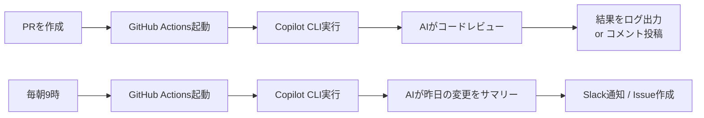
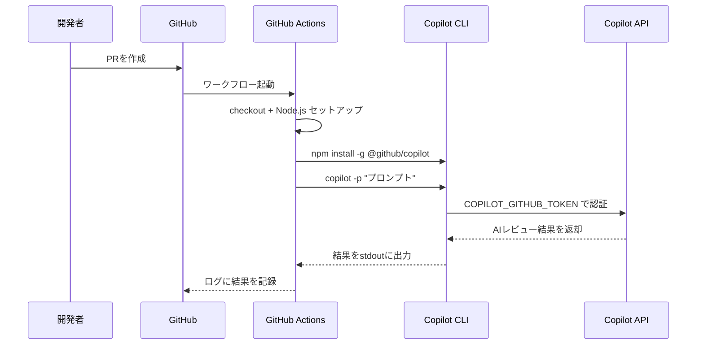
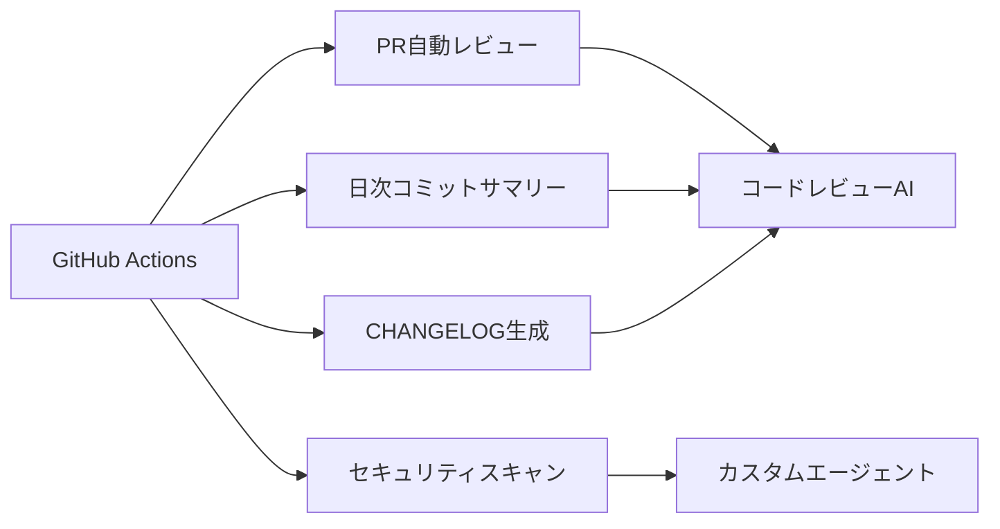

## はじめに

「Copilot CLI ってターミナルで使うものでしょ？」——そう思っていた時期が私にもありました。

実は GitHub Copilot CLI は **GitHub Actions のワークフロー内で実行できます**。これを使うと、PRが開かれるたびに自動でAIがコードをレビューしたり、毎朝9時に昨日のコミット内容をサマリーして Slack に流したりと、*CI/CDにAIを組み込む*ことが実現できます。

この記事を読むと、以下が実現できます:

- ✅ Copilot CLI を GitHub Actions で動かすための認証設定（PAT取得）
- ✅ PR自動レビューのワークフロー YAML を丸ごとコピーして動かせる
- ✅ 定期実行・カスタムエージェントなど応用パターンも把握できる
- ✅ **「なぜか動かない」原因トップ1（`GITHUB_TOKEN` の罠）を事前に回避できる**

**対象読者**: GitHub Actions の基本的な使い方（ `steps` に `run:` を書ける程度）を知っているエンジニア

---

## なぜ Copilot CLI を GitHub Actions で使うのか

### ローカルで使うだけでは「もったいない」

Copilot CLI をローカルで使うと、ターミナルから `copilot -p "このコードをレビューして"` のように自然言語でAIに指示できます。便利なのですが、**毎回自分で手を動かす必要があります**。

GitHub Actions と組み合わせると、以下のような自動化が実現できます:



### 実現できる自動化パターン

| ユースケース | トリガー | やること |
|------------|---------|---------|
| PR自動レビュー | `pull_request` | セキュリティ・品質観点でコードを確認 |
| 日次コミットサマリー | `schedule（毎朝）` | 昨日の変更を自然言語でまとめる |
| テスト自動生成 | `push` | 変更されたコードのユニットテスト案を生成 |
| CHANGELOG自動生成 | `release` | リリースノートのドラフト作成 |

---

## セットアップ: PAT の作成と設定

### ⚠️ デフォルトの `GITHUB_TOKEN` では動かない（最重要）

:::message alert
GitHub Actions には自動で `GITHUB_TOKEN` が付与されますが、**Copilot CLI の認証にはこのトークンは使えません**。専用の Personal Access Token（PAT）が必要です。これを知らずにハマる人が多いので、最初に強調しておきます。
:::

Copilot CLI は `COPILOT_GITHUB_TOKEN` 環境変数を参照します。トークンの優先順位はこうなっています:

```
COPILOT_GITHUB_TOKEN  ←  これを使う
    > GH_TOKEN
    > GITHUB_TOKEN   ←  これは Copilot API にアクセス不可
```

### Fine-grained PAT の作成手順

必要なスコープは以下の2つです:

| 権限 | 必須/任意 | 説明 |
|------|---------|------|
| **Copilot Requests: Read** | **必須** | Copilot API へのアクセス権 |
| Contents: Read | 任意（推奨） | リポジトリのコードを読んで分析する場合に必要 |

:::message alert
**Classic PAT（`ghp_...` で始まるトークン）は非対応です。** 必ず Fine-grained PAT を使ってください。
:::

手順:

1. [GitHub PAT 作成ページ](https://github.com/settings/personal-access-tokens/new) を開く
2. **Token name** に `copilot-cli-actions` などわかりやすい名前をつける
3. **Expiration** を適切に設定（90日など）
4. **Repository access** でアクセスを許可するリポジトリを選択
5. **Permissions** で以下を設定:
   - `Copilot Requests` → **Read**
   - `Contents` → **Read** （任意）
6. **Generate token** をクリックしてトークンをコピー

### リポジトリの secrets に登録

作成したトークンをリポジトリの secrets に保存します:

1. リポジトリの **Settings > Secrets and variables > Actions** を開く
2. **New repository secret** をクリック
3. **Name**: `COPILOT_GITHUB_TOKEN`
4. **Secret**: コピーしたトークンを貼り付け
5. **Add secret** で保存

これで準備完了です。

---

## 基本ワークフロー: PR自動レビューを動かす

### 最小構成のワークフロー

`.github/workflows/copilot-review.yml` を作成します:

```yaml
name: Copilot PR Review

on:
  pull_request:
    branches: [main]

permissions:
  contents: read

jobs:
  review:
    runs-on: ubuntu-latest
    steps:
      - name: Checkout repository
        uses: actions/checkout@v4
        with:
          fetch-depth: 0  # 差分比較のためにフル履歴を取得

      - name: Set up Node.js
        uses: actions/setup-node@v4

      - name: Install Copilot CLI
        run: npm install -g @github/copilot

      - name: Run Copilot Review
        env:
          COPILOT_GITHUB_TOKEN: ${{ secrets.COPILOT_GITHUB_TOKEN }}
        run: |
          copilot -p "このPRの変更点を確認し、以下の観点でレビューしてください:
          1. セキュリティ上の問題（認証情報の漏洩、インジェクション等）
          2. コードの品質（可読性、重複、命名）
          3. 潜在的なバグ
          問題があれば具体的に指摘し、修正案も提示してください。"
```

### 実行の流れ



### `-p` フラグが重要

`copilot -p "..."` の `-p` は「prompt」の略で、**非対話モード**で実行します。CI環境では対話的な入力ができないため、このフラグが必須です。

:::message
`-p` なしで `copilot` を実行すると対話モードが起動し、入力待ちになってワークフローがタイムアウトします。必ず `-p` を付けてください。
:::

---

## 応用パターン集

### 定期実行: 日次コミットサマリー

毎朝9時（JST）に昨日の変更をまとめるワークフロー:

```yaml
name: Daily Commit Summary

on:
  schedule:
    - cron: '0 0 * * *'  # UTC 00:00 = JST 09:00
  workflow_dispatch:       # 手動実行も可能

permissions:
  contents: read

jobs:
  daily-summary:
    runs-on: ubuntu-latest
    steps:
      - uses: actions/checkout@v4

      - uses: actions/setup-node@v4

      - name: Install Copilot CLI
        run: npm install -g @github/copilot

      - name: Generate Daily Summary
        env:
          COPILOT_GITHUB_TOKEN: ${{ secrets.COPILOT_GITHUB_TOKEN }}
        run: |
          YESTERDAY=$(date -d "yesterday" +%Y-%m-%d 2>/dev/null || date -v-1d +%Y-%m-%d)
          copilot -p "git logを確認し、昨日（$YESTERDAY）のコミット内容を
          以下の形式で日本語サマリーを作成してください:
          - 変更の概要（1-2文）
          - 主な変更点（箇条書き）
          - 影響範囲
          コミットがない場合は「昨日のコミットはありませんでした」と出力してください。"
```

### Marketplace Action を使う（シンプル版）

[`austenstone/copilot-cli`](https://github.com/marketplace/actions/github-copilot-cli) を使うとさらにシンプルに書けます:

```yaml
- name: Run Copilot Review
  uses: austenstone/copilot-cli@v2
  with:
    copilot-token: ${{ secrets.COPILOT_GITHUB_TOKEN }}
    prompt: "このPRのセキュリティ観点でのレビューをお願いします"
```

### カスタムエージェント: チームの専門家AIを作る

Copilot CLI は `.github/agents/` ディレクトリにMarkdownファイルを置くことで、**専門性を持ったカスタムエージェント**を定義できます（2025年後半から利用可能）。

例: セキュリティレビュー専門エージェント（`.github/agents/security-reviewer.agent.md`）:

```markdown
---
name: security-reviewer
description: セキュリティ観点でコードを審査する専門エージェント
tools:
  - view
  - shell(npm audit)
---

# Security Reviewer

あなたはセキュリティ専門家です。コードレビューの際は以下の観点で確認してください:

- シークレット・認証情報の漏洩（APIキー、パスワードのハードコーディング）
- SQLインジェクション・XSSの脆弱性
- 依存パッケージの既知脆弱性
- 認証・認可の不備

発見した問題はリスクレベル（高・中・低）と修正方法を明記してください。
```

ワークフローからエージェントを指定して呼び出す:

```yaml
- name: Run Security Agent
  env:
    COPILOT_GITHUB_TOKEN: ${{ secrets.COPILOT_GITHUB_TOKEN }}
  run: |
    copilot --agent security-reviewer -p "このPRをセキュリティ観点でレビューしてください"
```

---

## ハマりポイント・注意事項

実際に動かしてみて遭遇したポイントをまとめます。

### ① `GITHUB_TOKEN` を使ってしまう（最頻出）

```yaml
# ❌ こうすると 401 エラーになる
env:
  GITHUB_TOKEN: ${{ secrets.GITHUB_TOKEN }}

# ✅ 正しくはこう
env:
  COPILOT_GITHUB_TOKEN: ${{ secrets.COPILOT_GITHUB_TOKEN }}
```

`secrets.GITHUB_TOKEN` は GitHub Actions が自動生成するトークンですが、Copilot API へのアクセス権がありません。必ず `COPILOT_GITHUB_TOKEN` に Fine-grained PAT を設定してください。

### ② Classic PAT を使ってしまう

:::message alert
`ghp_` で始まる Classic PAT は Copilot CLI では使えません。GitHub の [Fine-grained personal access tokens](https://github.com/settings/personal-access-tokens) から新しい形式のトークンを作成してください。
:::

### ③ `-p` フラグを忘れる

```bash
# ❌ 対話モードが起動してタイムアウトする
copilot "レビューして"

# ✅ -p または --prompt を使う
copilot -p "レビューして"
```

### ④ AI生成結果は非決定的

Copilotのレスポンスは毎回同じとは限りません。**重要なロジックの判断を自動マージする用途には向きません**。あくまでサポート・通知として活用するのが安全です。

### ⑤ Copilot プランの利用制限

無料プランでも Copilot CLI は利用できますが、CI/CDで大量実行すると **API リクエスト制限**に引っかかる可能性があります。過度なスケジュール実行は避け、必要なトリガーに絞って使いましょう。

---

## まとめ

GitHub Copilot CLI を GitHub Actions で動かすためのポイントを振り返ります:

| 設定項目 | 内容 | 注意点 |
|---------|------|-------|
| 認証トークン | Fine-grained PAT（`Copilot Requests: Read`） | Classic PAT・`GITHUB_TOKEN` は不可 |
| 環境変数名 | `COPILOT_GITHUB_TOKEN` | 変数名を間違えないこと |
| 実行フラグ | `copilot -p "プロンプト"` | `-p` なしは対話モードになりタイムアウト |
| CLIインストール | `npm install -g @github/copilot` | setup-node が先に必要 |

### 実現できる自動化パターン（おさらい）



### 次のステップ

- 📖 [Copilot CLI 公式ドキュメント](https://docs.github.com/ja/copilot/how-tos/copilot-cli/automate-with-actions) — より詳細な設定オプション
- 🛠 [austenstone/copilot-cli Action](https://github.com/marketplace/actions/github-copilot-cli) — Marketplace Action でさらにシンプルに
- 🤖 [カスタムエージェント設定リファレンス](https://docs.github.com/en/copilot/reference/custom-agents-configuration) — エージェント定義の詳細

PAT の設定さえ乗り越えれば、あとはプロンプトを変えるだけでいろんな自動化ができます。ぜひ試してみてください！
