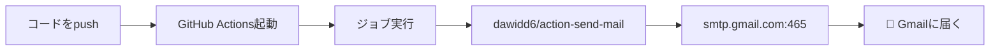
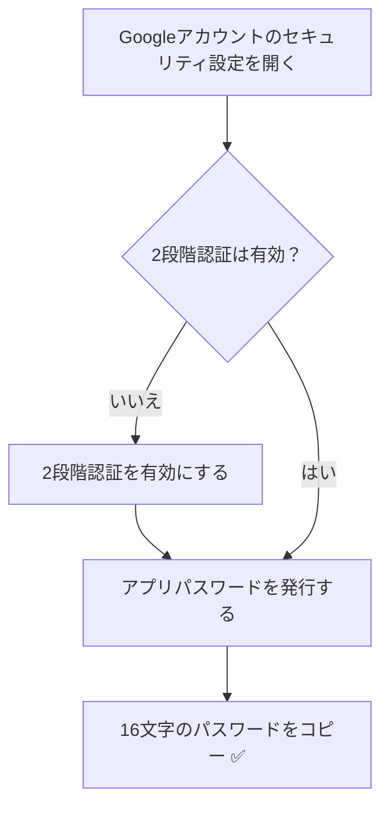
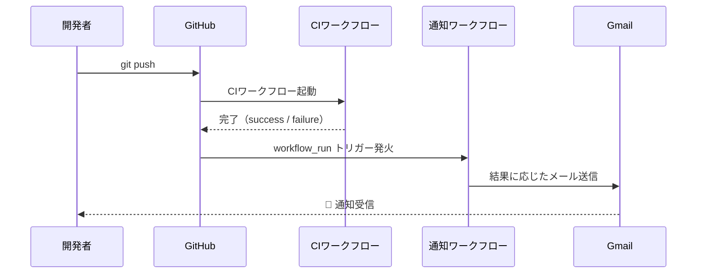

## はじめに

GitHub Actionsでビルドやデプロイを自動化したとき、「結果を通知したい」と思ったことはありませんか？

Slackが使えない個人プロジェクト、LINEは設定が面倒、そんな時に**Gmailは最も手軽な通知手段**です。Googleアカウントさえあれば追加の契約は不要で、SMTP経由で簡単に送信できます。

この記事では、**`dawidd6/action-send-mail`** というGitHub Marketplace製のアクションを使って、GitHub ActionsからGmailに通知を送る方法を実際に試した手順とともに解説します。

### この記事で得られること

- GmailのアプリパスワードをGitHub Secretsと連携する方法
- `dawidd6/action-send-mail` でpushトリガーのメール通知を作れる
- CIの成功/失敗で通知内容を出し分けられる（`workflow_run` 応用）
- ハマりやすいポイントとその解決策がわかる

### 対象読者

- GitHub Actionsのワークフロー（`.yml`）を触ったことがある方
- CI/CDの結果をメールで受け取りたい方

---

## なぜGmailで通知するのか

GitHub Actionsで通知を送る手段はいくつかあります。

| 通知手段 | 手軽さ | 前提条件 | コスト |
|---------|--------|---------|--------|
| **Gmail（SMTP）** | ✅ 簡単 | Googleアカウントのみ | 無料 |
| Slack | △ やや複雑 | Slackワークスペース + Webhook設定 | 無料枠あり |
| LINE Notify | ❌ 終了済み | ~~2025年3月に廃止~~ | - |
| LINE Messaging API | ❌ 複雑 | 公式アカウント作成・友達追加が必要 | 月200通まで無料 |
| SendGrid | △ 中程度 | SendGridアカウント登録 | 無料枠あり |

Gmailは**Googleアカウントさえあればすぐ使えて、無料で安定している**のが最大のメリットです。個人プロジェクトや小規模チームでの通知用途には十分すぎるほどです。

実際の通知の流れはこうなります。



---

## Gmail側の準備：アプリパスワードを発行する

最初に**Gmail側の設定**から始めます。ここが一番のつまずきポイントです。

:::message alert
GitHub Actionsから送信するとき、**通常のGmailパスワードは使えません**。必ず「アプリパスワード」を発行して使います。
:::

### 手順①：2段階認証を有効にする

アプリパスワードを発行するには、まずGoogleアカウントの**2段階認証が必須**です。

1. [Googleアカウントのセキュリティ設定](https://myaccount.google.com/security) を開く
2. 「2段階認証プロセス」をクリック
3. 画面に従って設定を完了する（電話番号 or 認証アプリ）

### 手順②：アプリパスワードを発行する

2段階認証が有効になったら、アプリパスワードを発行します。

1. [Googleアカウント セキュリティ設定](https://myaccount.google.com/security) を再度開く
2. 「2段階認証プロセス」のページへ移動
3. ページ下部の「アプリパスワード」をクリック
4. アプリ名に適当な名前（例: `GitHub Actions`）を入力して「作成」
5. 表示された**16文字のパスワードをコピー**する（画面を閉じると再表示できません）



---

## GitHub Secretsに認証情報を登録する

発行したアプリパスワードと送信元のGmailアドレスを、GitHubのSecrets（秘密変数）に登録します。**ワークフローファイルに直接書くのは絶対にNG**です。

### 登録するSecrets

| Secret名 | 登録する値 | 用途 |
|---------|-----------|------|
| `MAIL_USERNAME` | 送信元Gmailアドレス（例: `your@gmail.com`） | SMTP認証ユーザー |
| `MAIL_PASSWORD` | 先ほど発行した16文字のアプリパスワード | SMTP認証パスワード |
| `MAIL_TO` | 通知先メールアドレス | 宛先 |

### 登録手順

1. GitHubのリポジトリを開く
2. 「**Settings**」タブをクリック
3. 左メニューの「**Secrets and variables**」→「**Actions**」を選択
4. 「**New repository secret**」をクリック
5. 上の表の3つのSecretをそれぞれ登録する

---

## 基本のワークフローを作る

準備ができたら、実際にワークフローファイルを作成します。

リポジトリの `.github/workflows/` ディレクトリに `notify-email.yml` というファイルを作成してください。

```yaml
name: メール通知

on:
  push:
    branches: [main]

jobs:
  notify:
    runs-on: ubuntu-latest
    steps:
      - name: メールを送信する
        uses: dawidd6/action-send-mail@v3
        with:
          server_address: smtp.gmail.com
          server_port: 465
          username: ${{ secrets.MAIL_USERNAME }}
          password: ${{ secrets.MAIL_PASSWORD }}
          subject: "✅ デプロイ完了 - ${{ github.repository }}"
          to: ${{ secrets.MAIL_TO }}
          from: GitHub Actions <${{ secrets.MAIL_USERNAME }}>
          body: |
            デプロイが完了しました。

            リポジトリ: ${{ github.repository }}
            ブランチ: ${{ github.ref_name }}
            コミット: ${{ github.sha }}
            実行者: ${{ github.actor }}
```

このワークフローを `main` ブランチにpushすると、GitHub Actionsが起動してGmailに通知が届きます。

### 主要オプションの解説

`dawidd6/action-send-mail` のよく使うオプションをまとめました。

| オプション | 説明 | 例 |
|-----------|------|---|
| `server_address` | SMTPサーバーのアドレス | `smtp.gmail.com` |
| `server_port` | ポート番号 | `465`（SSL推奨） |
| `username` | 認証ユーザー | `${{ secrets.MAIL_USERNAME }}` |
| `password` | 認証パスワード | `${{ secrets.MAIL_PASSWORD }}` |
| `subject` | 件名 | GitHub Actions変数も使用可 |
| `to` | 宛先（カンマ区切りで複数可） | `a@example.com,b@example.com` |
| `from` | 差出人表示名 | `GitHub Actions <your@gmail.com>` |
| `body` | 本文（複数行OK） | `|` で複数行記述 |
| `html_body` | HTML形式の本文 | `<h1>完了</h1>` |
| `cc` / `bcc` | CC/BCC | 任意 |
| `attachments` | 添付ファイルのパス | `./report.csv` |

---

## 応用：CIの成功/失敗で通知内容を変える

「成功したら通知なし、**失敗したときだけ通知**したい」という場面がよくあります。  
`workflow_run` トリガーを使うと、他のワークフロー（CIジョブ）の完了後に結果を判定してメールを送れます。

```yaml
name: CI結果通知

on:
  workflow_run:
    workflows: ["CI"]      # 監視するワークフロー名
    types: [completed]     # 完了時に発火

jobs:
  notify:
    runs-on: ubuntu-latest
    steps:
      - name: CI結果をメールで通知
        uses: dawidd6/action-send-mail@v3
        with:
          server_address: smtp.gmail.com
          server_port: 465
          username: ${{ secrets.MAIL_USERNAME }}
          password: ${{ secrets.MAIL_PASSWORD }}
          subject: >
            ${{ github.event.workflow_run.conclusion == 'success' && '✅ CI成功' || '❌ CI失敗' }}
            - ${{ github.repository }}
          to: ${{ secrets.MAIL_TO }}
          from: GitHub Actions <${{ secrets.MAIL_USERNAME }}>
          body: |
            CIの結果: ${{ github.event.workflow_run.conclusion }}
            ワークフロー: ${{ github.event.workflow_run.name }}
            リポジトリ: ${{ github.repository }}
            詳細URL: ${{ github.event.workflow_run.html_url }}
```

:::message
`workflows: ["CI"]` の部分は、監視したいワークフローの `name:` に合わせて変更してください。
:::

:::message alert
**`workflow_run` トリガーの重要な制約**: このトリガーを含むワークフローファイルは、**リポジトリのデフォルトブランチ（main / master）に存在しないと動作しません**。PRのブランチに置いても発火しないため、必ずデフォルトブランチにコミットしてください。
:::

成功・失敗の通知フローはこのようになります。



---

## ハマりポイント・注意事項

実際に試してみて詰まった点と解決方法をまとめます。

### ① 通常のGmailパスワードを使ってしまう

:::message alert
**最もよくあるミスです。** 通常のGmailパスワードを `MAIL_PASSWORD` に設定すると認証エラーになります。
必ず「アプリパスワード（16文字）」を使ってください。
:::

エラーログには `535 Authentication Failed` と表示されます。

**解決策**: [前述の手順](#gmail側の準備アプリパスワードを発行する)でアプリパスワードを発行してSecretを更新する。

---

### ② 2段階認証が無効で、アプリパスワードの設定画面が出ない

アプリパスワードのメニューは、**2段階認証が有効なアカウントにしか表示されません。**

**解決策**: まず2段階認証を有効にする。

---

### ③ ポート587でうまくいかない

`server_port: 587`（STARTTLS）でうまくいかない場合があります。

**解決策**: `server_port: 465`（SMTPS/SSL）に変更する。Gmailとの相性は465の方が安定しています。

| ポート | プロトコル | Gmailでの動作 |
|-------|-----------|-------------|
| 465 | SMTPS（SSL/TLS） | ✅ 推奨・安定 |
| 587 | STARTTLS | △ 動く場合もある |
| 25 | SMTP | ❌ Googleがブロック |

---

### ④ Secretの名前をタイポしている

`${{ secrets.MAIL_PASWORD }}` のように1文字でもミスがあると、Secretの値が空になって認証エラーになります。

**解決策**: ワークフローファイルとSecretsの設定画面で名前が完全一致しているか確認する。

---

## まとめ

GitHub ActionsからGmailに通知を送るための全手順を振り返ります。

| 手順 | 内容 |
|-----|------|
| 1 | Googleアカウントの2段階認証を有効にする |
| 2 | アプリパスワード（16文字）を発行する |
| 3 | GitHub SecretにMAIL_USERNAME / MAIL_PASSWORD / MAIL_TOを登録 |
| 4 | `.github/workflows/notify-email.yml` を作成 |
| 5 | `dawidd6/action-send-mail@v3` を使ってGmailにメール送信 |

最初の「アプリパスワードの発行」さえクリアできれば、あとはYAMLを書くだけでGmailへの通知が実現できます。

### 次のステップ

- **HTMLメールを送る**: `html_body` オプションでリッチなメールを作成できます
- **添付ファイルを送る**: テストレポートのCSVをそのままメールに添付できます
- **大量送信が必要な場合**: 月200通以上が必要な場合は [SendGrid](https://sendgrid.com/) や [Resend](https://resend.com/) などの専用メールサービスの利用を検討してください

---

## 参考リンク

- [dawidd6/action-send-mail - GitHub Marketplace](https://github.com/marketplace/actions/send-email)
- [Googleアプリパスワードについて - 公式ヘルプ](https://support.google.com/accounts/answer/185833?hl=ja)
- [GitHub Actions公式ドキュメント](https://docs.github.com/ja/actions)
