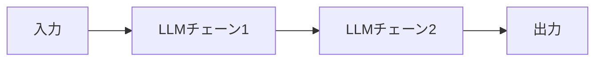
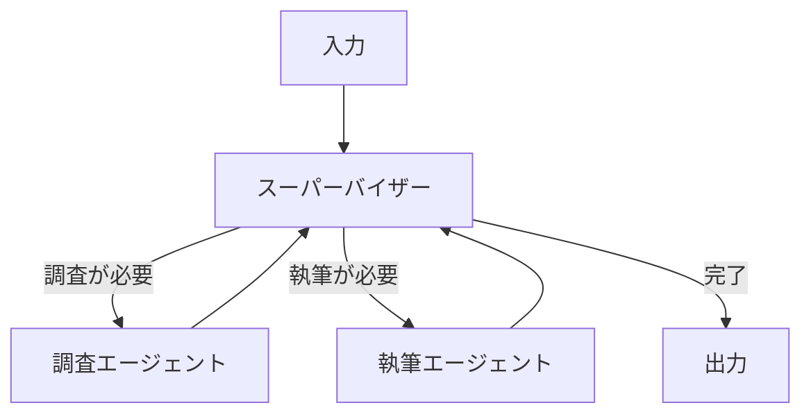
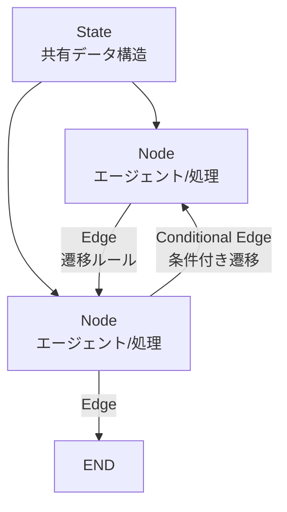
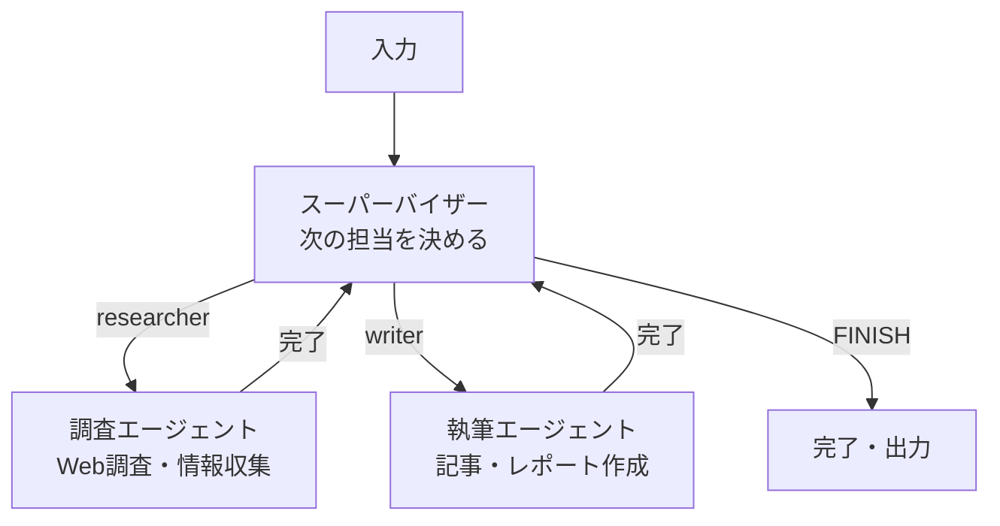

## はじめに

LangChainで調査→執筆→レビューのパイプラインを作ろうとしたとき、こんな壁にぶつかったことはないでしょうか？

- 「レビューでNGが出たら執筆に戻る」**ループ処理**が書けない
- 複数エージェントの**状態を共有**できない
- 「前の処理の結果によって次のステップを変える」**動的な条件分岐**が辛い

LangChainは線形なパイプラインには強いですが、「ループ」「状態共有」「動的ルーティング」が絡んでくると途端に複雑になります。

そこで登場するのが **LangGraph**です。

この記事では、LangGraphの基礎概念から実際のマルチエージェント実装まで、段階的なコード例で解説します。

**この記事で学べること：**

- LangChainとLangGraphの違い、LangGraphが必要な理由
- StateGraph・Node・Edge・Stateの4つの基礎概念
- シングルエージェントからマルチエージェント（スーパーバイザーパターン）への発展
- 実務で使える設計パターン（スーパーバイザー vs ネットワーク）
- よくあるハマりポイントと解決策

**対象読者：**

- PythonとOpenAI APIの基礎知識がある方
- LangChainを多少触ったことがある方（なくてもOK）
- LLMエージェントを実務に活かしたい方

:::message
**環境情報**：
- Python 3.11+
- langgraph 0.3.x
- langchain-openai 0.3.x
:::

---

## なぜLangGraphが必要か？

### LangChainだけでは難しいこと

LangChainはチェーン（Chain）とパイプラインの概念が基本です。処理は基本的に一方向（A→B→C）で進みます。



これはシンプルなQ&Aや要約では十分ですが、**「条件によって処理を戻す」「複数エージェントが協調する」**ようなワークフローでは限界があります。

### LangGraphが解決すること

LangGraphはワークフローを**グラフ構造**で定義します。これにより：

1. **ループ**：レビューで失敗したら執筆に戻る
2. **条件分岐**：タスクの種類によって担当エージェントを変える
3. **状態共有**：全エージェントが同じデータを読み書きできる
4. **永続化**：長期間にわたるタスクの中断・再開



LangChain（線形DAG）とLangGraph（有向グラフ）の主な違い：

| 特徴 | LangChain | LangGraph |
|------|-----------|-----------|
| フロー | 一方向（線形） | 任意方向（グラフ） |
| ループ | 難しい | ネイティブサポート |
| 状態管理 | 限定的 | 型安全な共有ステート |
| 条件分岐 | 基本的なもの | 動的なルーティング |
| エージェント協調 | 煩雑 | 設計の中心概念 |

---

## LangGraphの4つの基礎概念

LangGraphを理解するうえで欠かせない概念が4つあります。



### 1. State（ステート）：エージェント間の共有メモリ

全エージェントが読み書きする**共有データ構造**です。`TypedDict`で定義します。

```python
from typing import TypedDict, Annotated, List
import operator

class MyState(TypedDict):
    # Annotated[list, operator.add] → リストに追記（上書きでなく）
    messages: Annotated[List[str], operator.add]
    current_task: str
    is_finished: bool
```

`Annotated[List[str], operator.add]`のポイント：複数のノードがメッセージを追加しても上書きされず、すべて蓄積されます。

### 2. Node（ノード）：個々のエージェント

Stateを受け取り、**部分的なState更新を返す**Python関数です。

```python
def research_agent(state: MyState) -> dict:
    # stateから情報を読む
    task = state["current_task"]
    
    # 処理を行う（LLM呼び出しなど）
    result = f"{task}の調査結果: ..."
    
    # Stateの更新部分だけ返す（全フィールド不要）
    return {"messages": [result]}
```

### 3. Edge（エッジ）：ノード間の遷移

2種類あります：

```python
from langgraph.graph import StateGraph, END

graph = StateGraph(MyState)
graph.add_node("research", research_agent)
graph.add_node("write", writer_agent)

# 通常のエッジ：常にresearch → write
graph.add_edge("research", "write")

# 条件付きエッジ：状態に応じて動的にルーティング
graph.add_conditional_edges(
    "write",                    # 遷移元ノード
    decide_next_step,           # ルーティング関数
    {
        "review": "review",     # "review"が返ったらreviewノードへ
        "finish": END,          # "finish"が返ったら終了
    }
)
```

### 4. StateGraph：グラフ全体の定義

ノードとエッジを組み合わせてワークフロー全体を定義します。

---

## シングルエージェントを実装してみる

まずシンプルな1エージェントから始めましょう。セットアップ：

```bash
pip install langgraph langchain-openai langchain-core
```

環境変数の設定：

```bash
export OPENAI_API_KEY="your-api-key"
```

最小構成のLangGraphアプリ：

```python
from typing import TypedDict, Annotated
from langgraph.graph import StateGraph, END
from langchain_openai import ChatOpenAI
import operator

# 1. Stateの定義
class SimpleState(TypedDict):
    messages: Annotated[list, operator.add]
    question: str

# 2. LLMの準備
llm = ChatOpenAI(model="gpt-4o-mini", temperature=0)

# 3. ノードの定義
def answer_agent(state: SimpleState) -> dict:
    question = state["question"]
    response = llm.invoke(f"質問: {question}")
    return {"messages": [response.content]}

# 4. グラフの構築
graph = StateGraph(SimpleState)
graph.add_node("answer", answer_agent)
graph.set_entry_point("answer")
graph.add_edge("answer", END)

# 5. コンパイル
app = graph.compile()

# 6. 実行
result = app.invoke({
    "question": "LangGraphとLangChainの違いを教えて",
    "messages": []
})
print(result["messages"][-1])
```

動きました！次はこれをマルチエージェントに発展させます。

---

## マルチエージェントを実装してみる

### スーパーバイザーパターンとは

最も使いやすいのが**スーパーバイザーパターン**です。「司令塔エージェント」が全体を制御し、専門エージェントにタスクを振り分けます。



### 実装してみる

```python
from typing import TypedDict, Annotated, List
from langgraph.graph import StateGraph, END
from langchain_openai import ChatOpenAI
from langchain_core.messages import HumanMessage, SystemMessage
import operator
import json

llm = ChatOpenAI(model="gpt-4o-mini", temperature=0)

# Stateの定義
class AgentState(TypedDict):
    messages: Annotated[List[str], operator.add]
    topic: str
    next_agent: str

# スーパーバイザー：次に動かすエージェントをLLMで決定
def supervisor(state: AgentState) -> dict:
    system_prompt = """あなたはチームのマネージャーです。
    以下のエージェントを管理しています:
    - researcher: Web調査・情報収集を担当
    - writer: 記事・レポートの執筆を担当
    
    会話履歴を見て、次に動かすエージェントを決めてください。
    全タスクが完了したら "FINISH" と答えてください。
    
    回答はJSON形式で: {"next": "researcher" or "writer" or "FINISH"}"""
    
    history = "\n".join(state["messages"]) if state["messages"] else "まだ何もしていない"
    
    response = llm.invoke([
        SystemMessage(content=system_prompt),
        HumanMessage(content=f"トピック: {state['topic']}\n\n作業履歴:\n{history}")
    ])
    
    try:
        result = json.loads(response.content)
        next_agent = result.get("next", "FINISH")
    except json.JSONDecodeError:
        # JSONパースに失敗した場合はFINISH
        next_agent = "FINISH"
    
    return {"next_agent": next_agent}

# 調査エージェント
def researcher(state: AgentState) -> dict:
    topic = state["topic"]
    
    response = llm.invoke(
        f"「{topic}」について技術的な観点から重要なポイントを3つ調査してください。"
        f"各ポイントは具体的に説明してください。"
    )
    
    return {"messages": [f"[調査結果]\n{response.content}"]}

# 執筆エージェント
def writer(state: AgentState) -> dict:
    topic = state["topic"]
    research = "\n".join([m for m in state["messages"] if m.startswith("[調査結果]")])
    
    response = llm.invoke(
        f"以下の調査結果を元に、「{topic}」についての技術記事の概要を書いてください。\n\n"
        f"調査結果:\n{research}"
    )
    
    return {"messages": [f"[執筆結果]\n{response.content}"]}

# ルーティング関数
def route_next(state: AgentState) -> str:
    return state["next_agent"]

# グラフの構築
workflow = StateGraph(AgentState)
workflow.add_node("supervisor", supervisor)
workflow.add_node("researcher", researcher)
workflow.add_node("writer", writer)

# エントリーポイント
workflow.set_entry_point("supervisor")

# スーパーバイザーからの条件付きエッジ
workflow.add_conditional_edges(
    "supervisor",
    route_next,
    {
        "researcher": "researcher",
        "writer": "writer",
        "FINISH": END,
    }
)

# 各エージェント完了後はスーパーバイザーへ戻る
workflow.add_edge("researcher", "supervisor")
workflow.add_edge("writer", "supervisor")

# コンパイル
app = workflow.compile()

# 実行
result = app.invoke({
    "topic": "LangGraphを使ったマルチエージェントシステム",
    "messages": [],
    "next_agent": ""
})

# 結果の表示
for message in result["messages"]:
    print(message)
    print("---")
```

実際に動かしてみると、スーパーバイザーが自動的に「まず調査してから執筆する」という判断をして、各エージェントを順番に動かしてくれました。

---

## 実践パターン集

### パターン1：スーパーバイザー vs ネットワーク（Swarm）

| 観点 | スーパーバイザー | ネットワーク（Swarm） |
|------|----------------|-------------------|
| 制御 | 中央集権型（司令塔が制御） | 分散型（エージェントが自律） |
| シンプルさ | ○ デバッグしやすい | △ 追跡が難しい |
| 柔軟性 | △ スーパーバイザー次第 | ○ 動的に協調 |
| 向いている用途 | 明確なタスク分割 | 創造的・探索的タスク |
| 障害耐性 | △ SPOFになりやすい | ○ 分散で耐性あり |

初心者は**スーパーバイザーパターン**から始めるのがおすすめです。

### パターン2：ループ（リトライ）の実装

品質チェックをしてNGなら書き直すループの実装例：

```python
class WritingState(TypedDict):
    draft: str
    feedback: str
    revision_count: int
    approved: bool

def check_quality(state: WritingState) -> str:
    """品質チェック：OKなら終了、NGなら書き直し"""
    if state["approved"]:
        return "approved"
    if state["revision_count"] >= 3:  # 最大3回
        return "approved"  # 上限に達したら強制終了
    return "revise"

workflow.add_conditional_edges(
    "reviewer",
    check_quality,
    {
        "approved": END,
        "revise": "writer"  # 書き直しのループ
    }
)
```

### パターン3：ストリーミング出力

ユーザーに進捗をリアルタイムで見せたい場合：

```python
# streamメソッドで逐次実行
for event in app.stream({"topic": "Python非同期処理", "messages": [], "next_agent": ""}):
    for key, value in event.items():
        if key != "__end__":
            print(f"[{key}] 処理中...")
            if "messages" in value:
                for msg in value["messages"]:
                    print(msg[:100] + "...")  # 先頭100文字を表示
```

---

## ハマりポイント・注意事項

実際に使っていてぶつかったハマりポイントを紹介します。

### ① 無限ループで処理が止まらなくなる

スーパーバイザーが「FINISH」を返さないバグがあると、無限ループになって処理が終わりません。

```python
# ❌ recursion_limitのデフォルト(25)を超えると GraphRecursionError になる
# 終了条件のバグがあると25ステップで強制終了してしまう
result = app.invoke(initial_state)

# ✅ recursion_limitを意図した上限に設定して安全に
result = app.invoke(
    initial_state,
    config={"recursion_limit": 50}  # エージェント数 × 想定往復回数 + 余裕分
)
```

:::message alert
`recursion_limit`を超えると`GraphRecursionError`が発生します。無限ループの検知はこのエラーで気づくことが多いです。ループが想定より多い場合は限界値を上げるか、ループの終了条件を見直してください。
:::

### ② Stateの更新で意図しない上書きが起きる

`Annotated[list, operator.add]`を使わないと、ノードがリストを**返すたびに上書き**されてしまいます。

```python
# ❌ 上書きになる
class BadState(TypedDict):
    messages: list  # 毎回上書き

# ✅ 追記になる
class GoodState(TypedDict):
    messages: Annotated[list, operator.add]  # 前の値に追記
```

### ③ `add_conditional_edges`の戻り値の型ミス

条件関数の戻り値と`mapping`のキーが一致していないと実行時エラーになります。

```python
# ❌ 戻り値が"finished"だがmappingに"finished"がない
def router(state):
    return "finished"  # ← ここが"FINISH"だとエラー

workflow.add_conditional_edges(
    "node",
    router,
    {"FINISH": END}  # ← "finished"に対応するキーがない
)

# ✅ 戻り値とmappingのキーを一致させる
def router(state):
    return "FINISH"

workflow.add_conditional_edges(
    "node",
    router,
    {"FINISH": END}
)
```

### ④ バージョン間の破壊的変更

LangGraphは更新が頻繁で、メジャーバージョン間で`add_conditional_edge`→`add_conditional_edges`など細かいAPIの変更があります。

```bash
# バージョンを固定して安定運用
pip install langgraph==0.3.5 langchain-openai==0.3.0
```

:::message
公式ドキュメントは常に最新バージョンを指しているので、エラーが出たときはまず`pip show langgraph`でバージョンを確認しましょう。
:::

### ⑤ デバッグはLangSmithで可視化する

グラフが複雑になるとどのノードで何が起きているかわかりにくくなります。LangSmithを使うとグラフの実行過程を可視化できます。

```bash
export LANGCHAIN_TRACING_V2=true
export LANGCHAIN_API_KEY="your-langsmith-key"
```

これだけで実行時のトレースが自動で記録されます。

---

## まとめ

LangGraphで学んだことを整理します。

| 概念 | 一言で | 使い所 |
|------|--------|--------|
| **State** | エージェント間の共有メモリ | 全エージェントが読み書きするデータ |
| **Node** | 個々のエージェント/処理 | LLM呼び出し・ツール実行・判断 |
| **Edge** | ノード間の遷移 | 常に次のノードへ進む場合 |
| **Conditional Edge** | 動的なルーティング | 状態に応じて次の処理を変える場合 |
| **Supervisor Pattern** | 中央集権型マルチエージェント | 明確なタスク分割・デバッグしやすさ |

LangGraphのポイントは「**グラフで考える**」こと。処理を点（ノード）と矢印（エッジ）で表現し、どのエージェントがいつ何をするかを設計します。

**次のステップ：**

- **Human-in-the-loop**：人間の承認ステップをワークフローに組み込む
- **LangGraph Cloud**：マネージドサービスでの本番デプロイ
- **Streaming**：リアルタイムでの中間結果表示
- **Checkpointing**：長期タスクの中断・再開

```python
# Human-in-the-loopの片鱗（interrupt機能）
from langgraph.checkpoint.memory import MemorySaver

checkpointer = MemorySaver()
app = workflow.compile(checkpointer=checkpointer)

# interruptで人間の確認ポイントを追加
app = workflow.compile(
    checkpointer=checkpointer,
    interrupt_before=["writer"]  # writerの前で一時停止
)
```

LangGraphはまだ発展途上のフレームワークですが、複雑なLLMワークフローの構築に確実に役立ちます。ぜひ小さなプロトタイプから試してみてください！

---

**参考リソース：**

- [LangGraph 公式ドキュメント](https://langchain-ai.github.io/langgraph/)
- [LangGraph Tutorials](https://langchain-ai.github.io/langgraph/tutorials/)
- [LangGraph How-to Guides](https://langchain-ai.github.io/langgraph/how-tos/)
