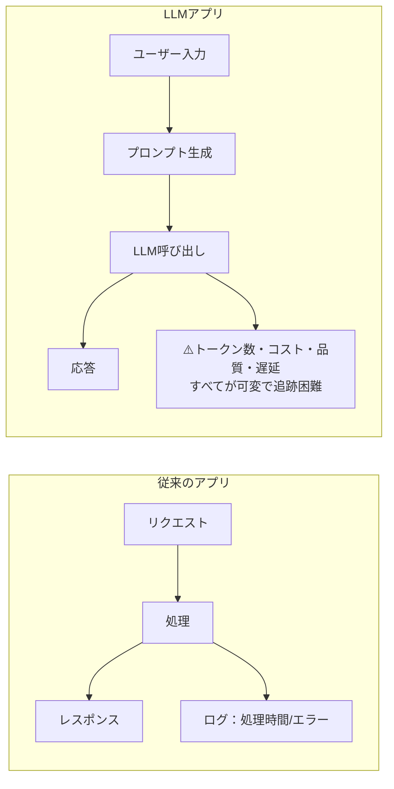
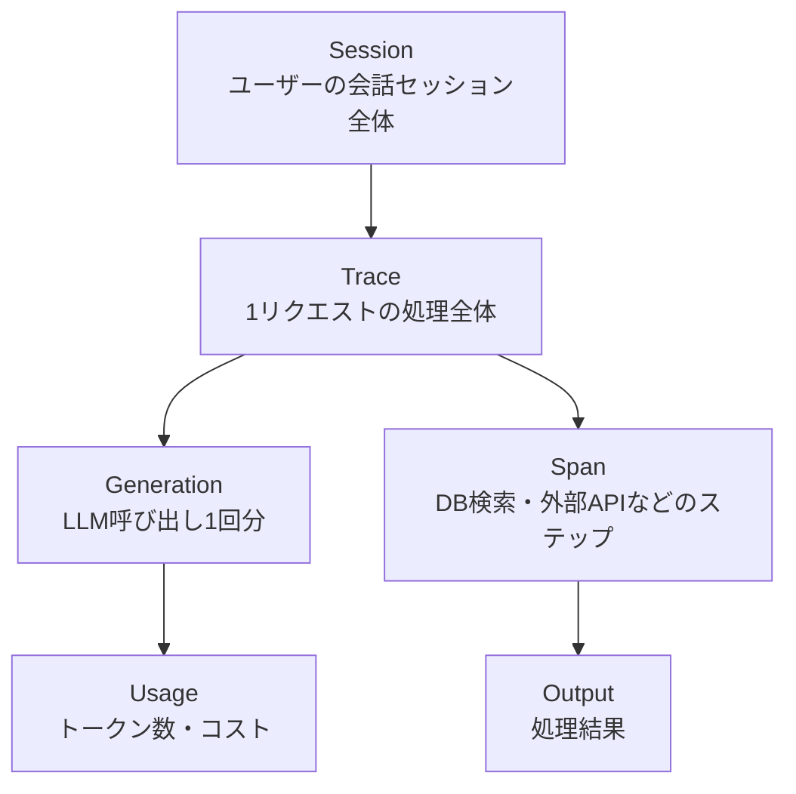
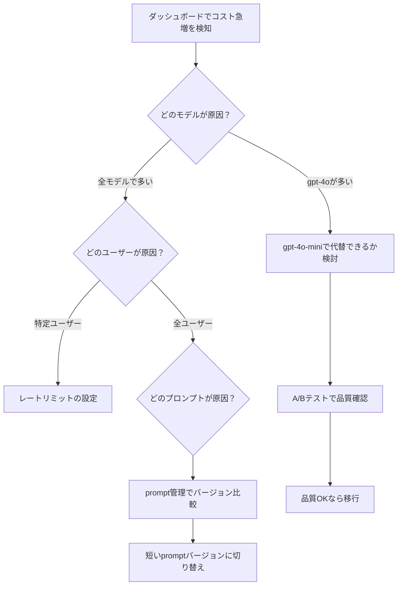
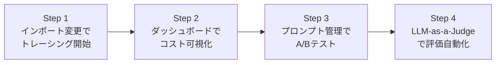

## はじめに

LLMアプリを作り始めると、こんな問題に必ずぶつかります。

- **「なぜかたまに応答が遅い。でも何が原因か分からない」**
- **「今月のAPI代が想定の3倍になっていた。どのユーザーがどのくらい使っているのか追えない」**
- **「プロンプトを変えたら品質が上がった気がするが、数値で比較できない」**

通常のWebアプリならログやメトリクスで追えますが、LLMアプリはプロンプト・トークン数・モデルの非決定性という要素が絡むため、従来の監視では追いきれません。

この記事では、**Langfuse**を使ってLLMアプリの「見える化」を実現する方法を実践的に解説します。

この記事で得られるもの:
- LLM Observabilityがなぜ必要かわかる
- LangfuseをOpenAI・Claude両方で実装できる
- コスト管理・プロンプト評価の実践ノウハウを得られる

**対象読者**: PythonでOpenAIやClaude APIを呼んだことがある中級エンジニア

---

## なぜLLMアプリには専用の「見える化」が必要か

### 従来のアプリ監視との違い

通常のAPIを使ったアプリでは、「レスポンスタイム」「エラー率」「スループット」を監視すれば十分でした。しかしLLMアプリには独特の観測課題があります。



LLMアプリで起きる問題と必要な観測の対応を整理すると:

| 問題 | 必要な観測 |
|------|-----------|
| 応答が遅い | どのLLM呼び出しで遅延が発生しているか |
| API代が高い | どのモデル・どのユーザーがトークンを消費しているか |
| 品質が下がった | どのプロンプトバージョンで発生したか |
| エージェントが誤動作 | どのステップで間違った判断をしたか |

これらをすべて解決するのが**LLM Observability（可観測性）**ツールであり、その代表格が**Langfuse**です。

---

## Langfuseとは

[Langfuse](https://langfuse.com)は**MIT LicenseのOSS**として公開されているLLMアプリ向けのObservabilityプラットフォームです。

主な機能:
- **Tracing**: LLM呼び出し単位でプロンプト・出力・トークン・レイテンシを記録
- **Cost Monitoring**: モデルごとのAPI費用をリアルタイム可視化
- **Prompt Management**: プロンプトのバージョン管理とA/Bテスト
- **Evaluation**: 出力品質の自動・手動評価
- **Session Management**: マルチターンチャットの会話全体を可視化

### データの階層構造

Langfuseのデータ構造を理解しておくと、後の実装がスムーズになります。



### Cloud vs Self-hosted

| 方式 | 向いているケース | 注意点 |
|------|----------------|--------|
| **Langfuse Cloud** | 手軽に試したい・小〜中規模 | 大量使用で課金発生 |
| **Self-hosted** | 本番・データ主権が必要・コスト重視 | PostgreSQL + サーバー運用が必要 |

お試しならまずCloud版から始めるのがおすすめです。

---

## セットアップ（5分で動かす）

### 1. Langfuse Cloudにサインアップ

[cloud.langfuse.com](https://cloud.langfuse.com) でアカウント作成 → プロジェクト作成 → APIキーを取得。

### 2. SDKをインストール

```bash
pip install langfuse openai anthropic
```

### 3. 環境変数を設定

```bash
# .env ファイルに追記
LANGFUSE_SECRET_KEY="sk-lf-..."     # プロジェクト設定から取得
LANGFUSE_PUBLIC_KEY="pk-lf-..."     # プロジェクト設定から取得
LANGFUSE_HOST="https://cloud.langfuse.com"
OPENAI_API_KEY="sk-..."
ANTHROPIC_API_KEY="sk-ant-..."
```

### 4. 最小構成で動作確認

まずOpenAIラッパーで試してみます。**インポートを1行変えるだけ**でトレーシングが始まります。

```python
# 変更前: from openai import OpenAI
from langfuse.openai import OpenAI  # ← これだけ変える！

client = OpenAI()

response = client.chat.completions.create(
    model="gpt-4o-mini",
    messages=[{"role": "user", "content": "Pythonでフィボナッチ数列を実装して"}]
)

print(response.choices[0].message.content)
```

これだけでLangfuseダッシュボードにトレースが記録されます。

:::message
実行後、Langfuseダッシュボードの「Traces」ページを開くと、プロンプト・応答・トークン数・コストがすべて確認できます。
:::

---

## OpenAI × Langfuseの実践実装

### ラッパー方式（最も簡単）

前述の通り、`from langfuse.openai import OpenAI` に変えるだけです。以下のメタデータを付加することでより詳細な追跡が可能になります。

```python
from langfuse.openai import OpenAI

client = OpenAI()

response = client.chat.completions.create(
    model="gpt-4o",
    messages=[
        {"role": "system", "content": "あなたはPython専門家です"},
        {"role": "user", "content": "ソートアルゴリズムを3種類比較して"}
    ],
    # Langfuse用のメタデータ（省略可）
    name="code-explanation",       # トレース名
    metadata={"user_id": "u001"},  # 任意のメタデータ
)
```

### 手動Trace APIで詳細に記録する

より詳細な制御が必要な場合は、Trace/Generation APIを使います。

```python
from langfuse import Langfuse
from langfuse.openai import OpenAI

langfuse = Langfuse()
client = OpenAI()

def answer_question(user_question: str, user_id: str) -> str:
    # トレース開始（このリクエスト全体を1つのトレースとして記録）
    trace = langfuse.trace(
        name="qa-session",
        user_id=user_id,
        input=user_question,
        metadata={"app_version": "1.2.0"}
    )

    response = client.chat.completions.create(
        model="gpt-4o",
        messages=[{"role": "user", "content": user_question}],
        trace_id=trace.id,  # トレースと紐づけ
    )

    answer = response.choices[0].message.content
    trace.update(output=answer)  # 最終出力を記録

    return answer
```

### RAGアプリのマルチステップトレーシング

RAG（検索拡張生成）アプリでは「検索」と「生成」の2ステップがあります。Spanを使って分けて追跡できます。

```python
from langfuse import Langfuse
from langfuse.openai import OpenAI

langfuse = Langfuse()
client = OpenAI()

def rag_query(user_question: str, session_id: str) -> str:
    trace = langfuse.trace(
        name="rag-pipeline",
        session_id=session_id,
        input=user_question
    )

    # Step 1: ベクトル検索（SpanとしてDB検索を記録）
    retrieval_span = trace.span(
        name="vector-search",
        input={"query": user_question}
    )
    docs = search_vector_db(user_question)  # 独自実装
    retrieval_span.end(
        output={"docs_count": len(docs), "top_doc": docs[0] if docs else None}
    )

    # Step 2: LLM生成
    context = "\n\n".join(docs)
    prompt = f"""以下の文書を参考に質問に答えてください。

文書:
{context}

質問: {user_question}"""

    response = client.chat.completions.create(
        model="gpt-4o",
        messages=[{"role": "user", "content": prompt}],
        trace_id=trace.id,
    )

    answer = response.choices[0].message.content
    trace.update(output=answer)

    return answer
```

ダッシュボードでは「検索に何ms」「LLM生成に何ms」が分かれて表示されるので、ボトルネックを特定しやすくなります。

---

## Claude（Anthropic）× Langfuseの統合

OpenAI用のラッパーは用意されていますが、ClaudeはDecorator方式を使います。

### `@observe()` デコレータで自動トレース

```python
from langfuse.decorators import observe
from anthropic import Anthropic

client = Anthropic()

@observe()  # このデコレータをつけるだけ
def ask_claude(question: str, system_prompt: str = "") -> str:
    messages = [{"role": "user", "content": question}]

    response = client.messages.create(
        model="claude-3-5-sonnet-20241022",
        max_tokens=2048,
        system=system_prompt if system_prompt else "あなたは優秀なアシスタントです",
        messages=messages
    )

    return response.content[0].text

# 呼び出す
result = ask_claude(
    question="TypeScriptとPythonのどちらをバックエンドに選ぶべきか教えて",
    system_prompt="あなたはバックエンド開発の専門家です"
)
print(result)
```

:::message
`@observe()` デコレータはClaudeだけでなく、任意の関数に適用できます。外部API呼び出しやDBクエリにも使えます。
:::

### OpenAIとClaudeを両方使うアプリ

実際のアプリでは用途によってモデルを使い分けることがあります。

```python
from langfuse.decorators import observe
from langfuse.openai import OpenAI
from anthropic import Anthropic

openai_client = OpenAI()
claude_client = Anthropic()

@observe(name="hybrid-pipeline")
def smart_answer(question: str) -> str:
    # まずGPT-4o-miniで簡易チェック（低コスト）
    classification = openai_client.chat.completions.create(
        model="gpt-4o-mini",
        messages=[
            {"role": "system", "content": "質問が技術的か一般的かを答えてください。technical/generalのみ回答"},
            {"role": "user", "content": question}
        ]
    ).choices[0].message.content.strip()

    if classification == "technical":
        # 技術的な質問はClaudeで詳しく回答
        return claude_client.messages.create(
            model="claude-3-5-sonnet-20241022",
            max_tokens=2048,
            messages=[{"role": "user", "content": question}]
        ).content[0].text
    else:
        # 一般的な質問はGPT-4o-miniで十分
        return openai_client.chat.completions.create(
            model="gpt-4o-mini",
            messages=[{"role": "user", "content": question}]
        ).choices[0].message.content
```

このパターンをLangfuseで追跡すると、どのルートがどのくらいのコスト・時間で処理されているか一目でわかります。

---

## コスト管理の実践

### ダッシュボードで確認できること

Langfuseのダッシュボード（「Analytics」タブ）では以下が自動集計されます。

| 指標 | 確認できること |
|------|--------------|
| **Daily Cost** | 日ごとのAPI費用の推移グラフ |
| **Cost by Model** | gpt-4o vs claude-3-5-sonnet などモデル別内訳 |
| **Cost by User** | どのユーザーがコストを消費しているか |
| **Token Usage** | input/output tokens の比率 |
| **Latency** | P50/P95/P99 のレスポンス時間分布 |

### コードで手動コスト記録

Langfuseが自動計算できない場合（カスタムモデル等）は手動でトークン数を渡します。

```python
from langfuse import Langfuse

langfuse = Langfuse()

trace = langfuse.trace(name="custom-model-call")
generation = trace.generation(
    name="my-finetuned-model",
    model="my-company/gpt-finetuned-v2",
    input="ユーザーの入力",
    output="モデルの出力",
    usage={
        "input": 150,        # input tokens
        "output": 300,       # output tokens
        "total": 450,        # 合計
        "unit": "TOKENS"
    },
)
```

### コスト最適化のフロー



---

## プロンプト評価とA/Bテスト

### プロンプト管理

LangfuseのUIからプロンプトを管理できます。コードに直書きするより安全です。

```python
from langfuse import Langfuse
from langfuse.openai import OpenAI

langfuse = Langfuse()
client = OpenAI()

# Langfuseに保存したプロンプトを取得（バージョン管理される）
prompt = langfuse.get_prompt("customer-support-v3")
compiled = prompt.compile(user_name="田中さん", product="LLMアプリ")

response = client.chat.completions.create(
    model="gpt-4o",
    messages=[{"role": "user", "content": compiled}],
    langfuse_prompt=prompt,  # どのプロンプトを使ったか記録
)
```

### 評価スコアをつける

```python
# 人間がレビューしてスコアをつける場合
langfuse.score(
    trace_id="trace_abc123",
    name="quality",
    value=0.9,           # 0〜1のスコア
    comment="適切な回答"
)

# LLM-as-a-Judgeで自動評価する場合
def evaluate_with_llm(trace_id: str, output: str, expected: str):
    eval_prompt = f"""以下の回答を評価してください（0〜1のスコアを返す）:

回答: {output}
期待: {expected}

スコアのみ数値で答えてください:"""

    score = float(client.chat.completions.create(
        model="gpt-4o-mini",
        messages=[{"role": "user", "content": eval_prompt}]
    ).choices[0].message.content.strip())

    langfuse.score(trace_id=trace_id, name="auto-eval", value=score)
```

---

## ハマりポイント・注意事項

実際に使ってみてハマった点を正直に書きます。

### ⚠️ 1. 非同期処理でトレースが送信されない

**症状**: スクリプトを実行してもLangfuseダッシュボードにデータが来ない。

**原因**: LangfuseはSDKの送信を非同期で行うため、プロセスが終了する前にデータが送られない場合があります。

```python
# ❌ これだとデータが送信されないことがある
langfuse = Langfuse()
trace = langfuse.trace(name="test")
# ...処理...
# プロセス終了 → 送信前に終わる

# ✅ 必ずflushを呼ぶ
langfuse = Langfuse()
trace = langfuse.trace(name="test")
# ...処理...
langfuse.flush()  # ← 送信待ち。プロセス終了前に必ず呼ぶ
```

:::message alert
Jupyter Notebookや短命スクリプトでは特にこのハマりポイントに注意。`langfuse.flush()` を最後に呼ぶか、`with` ブロックを使いましょう。
:::

### ⚠️ 2. モデル単価の自動計算が古い

**症状**: コストが0円または実際と大きくズレている。

**原因**: Langfuseのモデル単価リストは定期更新ですが、新しいモデルや価格改定に追いつかない場合があります。

**解決策**: Langfuseダッシュボードの「Settings > LLM Models」から手動で単価を設定します。

```python
# または、コードからgeneration時にトークン数を明示指定
generation = trace.generation(
    model="gpt-4o-2024-11-20",
    usage={
        "input": 500,
        "output": 200,
    }
    # ダッシュボードの「Settings > LLM Models」で単価を設定しておくと
    # トークン数からコストが自動計算される
)
```

### ⚠️ 3. Self-hosted時のメモリ不足

**症状**: Docker ComposeでLangfuseを起動すると、PostgreSQLが頻繁に落ちる。

**原因**: デフォルト設定のままだとメモリが足りないことがある。

**解決策**: `docker-compose.yml` のPostgreSQLにメモリ制限と`shared_buffers`を設定します。

```yaml
# docker-compose.yml
postgres:
  image: postgres:15
  environment:
    POSTGRES_USER: postgres
    POSTGRES_PASSWORD: postgres
    PGDATA: /var/lib/postgresql/data
  command:
    - "postgres"
    - "-c"
    - "shared_buffers=256MB"    # ← 追加
    - "-c"
    - "max_connections=100"     # ← 追加
  mem_limit: 512m               # ← 追加
```

### ⚠️ 4. Claudeとの統合でトークン数が取れない

**症状**: ClaudeのトレースはあるがToken Usage / Costが0になっている。

**原因**: Anthropicのライブラリは自動トークン計測に非対応の部分がある。

**解決策**: レスポンスからusageを取り出して手動で記録します。

```python
from langfuse.decorators import observe, langfuse_context
from anthropic import Anthropic

client = Anthropic()

@observe()
def ask_claude_with_usage(question: str) -> str:
    response = client.messages.create(
        model="claude-3-5-sonnet-20241022",
        max_tokens=1024,
        messages=[{"role": "user", "content": question}]
    )

    # usageを手動で記録
    langfuse_context.update_current_observation(
        usage={
            "input": response.usage.input_tokens,
            "output": response.usage.output_tokens,
        }
    )

    return response.content[0].text
```

---

## まとめ

LangfuseでLLMアプリを見える化する方法を解説しました。

| 機能 | 何ができるか | 実装の手軽さ |
|------|------------|------------|
| **自動トレーシング（OpenAI）** | インポート1行変えるだけ | ⭐ 超簡単 |
| **@observe デコレータ（Claude）** | デコレータをつけるだけ | ⭐ 超簡単 |
| **手動Trace/Span** | 詳細なマルチステップ追跡 | ⭐⭐ 普通 |
| **コスト管理** | モデル・ユーザー別のAPI費用 | ⭐ 自動で可視化 |
| **プロンプト管理** | バージョン管理・A/Bテスト | ⭐⭐ 普通 |
| **評価（Evaluation）** | 品質スコアの記録・比較 | ⭐⭐⭐ 設計が必要 |

### 導入ステップ

まずは「自動トレーシングだけ試す」→「コスト可視化を使う」→「評価まで自動化する」の順で段階的に導入するのがおすすめです。



LLMアプリが本番に近づくほど、Observabilityの重要性が増します。まず1行のインポート変更から始めてみてください。

---

### 参考リンク

- [Langfuse公式ドキュメント](https://langfuse.com/docs)
- [Langfuse GitHub](https://github.com/langfuse/langfuse)
- [Langfuse Python SDK](https://github.com/langfuse/langfuse-python)
- [OpenAI Integration](https://langfuse.com/docs/integrations/openai)
- [Anthropic Claude Integration](https://langfuse.com/docs/integrations/anthropic)
