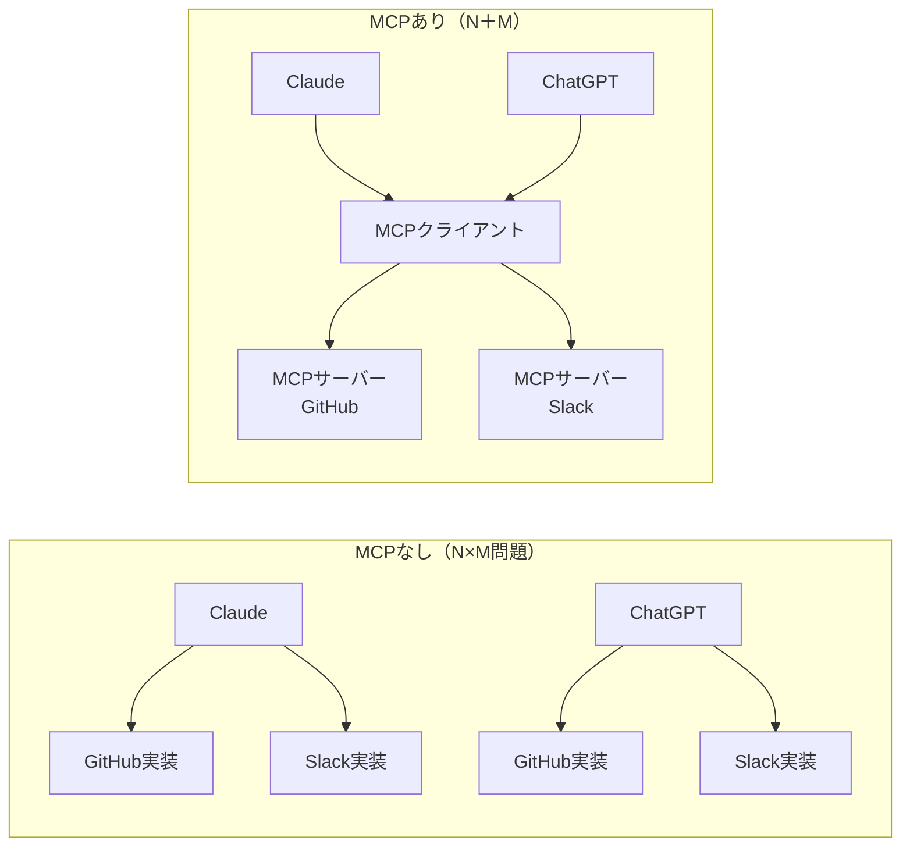
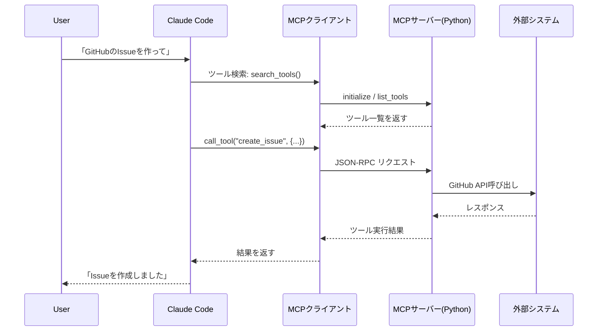

## はじめに

この記事を読んで得られること：

- **MCP（Model Context Protocol）の仕組み**と、なぜ今エンジニアが注目すべきかを理解できる
- **PythonでMCPサーバーを自作**して、Claude Codeから使えるようになる
- **stdioの罠**など実際にハマったポイントを知って、スムーズに実装できる

対象読者：
- Pythonの基礎を知っている方
- Claude Codeを使ったことがある、または興味がある方
- AIエージェントに外部ツールを繋ぎたいと思っている方

**TL;DR**: MCPとはAIと外部ツールをつなぐ標準プロトコルです。`pip install "mcp[cli]"` → デコレータでツール定義 → `claude mcp add` で登録、の3ステップで動きます。ただしstdioモードで `print()` すると通信が壊れます（これが最大のハマりポイント）。

---

## MCPとは何か〜AIのUSBと呼ばれる理由〜

### N×M問題：個別API連携の地獄

MCPが登場する前、AIに外部ツールを接続するには**ツールごとに専用実装が必要**でした。

- Claude用のGitHubツール
- ChatGPT用のGitHubツール
- Cursor用のGitHubツール
- Claude用のSlackツール
- ……

N個のAIクライアントとM個の外部ツールがあれば、**N×M通りの実装**が必要です。これは保守地獄です。

MCPはこれを**N＋M**に圧縮します。MCPサーバーを一度作れば、MCP対応のAIクライアント（Claude/ChatGPT/Cursor等）すべてで使い回せます。



### RAGとの違い：データ取得 vs アクション実行

よく「RAGとMCPの違いは？」と聞かれます。シンプルに言うと：

| | RAG | MCP |
|---|---|---|
| **主な目的** | 知識・データの検索・取得 | ツール呼び出し・アクション実行 |
| **方向** | 読み取り専用（Read） | 読み書き・実行（Read/Write/Execute） |
| **例** | 「社内ドキュメントから関連情報を取得」 | 「GitHubにIssueを作成」「DBに書き込み」 |
| **AIの役割** | 回答の精度向上 | 外部システムを操作する |

MCPはRAGの上位概念ではなく、**別の問題を解く**ものです。両方組み合わせることも可能です。

---

## MCPの3つの構成要素

MCPサーバーが提供できる機能は3種類です：

| 要素 | 役割 | 読み書き | 例 |
|------|------|---------|-----|
| **Tools（ツール）** | AIが呼び出せる関数・アクション | 読み書き | `search_github(query)` |
| **Resources（リソース）** | 読み取り専用のデータ | 読み取りのみ | 設定ファイル・DBレコード |
| **Prompts（プロンプト）** | 再利用可能なプロンプトテンプレート | — | コードレビュー依頼テンプレート |

実装の8割は **Tools** です。まずはToolsだけ覚えれば十分です。

---

## PythonでMCPサーバーを自作する（ハンズオン）

### 環境構築

```bash
# Python 3.10以上が必要
python --version

# MCP SDKのインストール
pip install "mcp[cli]"

# バージョン確認
python -c "import mcp; print(mcp.__version__)"
```

### シンプルなMCPサーバーを作る

まず最小構成から始めましょう。`my_server.py` を作成します：

```python
from mcp.server.fastmcp import FastMCP

# サーバーを初期化
mcp = FastMCP("my-first-mcp-server")

@mcp.tool()
def add(a: int, b: int) -> int:
    """2つの数値を足し算する"""
    return a + b

@mcp.tool()
def search_docs(query: str) -> str:
    """社内ドキュメントを検索する（モック）"""
    # 実際はDBやElasticsearchを呼ぶ
    return f"「{query}」に関するドキュメント: ..."

if __name__ == "__main__":
    mcp.run()
```

ポイント：
- `FastMCP` クラスがサーバーの土台
- `@mcp.tool()` デコレータをつけるだけでツールになる
- **docstringが必須**：AIがツールの説明として使う

### リソースとプロンプトも追加する

```python
from mcp.server.fastmcp import FastMCP

mcp = FastMCP("my-server")

# --- Tools: AIが呼び出せるアクション ---
@mcp.tool()
def add(a: int, b: int) -> int:
    """2つの数値を足し算する"""
    return a + b

# --- Resources: 読み取り専用データ ---
@mcp.resource("config://app")
def get_config() -> str:
    """アプリ設定を返す"""
    return "debug=true\nlog_level=INFO\nenv=development"

# --- Prompts: 再利用可能なプロンプトテンプレート ---
@mcp.prompt()
def code_review(code: str, language: str = "python") -> str:
    """コードレビューを依頼するプロンプト"""
    return f"""以下の{language}コードをレビューしてください。
観点: 可読性・パフォーマンス・セキュリティ・テスタビリティ

```{language}
{code}
```
"""

if __name__ == "__main__":
    mcp.run()
```

### ローカルで動作確認

```bash
# MCPインスペクターで対話的に確認（後述）
mcp dev my_server.py
```

---

## Claude Codeに接続する

### MCPサーバーを登録する

```bash
# ローカルのPythonファイルをClaude Codeに登録
claude mcp add my-server python /path/to/my_server.py

# 登録済みのMCPサーバー一覧を確認
claude mcp list

# 削除する場合
claude mcp remove my-server
```

### 動作確認：Claude Codeからツールを呼び出す

Claude Codeを起動して試してみます：

```
> my-serverのaddツールで3と5を足してください
```

Claude Codeが `add(a=3, b=5)` を呼び出して `8` を返します。

接続の仕組みはこうなっています：



---

## ハマりポイント・注意事項

私が実際にMCPサーバーを実装した際にハマった点をまとめます。これを読めば同じ罠を避けられます。

:::message alert
**最重要: stdioモードで `print()` を使わない！**

stdioトランスポート（デフォルト）では、標準出力がJSON-RPCの通信路として使われます。
`print()` でデバッグ出力すると**通信プロトコルが壊れてサーバーがクラッシュ**します。
:::

```python
# ❌ 絶対ダメ（stdioモードでの通信が壊れる）
@mcp.tool()
def my_tool(query: str) -> str:
    print(f"Debug: query={query}")  # ← これが通信を壊す！
    return "result"

# ✅ 正しい方法（stderrにログを出す）
import sys

@mcp.tool()
def my_tool(query: str) -> str:
    print(f"Debug: query={query}", file=sys.stderr)  # ← stderrはOK
    return "result"
```

### ハマりポイント2: SDKバージョンの破壊的変更

MCP SDKは2024年→2025年で大きく変わりました。古い記事のコードがそのまま動かないことがあります。

```bash
# バージョンを固定して安定運用（X.X.X は最新の安定版に置き換えてください）
pip install "mcp[cli]==1.9.0"  # 例: 1.9.0

# 現在の最新バージョンを確認
pip index versions mcp

# インストール済みバージョンを確認
pip show mcp
```

公式ドキュメント（https://modelcontextprotocol.io）を必ず参照してください。

### ハマりポイント3: MCPインスペクターを活用する

Claude Codeに繋ぐ前に、MCPインスペクターで単体テストするのが鉄則です：

```bash
# インスペクターを起動（ブラウザで対話的にテストできる）
mcp dev my_server.py

# または
npx @modelcontextprotocol/inspector python my_server.py
```

ブラウザで `http://localhost:5173` を開くと、ツールの一覧表示・実行・レスポンス確認ができます。

### ハマりポイント4: セキュリティ設計

MCPサーバーに過剰な権限を持たせると危険です：

```python
# ❌ 危険：任意のコマンドを実行できるツール
@mcp.tool()
def run_command(cmd: str) -> str:
    """システムコマンドを実行する"""
    import subprocess
    return subprocess.check_output(cmd, shell=True).decode()

# ✅ 安全：許可リストで制限する
ALLOWED_COMMANDS = ["ls", "pwd", "cat"]

@mcp.tool()
def run_safe_command(cmd: str) -> str:
    """許可されたコマンドのみ実行する"""
    if cmd.split()[0] not in ALLOWED_COMMANDS:
        return f"Error: '{cmd.split()[0]}' は許可されていません"
    import subprocess
    return subprocess.check_output(cmd.split()).decode()
```

**最小権限原則**を守り、MCPサーバーに必要最小限の機能だけ実装しましょう。

---

## まとめ

| 項目 | ポイント |
|------|---------|
| **MCPとは** | AIと外部ツールをつなぐ標準プロトコル。N×M問題をN＋Mに圧縮 |
| **RAGとの違い** | RAG=読み取り、MCP=アクション実行（別の問題を解く）|
| **3要素** | Tools（アクション）/ Resources（読み取り）/ Prompts（テンプレート） |
| **実装方法** | `FastMCP` + `@mcp.tool()` デコレータで簡単に作れる |
| **最重要の罠** | stdioモードで `print()` NG → `sys.stderr` を使う |
| **デバッグ** | `mcp dev` でインスペクターを起動して単体テスト必須 |
| **セキュリティ** | 最小権限原則。任意コマンド実行ツールは作らない |

### 次のステップ

MCPを覚えると、できることが大幅に広がります：

1. **既存のAPIをMCPサーバー化** — 社内システムをAIエージェントから操作可能に
2. **公開MCPサーバーを活用** — [Smithery](https://smithery.ai) で数百のMCPサーバーを探せる
3. **リモートMCPサーバー** — HTTP+SSEで複数人が使えるサーバーに発展させる
4. **セキュリティ強化** — OAuth認証・権限管理を追加して本番運用へ

MCPは「小さく作って育てる」スタイルが向いています。まずは自分が毎日使うツール1つをMCP化するところから始めてみてください！

---

参考リンク：
- [MCP公式ドキュメント](https://modelcontextprotocol.io)
- [MCP Python SDK](https://github.com/modelcontextprotocol/python-sdk)
- [公開MCPサーバー一覧 (Smithery)](https://smithery.ai)
