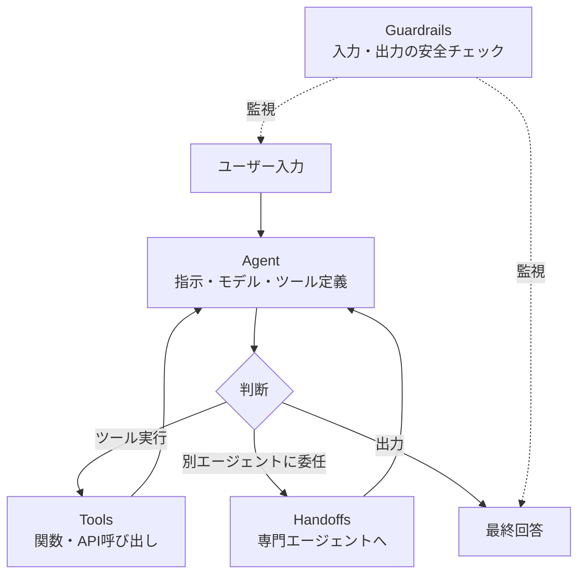
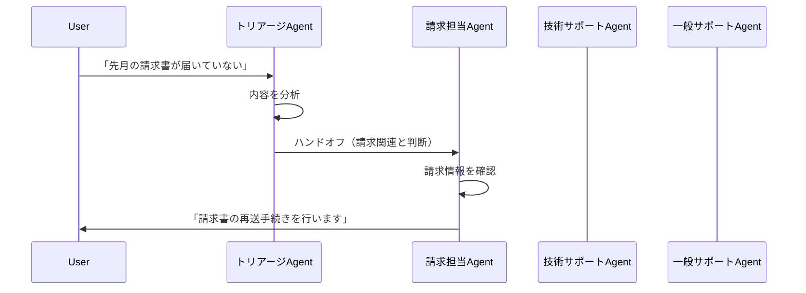
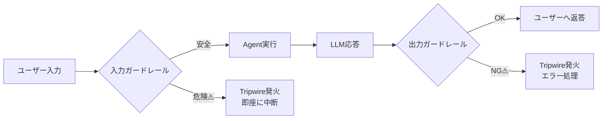
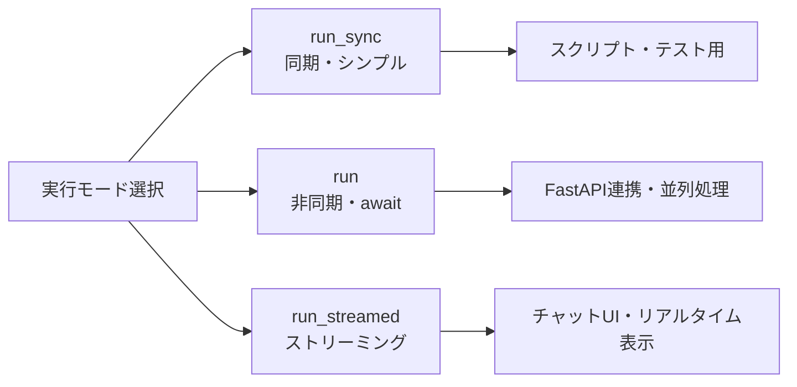

## はじめに

「LLMを使ったアプリを作りたいけど、LangGraphは学習コストが高くて……」

そんな悩みを抱えていたエンジニアに朗報です。OpenAIが2026年初頭にリリースした **OpenAI Agents SDK** は、Pythonネイティブな直感的APIで、複雑なマルチエージェントシステムを驚くほど手軽に構築できます。

この記事では、実際にOpenAI Agents SDKを触ってみた体験をもとに、以下を解説します：

- 🛠️ **Agent・Tool・Handoff・Guardrail** の4コンセプトを実コードで理解する
- 🤝 複数エージェントが協調する **マルチエージェントシステム** を実装する
- 🛡️ **ガードレール**（安全フィルタ）で本番利用に耐えるシステムを作る
- ⚡ **ストリーミング実行**でリアルタイム応答を実現する
- 🐛 実際にハマった落とし穴と解決策

**対象読者：** Python中級者（Python 3.10以上推奨）、ChatGPT APIを触ったことがある方、LLMエージェントに興味があるエンジニア

---

## OpenAI Agents SDKとは？

### 「AIエージェント」を3行で説明する

AIエージェントとは、**自律的にタスクを実行するAIプログラム**のことです。単に質問に答えるだけでなく、ツールを使ったり、判断を下したり、他のエージェントに仕事を振ったりします。

例えるなら：普通のLLM呼び出しが「質問に答えてくれる後輩」なら、エージェントは「仕事を任せられる担当者」です。

### Swarmの後継として登場

OpenAI Agents SDKは、以前のOSSフレームワーク **Swarm** の後継として2026年初頭に公開されました。Swarmのシンプルさを継承しながら、以下を強化しています：

- 組み込みの**トレーシング機能**（デバッグが格段に楽）
- **Guardrails**（安全設計が容易）
- 非同期・ストリーミング対応
- 本番利用を想定した堅牢なAPIデザイン

### LangGraphとの比較

LangGraphを知っている方向けに比較すると：

| 特徴 | OpenAI Agents SDK | LangGraph |
|------|------------------|-----------|
| 学習コスト | 低い（Python直感的API） | 高い（グラフ概念が必要） |
| 設計思想 | Agent中心・シンプル | グラフ構造・柔軟 |
| マルチエージェント | Handoffsで実現 | Nodeで実現 |
| デバッグ | 組み込みトレーシング | LangSmith連携 |
| 向いているケース | 中規模まで・手軽に作りたい | 複雑なフロー・細かい制御 |
| OpenAI以外のLLM | LiteLLM経由で対応 | 幅広く対応 |

「とりあえず動くものを作りたい」ならOpenAI Agents SDKがおすすめです。

### 4つのコアコンセプト



---

## セットアップ

### インストール

```bash
pip install openai-agents
```

### APIキーの設定

```bash
export OPENAI_API_KEY=sk-...
```

または `.env` ファイルに記載して `python-dotenv` で読み込む方法もおすすめです。

### Hello World

まず最小構成で動かしてみます：

```python
from agents import Agent, Runner

# エージェントを定義
agent = Agent(
    name="Assistant",
    instructions="You are a helpful assistant. Answer in Japanese."
)

# 同期実行
result = Runner.run_sync(agent, "Pythonの良いところを3つ教えて")
print(result.final_output)
```

**出力例：**
```
1. 読みやすいシンプルな文法
2. 豊富なライブラリエコシステム
3. データサイエンス・AI開発に強い
```

たったこれだけ！驚くほどシンプルです。

---

## コア機能① Tools（ツール）

### ツールとは何か

エージェントが「外の世界」と接続するための橋渡し。Python関数に `@function_tool` デコレータを付けるだけで、エージェントが使えるツールになります。

### 実践：天気情報エージェント

```python
from agents import Agent, Runner, function_tool
import json

@function_tool
def get_weather(city: str) -> str:
    """
    指定した都市の天気情報を取得する
    
    Args:
        city: 都市名（例: "Tokyo", "Osaka"）
    
    Returns:
        天気情報の文字列
    """
    # 実際はAPIを叩く。ここはデモ用のダミーデータ
    weather_data = {
        "Tokyo": {"weather": "晴れ", "temp": 22, "humidity": 60},
        "Osaka": {"weather": "曇り", "temp": 20, "humidity": 70},
        "Sapporo": {"weather": "雪", "temp": -2, "humidity": 80},
    }
    data = weather_data.get(city, {"weather": "不明", "temp": 0, "humidity": 0})
    return f"{city}の天気: {data['weather']}, 気温: {data['temp']}℃, 湿度: {data['humidity']}%"

@function_tool
def get_forecast(city: str, days: int) -> str:
    """
    指定した都市の天気予報を取得する
    
    Args:
        city: 都市名
        days: 予報日数（1〜7日）
    """
    return f"{city}の{days}日間予報: 概ね晴れ（デモデータ）"

# ツールを複数持つエージェント
weather_agent = Agent(
    name="Weather Agent",
    instructions="""
    天気情報を提供するエージェントです。
    ユーザーが都市名を伝えたら、天気と予報を取得して日本語で回答してください。
    """,
    tools=[get_weather, get_forecast]
)

result = Runner.run_sync(weather_agent, "東京と大阪の今日の天気を教えて")
print(result.final_output)
```

:::message
**ポイント**: `@function_tool` はDocstringをLLMに渡します。引数の説明が丁寧なほど、エージェントが正確にツールを使えます。
:::

---

## コア機能② Handoffs（ハンドオフ）

### ハンドオフとは何か

「この仕事はあなたが詳しいから、お願い」と別のエージェントに委任する仕組みです。専門性の異なるエージェントを組み合わせて、大きな問題を解決できます。

### マルチエージェントの構造



### 実践：カスタマーサポートシステム

```python
from agents import Agent, Runner, function_tool

# 専門エージェント①：請求担当
billing_agent = Agent(
    name="請求担当エージェント",
    instructions="""
    請求・支払いに関する問い合わせを担当します。
    請求書の再送、支払い方法の変更、返金対応を行います。
    常に丁寧に、具体的なアクションを提示してください。
    """
)

# 専門エージェント②：技術サポート
tech_agent = Agent(
    name="技術サポートエージェント",
    instructions="""
    製品の技術的な問題を担当します。
    エラーメッセージ、設定方法、バグ報告などを対応します。
    問題を段階的に切り分けながら解決策を提示してください。
    """
)

# 専門エージェント③：一般サポート
general_agent = Agent(
    name="一般サポートエージェント",
    instructions="""
    一般的な問い合わせを担当します。
    使い方の質問、機能の説明、アカウント管理などを対応します。
    """
)

# トリアージエージェント：問い合わせを分類して振り分ける
triage_agent = Agent(
    name="トリアージエージェント",
    instructions="""
    ユーザーの問い合わせを分析し、適切な担当エージェントに転送してください。
    
    転送の判断基準:
    - 請求・支払い・返金 → 請求担当エージェント
    - エラー・バグ・技術的問題 → 技術サポートエージェント
    - その他 → 一般サポートエージェント
    
    転送先が決まったら、すぐにハンドオフを実行してください。
    """,
    handoffs=[billing_agent, tech_agent, general_agent]
)

# 実行
queries = [
    "先月の請求書が届いていません",
    "ログイン時に500エラーが出ます",
    "パスワードの変更方法を教えてください"
]

for query in queries:
    print(f"\n📩 問い合わせ: {query}")
    result = Runner.run_sync(triage_agent, query)
    print(f"💬 回答: {result.final_output}")
    print("-" * 50)
```

:::message
ハンドオフ後のエージェントは、会話履歴を引き継ぎます。ユーザーがすでに伝えた情報を再度聞かれることはありません。
:::

---

## コア機能③ Guardrails（ガードレール）

### ガードレールとは何か

本番でAIエージェントを動かすとき、予期しない入力や出力が問題になることがあります。ガードレールは「入力の安全チェック」と「出力の品質チェック」を自動化する仕組みです。



### 実践：入力ガードレール付きエージェント

```python
from agents import (
    Agent, Runner,
    GuardrailFunctionOutput, InputGuardrailTripwireTriggered,
    RunContextWrapper, TResponseInputItem,
    input_guardrail
)
from pydantic import BaseModel

# ガードレールの判定結果を型定義
class ContentSafetyOutput(BaseModel):
    is_safe: bool
    reason: str
    category: str  # "safe", "inappropriate", "off_topic"

# 安全チェック用の軽量エージェント
safety_checker = Agent(
    name="安全チェッカー",
    instructions="""
    ユーザーの入力が以下のカテゴリに該当するか判定してください:
    - safe: 問題なし
    - inappropriate: 不適切なコンテンツ（ヘイトスピーチ、暴力的表現など）
    - off_topic: サービス対象外のトピック（競合他社の情報要求など）
    
    必ずJSONで回答: {"is_safe": true/false, "reason": "理由", "category": "カテゴリ"}
    """,
    output_type=ContentSafetyOutput
)

@input_guardrail
async def content_safety_guardrail(
    ctx: RunContextWrapper[None],
    agent: Agent,
    input: str | list[TResponseInputItem]
) -> GuardrailFunctionOutput:
    """入力コンテンツの安全チェック"""
    result = await Runner.run(
        safety_checker,
        f"以下の入力を安全チェックしてください: {input}",
        context=ctx.context
    )
    check = result.final_output_as(ContentSafetyOutput)
    
    return GuardrailFunctionOutput(
        output_info=check,
        tripwire_triggered=not check.is_safe  # 危険なら即中断
    )

# ガードレール付きメインエージェント
safe_agent = Agent(
    name="カスタマーサポート",
    instructions="お客様の問い合わせに丁寧に答えます。",
    input_guardrails=[content_safety_guardrail]
)

# 実行例
test_inputs = [
    "サービスの使い方を教えてください",  # 安全
    "競合他社Xの方が良いですか？",        # オフトピック
]

for test_input in test_inputs:
    try:
        result = Runner.run_sync(safe_agent, test_input)
        print(f"✅ '{test_input}'\n   → {result.final_output}\n")
    except InputGuardrailTripwireTriggered as e:
        print(f"🚫 '{test_input}'\n   → ガードレール発動: {e}\n")
```

---

## 実行モードの選択

### 3種類の実行モード



### ストリーミング実装例

```python
import asyncio
from agents import Agent, Runner

async def streaming_example():
    agent = Agent(
        name="ストーリーテラー",
        instructions="与えられたテーマで短いストーリーを語ります。"
    )
    
    print("ストーリー生成中...\n")
    
    # ストリーミング実行
    result = await Runner.run_streamed(agent, "月に住む猫の話")
    
    async for event in result.stream_events():
        # テキストイベントのみ処理
        if event.type == "raw_response_event":
            if hasattr(event.data, 'delta') and event.data.delta:
                print(event.data.delta, end="", flush=True)
    
    print("\n\n✅ 生成完了")

asyncio.run(streaming_example())
```

---

## トレーシング（デバッグ）

OpenAI Agents SDKの組み込みトレーシングは、複雑なマルチエージェントのデバッグに絶大な威力を発揮します。

デフォルトで有効になっており、以下がすべて記録されます：

| 記録内容 | 用途 |
|---------|------|
| LLM呼び出し（プロンプト・応答） | コスト分析・品質確認 |
| ツール呼び出し（引数・戻り値） | バグ調査 |
| ハンドオフの流れ | エージェント間のフロー確認 |
| ガードレール判定結果 | 安全性の監査 |
| 実行時間 | パフォーマンス最適化 |

トレース結果はOpenAIダッシュボードの **Traces** タブで可視化できます。

```python
from agents import Agent, Runner, RunConfig

# トレーシングのカスタマイズ（無効化したい場合）
result = Runner.run_sync(
    agent,
    "こんにちは",
    run_config=RunConfig(tracing_disabled=True)  # 本番でコスト削減したい場合
)

# 環境変数でも無効化できる
# OPENAI_AGENTS_DISABLE_TRACING=1
```

---

## ハマりポイント・注意事項

実際に開発してみてハマった点を正直に共有します。

### ❶ max_turns のデフォルト値に注意

:::message alert
デフォルトの `max_turns` は10です。ツール呼び出しやハンドオフが多いワークフローでは、意図せず途中で止まることがあります。
:::

```python
# NG: 複雑なワークフローでmax_turnsに引っかかった
result = Runner.run_sync(triage_agent, "複雑な問い合わせ")

# OK: 必要に応じてmax_turnsを増やす
result = Runner.run_sync(
    triage_agent,
    "複雑な問い合わせ",
    max_turns=50  # ワークフローの複雑さに応じて調整
)
```

### ❷ ガードレールのコストが2倍になる

入力ガードレール・出力ガードレールはそれぞれ別のLLM呼び出しを発生させます。コストを意識した設計が必要です。

```python
# 重いガードレール（専用エージェントを使う）→ API呼び出しコスト増
@input_guardrail
async def expensive_guardrail(ctx, agent, input):
    result = await Runner.run(gpt4_safety_checker, ...)  # 高コスト

# 軽いガードレール（ルールベース）→ コスト0
@input_guardrail
async def cheap_guardrail(ctx, agent, input):
    forbidden_words = ["競合A", "競合B"]
    input_str = str(input)
    for word in forbidden_words:
        if word in input_str:
            return GuardrailFunctionOutput(
                output_info={"blocked": True},
                tripwire_triggered=True
            )
    return GuardrailFunctionOutput(
        output_info={"blocked": False},
        tripwire_triggered=False
    )
```

### ❸ Handoffしたエージェントが「引き継ぎ先を知らない」問題

ハンドオフ先のエージェントには、元のエージェントの情報は伝わりません。必要なコンテキストはinstructionsに明示するか、会話履歴で渡す必要があります。

```python
# NG: ハンドオフ先が何も知らない状態
refund_agent = Agent(
    name="返金担当",
    instructions="返金処理を行います"  # 薄い指示
)

# OK: 十分なコンテキストを持たせる
refund_agent = Agent(
    name="返金担当",
    instructions="""
    返金処理を担当します。
    ユーザーはすでにトリアージエージェントによって
    「返金対応が必要」と判断されてここに転送されています。
    
    以下の手順で対応してください：
    1. 注文番号を確認する
    2. 返金ポリシーを説明する
    3. 返金処理の手続きを案内する
    """
)
```

### ❹ function_toolのDocstringは英語推奨

LLMへの指示として渡されるため、日本語Docstringよりも英語の方が精度が上がる場合があります（特に関数の引数説明）。

```python
# 精度が低い場合がある
@function_tool
def search_product(query: str) -> str:
    """商品を検索する。queryは検索キーワード"""
    ...

# 推奨
@function_tool
def search_product(query: str) -> str:
    """
    Search for products by keyword.
    
    Args:
        query: Search keyword for products
    
    Returns:
        JSON string with matching products
    """
    ...
```

---

## まとめ

OpenAI Agents SDKを実際に使ってみた感想は「**LangGraphほど強力ではないが、圧倒的に手軽**」です。

### 機能早見表

| 機能 | 役割 | キーコード |
|------|------|-----------|
| **Agent** | 実行ユニット | `Agent(name, instructions, tools, handoffs)` |
| **function_tool** | ツール定義 | `@function_tool` デコレータ |
| **Handoffs** | エージェント委任 | `handoffs=[agent_a, agent_b]` |
| **input_guardrail** | 入力検証 | `@input_guardrail` デコレータ |
| **output_guardrail** | 出力検証 | `@output_guardrail` デコレータ |
| **Runner.run_sync** | 同期実行 | `Runner.run_sync(agent, input)` |
| **Runner.run** | 非同期実行 | `await Runner.run(agent, input)` |
| **Runner.run_streamed** | ストリーミング | `await Runner.run_streamed(agent, input)` |

### LangGraph vs OpenAI Agents SDK の使い分け

| こんな時 | おすすめ |
|---------|---------|
| とりあえず動くものを早く作りたい | OpenAI Agents SDK ✅ |
| 複雑な条件分岐・ループのあるワークフロー | LangGraph |
| OpenAI以外のLLMも使いたい | LangGraph（またはLiteLLM経由で両方） |
| 本番運用・安全設計を重視したい | OpenAI Agents SDK（Guardrailsが強力） |
| チームでの大規模開発 | LangGraph（状態管理が明確） |

### 次のステップ

- 📚 [公式ドキュメント](https://openai.github.io/openai-agents-python/) — 豊富なサンプルコードあり
- 🔍 [GitHubリポジトリ](https://github.com/openai/openai-agents-python) — examplesフォルダが参考になる
- 🔗 **LiteLLM連携** — OpenAI以外のLLM（Claude・Gemini等）をOpenAI Agents SDKで使う方法
- 🗂️ **Context管理** — 会話メモリ・セッション管理の実装パターン

AIエージェント開発の入り口として、ぜひOpenAI Agents SDKを触ってみてください！
