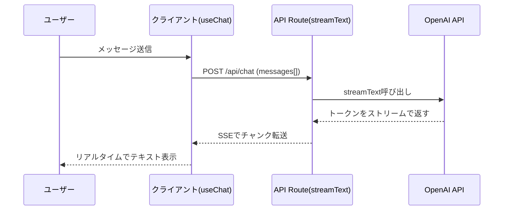

## はじめに

「Next.jsにAI機能を追加したいけど、どこから手をつければいいかわからない」

フロントエンドエンジニアとして、AIブームに乗り遅れてはいけないと思いつつも、PythonのLangChainやLangGraphの記事ばかり目に入って、**TypeScript/Next.jsの自分にはどれが合うのか**迷っていた。

そんなとき見つけたのが **Vercel AI SDK** だ。Next.jsを作ったVercelが提供するこのライブラリ、触ってみたら想像以上に「フロントエンドエンジニアのために設計されている」ことがわかった。

この記事では、Vercel AI SDKを使って **2つの実践的なAI機能** を実装する：

- ✅ **リアルタイムチャットUI**（`useChat` + `streamText`）
- ✅ **構造化データ生成**（`generateObject` + Zodスキーマ）
- ✅ **プロバイダー切り替え**（OpenAI → Anthropic を1行で）

**対象読者：**
- Next.js App Routerの基礎がわかる方
- TypeScriptが読み書きできる方
- AI機能をWebアプリに組み込みたい方

**前提知識：** Next.js App Router（API Route・Server Components）、TypeScript基本

---

## なぜVercel AI SDKなのか — 類似ライブラリとの比較

実装を始める前に「なぜVercel AI SDKなのか」を整理しておこう。

最初は素のOpenAI SDKを使おうと思っていたが、**ストリーミング対応のUIを作ろうとした時点で詰まった**。`ReadableStream`を自前で処理して、Reactのstateにつなぐ処理がかなり面倒だったのだ。

各アプローチの比較がこちら：

| アプローチ | セットアップ | ストリーミングUI | プロバイダー切り替え | TS型安全 |
|-----------|------------|----------------|-------------------|---------|
| 素のfetch + OpenAI API | 簡単 | 自前実装が必要（複雑） | 困難 | △ |
| OpenAI SDK直接使用 | 簡単 | ある程度サポート | OpenAI専用 | ○ |
| LangChain.js | 高機能だが重い | 対応 | 対応 | △ |
| **Vercel AI SDK** | **簡単** | **標準搭載** | **1行で切替** | **◎** |

Vercel AI SDKの最大の強みは **「Next.jsとの統合が完璧」** なことだ。`useChat`フック1つでチャット状態管理・ストリーミング表示・エラーハンドリングがすべて完結する。

また、**プロバイダーロックインがない**のも重要だ。OpenAI、Anthropic、Google Geminiなど複数のLLMプロバイダーを同一APIで扱えるので、「やっぱりClaudeに切り替えたい」という場合もコードの変更が1行で済む。

---

## セットアップ — インストールから動作確認まで

### Next.jsプロジェクトの準備

```bash
npx create-next-app@latest my-ai-app --typescript --tailwind --app
cd my-ai-app
```

### 必要パッケージのインストール

```bash
npm install ai @ai-sdk/openai @ai-sdk/react zod
```

| パッケージ | 役割 |
|-----------|------|
| `ai` | Vercel AI SDK コア（generateText・streamText・generateObject） |
| `@ai-sdk/openai` | OpenAIプロバイダーアダプター |
| `@ai-sdk/react` | Reactフック（useChat・useCompletion） |
| `zod` | スキーマバリデーション（generateObjectで使用） |

### APIキーの設定

`.env.local`を作成してOpenAIのAPIキーを設定する：

```bash
# .env.local
OPENAI_API_KEY=sk-xxxxxxxxxxxxxxxx
```

:::message
`.env.local`は必ず`.gitignore`に含まれていることを確認しよう。
`create-next-app`で作ったプロジェクトなら最初から含まれている。
:::

---

## 実践① チャットUI — useChat + streamText

### 全体の処理フロー

まず全体のデータフローを把握しておこう：



`useChat`フックがこのストリーミングのやり取りをすべて内部で処理してくれる。自前で`EventSource`や`ReadableStream`を書く必要がない。

### API Route（サーバーサイド）

`app/api/chat/route.ts`を作成する：

```typescript
// app/api/chat/route.ts
import { streamText } from 'ai'
import { openai } from '@ai-sdk/openai'

export const runtime = 'edge' // ← ストリーミングにはEdgeが推奨

export async function POST(req: Request) {
  const { messages } = await req.json()

  const result = await streamText({
    model: openai('gpt-4o'),
    system: 'あなたは親切な日本語アシスタントです。簡潔かつ正確に答えてください。',
    messages, // フロントから送られてきた会話履歴をそのまま渡す
  })

  // SSE形式のストリーミングレスポンスに変換
  return result.toDataStreamResponse()
}
```

`streamText`は**AIの応答をトークン単位でストリーミング**する関数だ。`toDataStreamResponse()`でVercel AI SDK専用のSSE形式に変換することで、フロントの`useChat`フックが自動的に解釈できる。

### クライアントコンポーネント

`app/chat/page.tsx`を作成する：

```tsx
// app/chat/page.tsx
'use client'
import { useChat } from '@ai-sdk/react'

export default function ChatPage() {
  const {
    messages,      // 会話履歴の配列
    input,         // 入力フォームのvalue
    handleInputChange, // inputのonChange
    handleSubmit,  // フォームのonSubmit
    isLoading,     // 生成中かどうか
    error,         // エラー情報
  } = useChat({
    api: '/api/chat', // デフォルトもこのパスだが明示的に書いておくと良い
  })

  return (
    <div className="max-w-2xl mx-auto p-4">
      <h1 className="text-2xl font-bold mb-4">AIチャット</h1>

      {/* エラー表示 */}
      {error && (
        <div className="p-3 mb-4 bg-red-100 text-red-700 rounded">
          エラーが発生しました: {error.message}
        </div>
      )}

      {/* メッセージ一覧 */}
      <div className="space-y-4 mb-4 min-h-64">
        {messages.map((message) => (
          <div
            key={message.id}
            className={`p-3 rounded-lg ${
              message.role === 'user'
                ? 'bg-blue-100 ml-8'
                : 'bg-gray-100 mr-8'
            }`}
          >
            <span className="font-semibold text-sm text-gray-500">
              {message.role === 'user' ? 'あなた' : 'AI'}
            </span>
            <p className="mt-1 whitespace-pre-wrap">{message.content}</p>
          </div>
        ))}

        {/* ローディング表示 */}
        {isLoading && (
          <div className="p-3 rounded-lg bg-gray-100 mr-8">
            <span className="text-gray-500">生成中...</span>
          </div>
        )}
      </div>

      {/* 入力フォーム */}
      <form onSubmit={handleSubmit} className="flex gap-2">
        <input
          value={input}
          onChange={handleInputChange}
          placeholder="メッセージを入力..."
          className="flex-1 border rounded p-2"
          disabled={isLoading}
        />
        <button
          type="submit"
          disabled={isLoading || !input.trim()}
          className="px-4 py-2 bg-blue-500 text-white rounded disabled:opacity-50"
        >
          送信
        </button>
      </form>
    </div>
  )
}
```

`useChat`フックが**会話履歴の管理・ストリーミング表示・入力フォームのバインディング**をすべて担当してくれる。自分でstateを管理したり、APIをポーリングしたりする必要がない。

実際にこのコードを動かしてみると、AIが文字を打っているかのようにリアルタイムでテキストが表示される。ChatGPTのような体験をわずか数十行で再現できた。

---

## 実践② 構造化出力 — generateObject + Zodスキーマ

チャットだけでなく、「AIにJSONを返してもらいたい」ケースも多い。たとえば：

- ブログ記事のタグを自動生成
- フォーム入力から構造化データを抽出
- レビューテキストの感情分析

そういった場合に `generateObject` を使う。

### ユースケース：記事タグ自動抽出

記事本文を渡すと、タイトル・タグ・要約をJSONで返すServer Actionを作ろう：

```typescript
// app/actions/analyze-article.ts
'use server'
import { generateObject } from 'ai'
import { openai } from '@ai-sdk/openai'
import { z } from 'zod'

// Zodスキーマで出力の型を定義
const ArticleAnalysisSchema = z.object({
  title: z.string().describe('記事の最適なタイトル'),
  tags: z.array(z.string()).max(5).describe('記事に関連するタグ（最大5個）'),
  summary: z.string().max(200).describe('記事の要約（200文字以内）'),
  difficulty: z.enum(['beginner', 'intermediate', 'advanced']).describe('対象者の難易度'),
})

// 型を自動推論させる
type ArticleAnalysis = z.infer<typeof ArticleAnalysisSchema>

export async function analyzeArticle(content: string): Promise<ArticleAnalysis> {
  const { object } = await generateObject({
    model: openai('gpt-4o'),
    schema: ArticleAnalysisSchema,
    prompt: `以下の記事を分析して、タイトル・タグ・要約・難易度を抽出してください。\n\n${content}`,
  })

  // objectはArticleAnalysis型として型安全に扱える
  return object
}
```

### クライアントから呼び出す

```tsx
// app/analyze/page.tsx
'use client'
import { useState } from 'react'
import { analyzeArticle } from '../actions/analyze-article'

export default function AnalyzePage() {
  const [content, setContent] = useState('')
  const [result, setResult] = useState<Awaited<ReturnType<typeof analyzeArticle>> | null>(null)
  const [loading, setLoading] = useState(false)

  const handleAnalyze = async () => {
    setLoading(true)
    try {
      const analysis = await analyzeArticle(content)
      setResult(analysis)
    } finally {
      setLoading(false)
    }
  }

  return (
    <div className="max-w-2xl mx-auto p-4">
      <h1 className="text-2xl font-bold mb-4">記事分析</h1>
      <textarea
        value={content}
        onChange={(e) => setContent(e.target.value)}
        placeholder="分析したい記事を貼り付けてください..."
        className="w-full h-48 border rounded p-2 mb-4"
      />
      <button
        onClick={handleAnalyze}
        disabled={loading || !content.trim()}
        className="px-4 py-2 bg-green-500 text-white rounded disabled:opacity-50"
      >
        {loading ? '分析中...' : '分析する'}
      </button>

      {result && (
        <div className="mt-4 p-4 bg-gray-50 rounded">
          <h2 className="font-bold">{result.title}</h2>
          <p className="text-sm text-gray-600 mt-1">{result.summary}</p>
          <div className="flex gap-2 mt-2">
            {result.tags.map((tag) => (
              <span key={tag} className="px-2 py-1 bg-blue-100 text-blue-700 text-xs rounded">
                {tag}
              </span>
            ))}
          </div>
          <span className="text-xs text-gray-500 mt-2 block">難易度: {result.difficulty}</span>
        </div>
      )}
    </div>
  )
}
```

Zodスキーマを定義するだけで、**AIが自動的にそのスキーマに合ったJSONを生成**してくれる。しかも`z.infer<typeof Schema>`で型推論が効くので、`result.title`のようにTypeScriptの補完が完全に機能する。

---

## プロバイダー切り替え — 1行でAnthropicやGeminiに

Vercel AI SDKの強力な機能の一つが **プロバイダー切り替えの容易さ** だ。

実際にやってみると本当に1行変更だけで動いた：

```typescript
// OpenAI を使う場合
import { openai } from '@ai-sdk/openai'
const model = openai('gpt-4o')

// ↓ Anthropic Claudeに切り替える場合
// npm install @ai-sdk/anthropic が必要
import { anthropic } from '@ai-sdk/anthropic'
const model = anthropic('claude-opus-4-5')

// ↓ Google Geminiに切り替える場合
// npm install @ai-sdk/google が必要
import { google } from '@ai-sdk/google'
const model = google('gemini-2.0-flash')
```

API Routeのコードでは`model`変数を切り替えるだけ：

```typescript
// app/api/chat/route.ts
import { streamText } from 'ai'
// import { openai } from '@ai-sdk/openai'
import { anthropic } from '@ai-sdk/anthropic' // ← 切り替え先に変更

export async function POST(req: Request) {
  const { messages } = await req.json()
  const result = await streamText({
    model: anthropic('claude-opus-4-5'), // ← ここだけ変更
    messages,
  })
  return result.toDataStreamResponse()
}
```

`useChat`フックはそのまま変更不要。**フロントエンドのコードには一切触れずにバックエンドのモデルを切り替えられる**のは、プロバイダーロックインを防ぐうえで非常に重要だ。

プロバイダーの選び方の目安：

| プロバイダー | 強み | こんな時に |
|------------|------|-----------|
| OpenAI (gpt-4o) | バランスが良い・ツール呼び出し強力 | 汎用チャット・ツール使用 |
| Anthropic (claude-opus) | 長文・推論・指示追従 | 複雑なタスク・コード生成 |
| Google (gemini) | マルチモーダル・高速 | 画像処理・低コスト用途 |

---

## ハマりポイント・注意事項

実装中にいくつかのハマりポイントがあったので共有する。

:::message alert
**① Edge Runtimeを忘れると、ストリーミングが動かない**

`streamText`を使う場合、API Routeに `export const runtime = 'edge'` を追記しないと、
Vercel等の環境でストリーミングが途切れる・遅延するケースがある。

```typescript
// app/api/chat/route.ts
export const runtime = 'edge' // ← これが必要
```

ローカル開発（`npm run dev`）では動いても、本番デプロイで壊れるという典型的なパターン。
:::

:::message alert
**② `useChat`の`messages[].content`の型に注意**

最新版のVercel AI SDKでは、`message.content`が文字列ではなく**ContentPart配列**になるケースがある（特にtool callを使う場合）。

安全に文字列として取り出すには：
```typescript
// 文字列として取り出す方法
const text = typeof message.content === 'string'
  ? message.content
  : message.content.filter(p => p.type === 'text').map(p => p.text).join('')
```
:::

:::message
**③ generateObjectのスキーマはシンプルに**

Zodスキーマが複雑すぎる（ネストが深い・条件分岐が多い）と、モデルがスキーマ通りのJSONを生成できずにエラーになることがある。

まずはシンプルなフラットなスキーマから始めて、動作確認してから複雑化するのが安全。
:::

:::message alert
**④ APIキーが設定されていないとエラーが出る**

`OPENAI_API_KEY`を設定し忘れると以下のエラーが出る：

```
Error: OpenAI API key is missing
```

`.env.local`の設定と、Vercelの環境変数設定（本番の場合）を忘れずに。
:::

---

## まとめ

Vercel AI SDKを使ってNext.jsにAI機能を実装した結果、予想以上にシンプルに実現できた。

| 機能 | 使うAPI | ポイント |
|------|---------|---------|
| リアルタイムチャットUI | `streamText` + `useChat` | API RouteとReactフックの連携が自動化 |
| 構造化データ生成 | `generateObject` + Zod | スキーマを定義するだけで型安全なJSON |
| プロバイダー切り替え | `@ai-sdk/*` アダプター | import文1行の変更で完結 |

Vercel AI SDKは **「フロントエンドエンジニアがAI機能を最速で実装するためのライブラリ」** だと実感した。特にTypeScript型安全性とNext.js最適化の組み合わせは、Pythonベースのフレームワークでは得られない体験だ。

### 次のステップ

この記事でカバーした内容をベースに、以下への発展もぜひ試してほしい：

- **ツール呼び出し（Tool Calling）**: AIが外部APIや関数を実行する高度な機能
- **RAG実装**: `embed`関数 + ベクトルDBで独自データを学習させる
- **`useObject`**: 構造化データをストリーミングで取得するフック
- **AI Gateway**: 複数プロバイダーの統合管理・コスト最適化

### 参考リンク

- [Vercel AI SDK 公式ドキュメント](https://sdk.vercel.ai/docs)
- [AI SDK GitHub](https://github.com/vercel/ai)
- [Next.js App Router ガイド](https://nextjs.org/docs/app)
