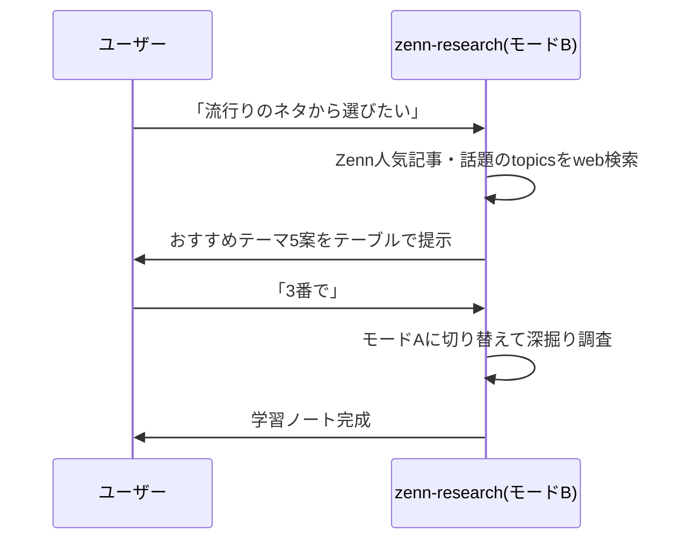
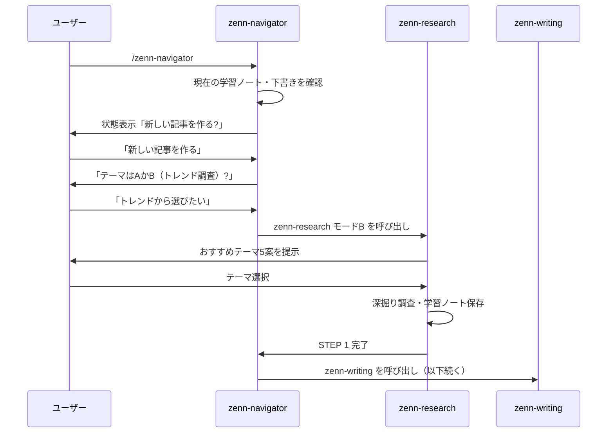

## はじめに

Zenn記事を継続して書くのは、思ったより**エネルギーのいる作業**です。

「何を書こうか」→「調査する」→「執筆する」→「レビューする」→「公開する」

この5ステップ、全部しんどい。特に**ネタ探し**と**書き始める瞬間**がボトルネックで、気づいたら1ヶ月記事を書いていない…なんてことが続いていました。

そこで **Claude Code + SKILL.md** を使って、Zenn記事の執筆フローを丸ごと自動化することにしました。

この記事では、実際に作った5スキル構成の全体像・設計思想・詰まったポイントを全部公開します。

:::message
この記事で扱うのは「Claude Code のスキル（SKILL.md）」の話です。Claude Code がまだの方は先に[公式ドキュメント](https://code.claude.com/docs/ja/skills)を確認してください。
:::

---

## 1. 全体のアーキテクチャ

まず作った全体像から見てもらいます。


**5つのスキルを `zenn-navigator` が統括する**構成です。ユーザーは `/zenn-navigator` を呼ぶだけで、あとはClaude Codeが各ステップを順番に進めてくれます。

### なぜ1スキルにまとめなかったのか？

最初は「zenn-writer」という1スキルで全部やろうとしました。でも**すぐに壊れました**。理由は2つ：

1. **コンテキストが爆発する** — 調査→執筆→公開を1スキルでやると、会話が長くなりすぎて前の指示を忘れる
2. **責務が曖昧になる** — 「調査」と「執筆」が混在すると、どちらもうまくいかない

5スキルに分けることで、各スキルは**1つのことだけに集中**できます。

| スキル | 責務 | 出力 |
|--------|------|------|
| `zenn-research` | Web調査・情報収集 | 学習ノート（.md） |
| `zenn-plan` | 企画・設計 | 企画書（.md） |
| `zenn-writing` | 執筆 | 下書き記事（.md） |
| `zenn-review` | 品質チェック | レビューレポート |
| `zenn-posting` | デプロイ | 公開済み記事 |

---

## 2. SKILL.md の書き方とハマりポイント

### 基本構造

SKILL.md は **YAMLフロントマター + Markdownの指示文** で構成されます。

```yaml
---
name: zenn-research
description: >
  Zenn記事の調査スキル。キーワードをWeb検索して学習ノートを作成する。
  Use when researching Zenn article topics, gathering information for writing.
---

# zenn-research スキル

以下の手順で調査を実行する...
```

**フォルダ構成：**

```
.claude/
└── skills/
    ├── zenn-navigator/
    │   └── SKILL.md
    ├── zenn-research/
    │   └── SKILL.md
    ├── zenn-plan/
    │   └── SKILL.md
    ├── zenn-writing/
    │   └── SKILL.md
    ├── zenn-review/
    │   └── SKILL.md
    └── zenn-posting/
        └── SKILL.md
```

:::message alert
**フォルダ名 = `name` フィールドの値**でないといけません。ここを間違えるとスキルが認識されません（後述）。
:::

### ❌ ハマりポイント1：descriptionが曖昧でスキルが呼ばれない

最初に書いた description はこうでした：

```yaml
# NG例
description: Zennの記事を書くときに使うスキル。
```

**スキルが全然呼ばれません。**

Claude Code はdescriptionを見て「今やるべきスキルはどれか」を判断します。この説明では「Zenn記事を書くとき」がいつなのかわからない。

解決策は **"Use when..."** を明示的に書くこと：

```yaml
# OK例
description: >
  Zennの記事を調査して学習ノートを作成するスキル。
  Use when researching Zenn article topics, when user says 'zenn', 'research',
  or when starting a new article workflow.
```

「どんなキーワードが来たら呼ぶか」まで書くと認識率が大幅に上がります。

### ❌ ハマりポイント2：学習ノートが次のスキルに引き継がれない

`zenn-research` で作った学習ノートを `zenn-writing` が参照できずに、調査結果を無視した記事が生成される問題が起きました。

原因は**ファイルパスの共有ができていない**こと。

解決策は「共有設定ファイルを作ること」：

```
.claude/skills/zenn-shared-config.md
```

ここに全スキルが参照すべきパス（学習ノートの保存先、記事の保存先など）を一元管理します。各スキルの冒頭に `> 共有設定: zenn-shared-config.md を参照` と書いておくだけです。

### ❌ ハマりポイント3：レビューを飛ばして公開してしまった

`zenn-writing` の後、勢いで `zenn-posting` を呼んでしまい、レビューなしで公開した記事が1本あります。誤字・構成の問題があってあとから修正しました。

解決策は `zenn-navigator` に**必須チェックを入れること**：

```markdown
> ⚠️ 重要: zenn-review を飛ばして直接 zenn-posting しないこと。レビューは必須ステップ。
```

navigator が「STEP 4（レビュー）が完了していること」を確認してからSTEP 5に進むよう制御します。

---

## 3. 各スキルの設計思想

### zenn-research：2つのモードを用意した

ネタ探しがつらくなってきた頃に気づいたのが「**自分のテーマが尽きた**」問題です。

そこで `zenn-research` に2つのモードを追加しました：

```
モードA（キーワード指定）: 書きたいテーマが決まっているとき
      ↓
モードB（トレンド調査）: ネタが思いつかないとき → Zennのトレンドを調査して3〜5案を提案
```

モードBはこういう動きをします：



### zenn-writing：4原則を明文化してスキルに埋め込んだ

執筆スキルには「**執筆4原則**」を必須要件として入れています：

| 原則 | 内容 | チェック項目 |
|------|------|------------|
| 体験ベース | 自分がやった・見た・感じた事実から書く | 「私は〜した」が含まれているか |
| 失敗必須 | ハマりポイント・注意事項のセクションを省略不可 | 失敗談セクションがあるか |
| 分かりやすく | 専門用語には説明を入れる | 初出の略語に説明があるか |
| 図多め | Mermaid・テーブル・ASCIIを最低3つ以上 | 図が3つ以上あるか |

スキルファイルにこれを書いておくだけで、Claudeが自然に4原則を守った記事を書くようになります。

### zenn-review：4軸×4原則チェック

レビューは以下の4軸で行います：

```
軸1: 技術的正確性（重み×1.5）
軸2: 構成・読みやすさ（重み×1.2）← ここに4原則チェックを追加
軸3: Zennフォーマット（重み×1.0）
軸4: タイトル・topics（重み×1.3）
```

軸2で4原則（体験表現・失敗談・専門用語説明・図3つ以上）が満たされているかを必ずチェックします。

---

## 4. 実際に使ってわかったこと

### 最初は3スキルだった

最初のバージョンは `research → writing → posting` の3スキルでした。動くには動くけど**品質が安定しない**。

具体的には：
- slugが適当になる（planがない）
- 公開前のチェックが甘い（reviewがない）
- 記事の方向性が決まらないまま書き始める（planがない）

**問題が出るたびにスキルを追加していって5スキル構成になりました。**

### トレンド調査モードで「書くことに詰まらなくなった」

記事を10本以上書くと「自分のネタ」が尽きてきます。そこでモードBを追加したら、毎回「今旬のテーマを提案してもらって選ぶ」スタイルになり、書く動機が上がりました。

この記事自体も、モードBで「Zenn執筆ワークフロー自動化」というテーマが提案されて書いています。

---

## 5. 実際の使い方デモ

`/zenn-navigator` と入力すると、こんな流れになります：



あとは流れに乗って選択していくだけです。最短で**20分くらいで記事が完成**します（調査に時間をかけなければ）。

---

## まとめ

- **5スキル構成（research → plan → writing → review → posting）** でZenn執筆を全自動化した
- 1スキルにまとめると壊れる。責務分離が品質安定の鍵
- SKILL.md は description に "Use when..." を書かないと呼ばれない
- 学習ノートの共有パス、レビューの必須化、トレンド調査モードは**使っていて困った問題から生まれた**

**この記事自体がそのワークフローで作られています**。実際に `/zenn-navigator` → トレンド調査 → このテーマを選択 → 企画 → 執筆 → レビュー → 投稿という流れで書きました。

今後の改善案：
- [ ] サムネイル自動生成スキルの追加（`zenn-thumbnail`）
- [ ] スキ活の自動化（公開直後に関連記事へのリアクション）
- [ ] 記事のパフォーマンス分析スキル

スキルファイルはリポジトリで管理しているので、興味があれば参考にしてください。
